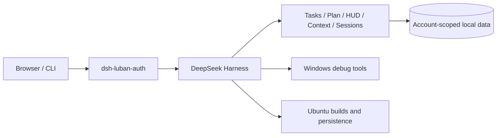

# dsh-luban

[简体中文](README.md) | [English](README.en.md)

[](https://github.com/yin52133/dsh-luban/actions/workflows/ci.yml)
[](https://github.com/yin52133/dsh-luban/stargazers)
[](https://github.com/yin52133/dsh-luban/releases)
[](https://www.npmjs.com/package/dsh-luban-auth)
[](LICENSE)

A [DeepSeek Harness](https://github.com/deepseek-ai/deepseek-harness) plugin suite for
embedded development. It connects a Windows debug workstation and an Ubuntu build server into a
browser-accessible DSH workbench with persistent jobs and account-separated contexts.

## Why dsh-luban

- **Two-host workflow**: use Windows for serial, ADB, flashing, and GDB; use Ubuntu for builds and long-running jobs.
- **One entry point**: sign in at `/luban-auth/login`; tasks, sessions, attachments, and contexts are separated by account.
- **Closed task loop**: a six-column board supports human edits, agent claims, progress reports, and human review.
- **Persistent work**: tmux, Windows Task Scheduler, and systemd keep sessions alive and recover them after restart.
- **Visible context**: the HUD reports context pressure, model, reasoning level, RPM/TPM, and replayable compaction.
- **Embedded toolchain**: one surface integrates serial, ADB/Fastboot, OpenOCD, GDB, SSH, Telnet, and TCP serial.
- **Modular installation**: every capability is an independent `dsh-luban-*` package.

The project targets a trusted LAN. Its simple account system separates a small number of users'
working contexts; it is not an enterprise identity or network-hardening product.

## Deployment profiles

| Host                      | Primary role                                                                     | Recommended plugins                                   |
| ------------------------- | -------------------------------------------------------------------------------- | ----------------------------------------------------- |
| Windows debug workstation | Serial, ADB/Fastboot, flashing, GDB, desktop and browser automation              | auth, taskboard, keepalive, HUD, win-debug, browser   |
| Ubuntu build server       | Web entry point, persistent sessions, build queue, artifacts, browser automation | auth, taskboard, keepalive, HUD, server-mode, browser |

Both hosts can add plan, context, image-paste, and session-share to work with tasks and session views
under the same account.

## Packages

| npm package               | Capability                                                              | Platform            |
| ------------------------- | ----------------------------------------------------------------------- | ------------------- |
| `dsh-luban-auth`          | Local login, authentication sidecar, and account context separation     | Windows / Ubuntu    |
| `dsh-luban-taskboard`     | Six-column board, agent claims, night jobs, and `taskctl`               | Windows / Ubuntu    |
| `dsh-luban-keepalive`     | tmux/Task Scheduler persistence, heartbeat, recovery, and checkpoints   | Windows / Ubuntu    |
| `dsh-luban-plan`          | Draft, approve, reject, and revise plans                                | Windows / Ubuntu    |
| `dsh-luban-session-share` | Cross-host session views, reconnect, and explicit control handoff       | Windows / Ubuntu    |
| `dsh-luban-image-paste`   | Paste and store images, preview them, and reference them from a session | Windows / Ubuntu    |
| `dsh-luban-hud`           | Web/CLI status bar with context and rate metrics                        | Windows / Ubuntu    |
| `dsh-luban-context`       | Context compaction, virtual-file archive, search, and replay            | Windows / Ubuntu    |
| `dsh-luban-server-mode`   | systemd service, build queue, resource checks, and artifacts            | Ubuntu              |
| `dsh-luban-win-debug`     | Serial, flashing, GDB, ADB, remote channels, and desktop MCP            | Windows             |
| `dsh-luban-browser`       | browser-use bridge, task templates, and taskboard automation            | Windows / Ubuntu    |
| `dsh-luban-core`          | Shared contracts, routes, errors, and storage utilities                 | Internal dependency |

## Quick start

### Install plugins

You need Node.js 22.19+, pnpm 11, and DeepSeek Harness 0.1.1-rc.2. Install the authentication
plugin first, then add only the capabilities needed by the profile:

```sh
dsh plugin --profile web add dsh-luban-auth
dsh plugin --profile web add dsh-luban-taskboard dsh-luban-hud dsh-luban-plan
```

After starting the profile, enter through the authentication sidecar:

```text
http://<host>:42600/luban-auth/login
```

Plugin routes consistently use `/luban-<module>`, including `/luban-taskboard`, `/luban-plan`,
and `/luban-browser`. See the [Windows deployment guide](design/05-deployment/deploy-windows.md)
and [Ubuntu deployment guide](design/05-deployment/deploy-ubuntu.md) for installation and service setup.

### Develop the repository

The Python browser bridge runs only from its locked `uv` environment; no global pip environment is used.

```sh
corepack enable
pnpm install
pnpm check
uv run --project tools/browser-bridge --locked python -m unittest discover -s tools/browser-bridge/tests
```

## Network access

On Ubuntu, expose the authentication sidecar only to the actual LAN client range. The CIDR below is
a placeholder; replace it with the range supplied by the router or network administrator, and never
commit private deployment details:

```sh
LAN_CIDR=<lan-client-cidr>
sudo ufw allow proto tcp from "$LAN_CIDR" to any port 42600
```

The firewall rule limits which devices can connect to the port. DSH access still requires a login at
`/luban-auth/login`.

## Architecture



Plugins do not depend on each other directly. Shared types and utilities live in `dsh-luban-core`,
while runtime cooperation uses DSH services, events, and HTTP contracts. See [design](design/README.md)
for design notes and [checklist.json](checklist.json) for current implementation status.

## Project status

The repository is preparing its first public release. The code passes Windows/Ubuntu CI and module
tests. Items that still require an external model, marketplace permissions, or real hardware remain
marked `review` or `blocked` in `checklist.json` and are not presented as released capabilities.

## License

[MIT](LICENSE). Third-party dependency and reference-project licensing is documented in
[reference analysis](design/07-references/reference-analysis.md) and each package's
`THIRD-PARTY-NOTICES.md`.
