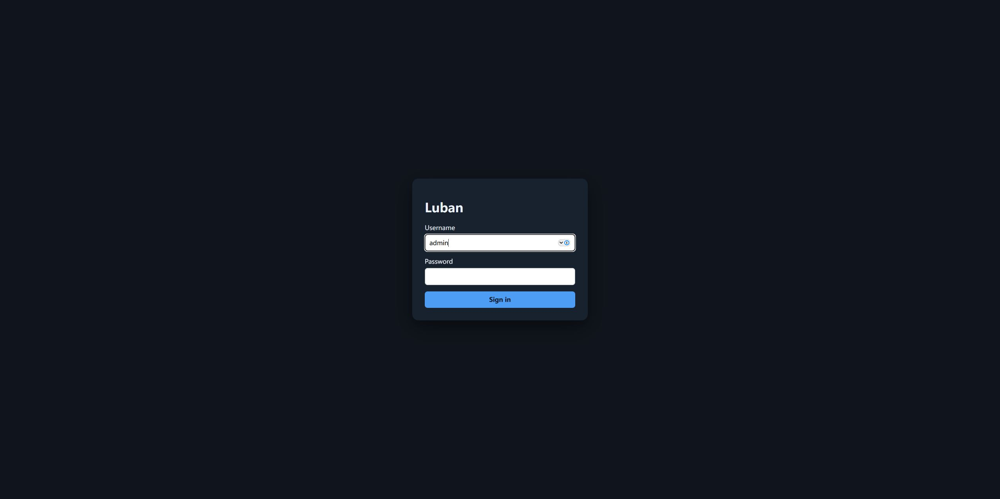
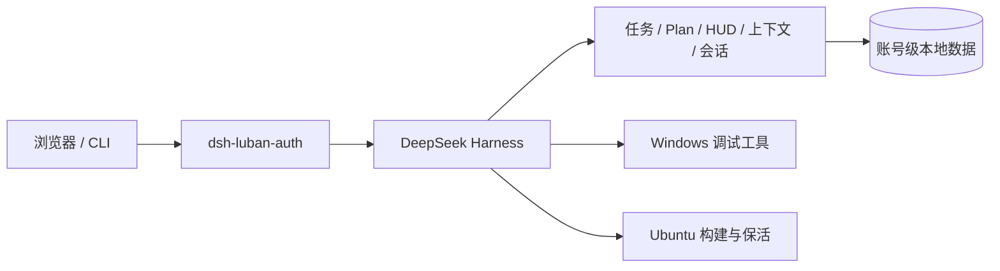

# dsh-luban

[简体中文](README.md) | [English](README.en.md)

[](https://github.com/yin52133/dsh-luban/actions/workflows/ci.yml)
[](https://github.com/yin52133/dsh-luban/stargazers)
[](https://github.com/yin52133/dsh-luban/releases)
[](https://www.npmjs.com/package/dsh-luban-auth)
[](LICENSE)

面向嵌入式开发的 [DeepSeek Harness](https://github.com/deepseek-ai/deepseek-harness)
插件套件：把 Windows 调试机和 Ubuntu 编译服务器连接成一个可从浏览器操作、可持续运行、
可按账号隔离上下文的 DSH 工作台。

## 项目定位

dsh-luban 面向个人与小团队的可信局域网开发环境，以功能闭环、运行稳定和账号上下文隔离为主，
不提供企业级身份、安全加固或公网防护方案。

## 为什么使用 dsh-luban

- **双机协作**：Windows 负责串口、ADB、烧录和 GDB，Ubuntu 负责后台构建与长任务。
- **一个入口**：通过 `/luban-auth/login` 登录，任务、会话、附件和上下文按账号隔离。
- **任务闭环**：六列任务看板支持人工操作、Agent 领单、进度回写和人工复核。
- **不中断工作**：tmux、Windows 计划任务与 systemd 负责会话保活和重启恢复。
- **上下文可见**：HUD 展示上下文占用、模型、推理档位、RPM/TPM，并支持可回放压缩。
- **嵌入式工具链**：统一接入串口、ADB/Fastboot、OpenOCD、GDB、SSH、Telnet 和网络串口。
- **模块化安装**：每项能力都是独立的 `dsh-luban-*` 包，只安装当前主机需要的插件。

本项目面向可信局域网，账号系统用于隔离少量用户的工作上下文，不定位为企业级身份与安全防护系统。

## 部署形态

| 主机              | 主要职责                                             | 推荐插件                                              |
| ----------------- | ---------------------------------------------------- | ----------------------------------------------------- |
| Windows 调试机    | 串口、ADB/Fastboot、烧录、GDB、桌面与浏览器自动化    | auth、taskboard、keepalive、HUD、win-debug、browser   |
| Ubuntu 编译服务器 | Web 入口、后台会话、构建队列、产物管理、浏览器自动化 | auth、taskboard、keepalive、HUD、server-mode、browser |

两个主机可以安装 plan、context、image-paste 和 session-share，共享同一账号下的任务与会话视图。

## 界面展示



所有 Web 功能从 `/luban-auth/login` 进入。登录后的看板、HUD、Plan 与图片功能复用同一账号会话，
匿名 API 请求返回 401，不存在 `/luban/auth/login` 兼容路由。

## 插件一览

| npm 包                    | 功能                                       | 平台             |
| ------------------------- | ------------------------------------------ | ---------------- |
| `dsh-luban-auth`          | 本地账号登录、认证 sidecar、账号上下文隔离 | Windows / Ubuntu |
| `dsh-luban-taskboard`     | 六列看板、Agent 领单、夜间任务与 `taskctl` | Windows / Ubuntu |
| `dsh-luban-keepalive`     | tmux/计划任务保活、心跳、重启恢复与检查点  | Windows / Ubuntu |
| `dsh-luban-plan`          | 计划草稿、批准、驳回和修订闭环             | Windows / Ubuntu |
| `dsh-luban-session-share` | 跨主机会话观察、重连与显式控制权交接       | Windows / Ubuntu |
| `dsh-luban-image-paste`   | Web/剪贴板图片落盘、预览与会话引用         | Windows / Ubuntu |
| `dsh-luban-hud`           | Web/CLI 状态栏、上下文与速率统计           | Windows / Ubuntu |
| `dsh-luban-context`       | 上下文压缩、虚拟文件归档、检索与回放       | Windows / Ubuntu |
| `dsh-luban-server-mode`   | systemd 常驻、构建队列、资源看护与产物下载 | Ubuntu           |
| `dsh-luban-win-debug`     | 串口、烧录、GDB、ADB、远程通道与桌面 MCP   | Windows          |
| `dsh-luban-browser`       | browser-use 桥接、任务模板和看板自动执行   | Windows / Ubuntu |
| `dsh-luban-core`          | 插件共用契约、路由、错误与存储工具         | 内部依赖         |

## 快速开始

### 使用插件

需要 Node.js 22.19+、pnpm 11 和 DeepSeek Harness 0.1.1-rc.2。先安装认证插件，再按需添加业务插件：

```sh
dsh plugin --profile web add dsh-luban-auth
dsh plugin --profile web add dsh-luban-taskboard dsh-luban-hud dsh-luban-plan
```

启动 profile 后，从认证 sidecar 进入：

```text
http://<host>:42600/luban-auth/login
```

插件统一使用 `/luban-<module>` 路由，例如 `/luban-taskboard`、`/luban-plan` 和
`/luban-browser`。完整安装与服务注册见 [Windows 部署](design/05-deployment/deploy-windows.md)
和 [Ubuntu 部署](design/05-deployment/deploy-ubuntu.md)。

### 开发仓库

Python 浏览器桥接只通过 `uv` 的锁定环境运行，不使用全局 pip：

```sh
corepack enable
pnpm install
pnpm check
uv run --project tools/browser-bridge --locked python -m unittest discover -s tools/browser-bridge/tests
```

## 网络说明

Ubuntu 只需向实际局域网客户端范围开放认证 sidecar 端口。下面的 CIDR 是占位符，应替换为
路由器或网络管理员提供的实际地址范围，不要把私有部署信息提交到仓库：

```sh
LAN_CIDR=<lan-client-cidr>
sudo ufw allow proto tcp from "$LAN_CIDR" to any port 42600
```

防火墙规则限制可以连接该端口的设备；访问 DSH 仍需通过 `/luban-auth/login` 登录。

## 架构



插件之间不直接依赖：共享类型和基础工具来自 `dsh-luban-core`，运行时协作通过 DSH 服务、
事件和 HTTP 契约完成。设计说明与当前状态分别见 [design](design/README.md) 和
[checklist.json](checklist.json)。

## 文档导航

- [Windows 部署](design/05-deployment/deploy-windows.md)
- [Ubuntu 部署](design/05-deployment/deploy-ubuntu.md)
- [架构与模块设计](design/README.md)
- [功能状态台账](checklist.json)
- [English README](README.en.md)

## 当前状态

仓库正在准备首次公开版本。代码已完成 Windows/Ubuntu CI 与模块测试；个别需要外部模型或真实设备的
验收项，以 `checklist.json` 中的 `review` 或 `blocked` 标记，不会被描述为已发布能力。

## 许可

[MIT](LICENSE)。第三方依赖和参考项目的许可说明见
[参考项目分析](design/07-references/reference-analysis.md)及各包的 `THIRD-PARTY-NOTICES.md`。
