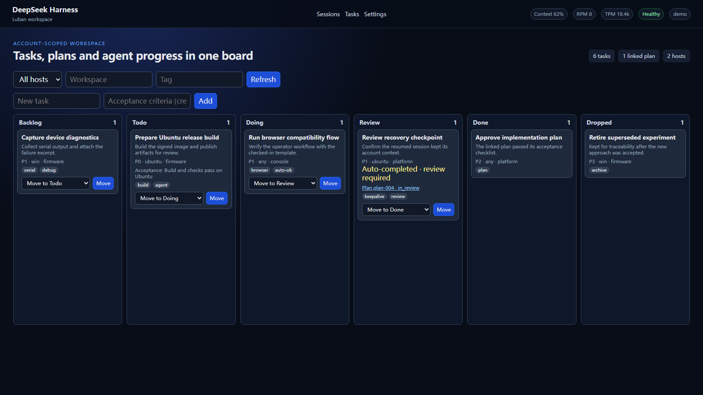

# dsh-luban

[简体中文](README.md) | [English](README.en.md)

[](https://www.npmjs.com/package/@yin52133/dsh-luban)
[](https://pnpm.io/)
[](https://github.com/deepseek-ai/deepseek-harness)

## 项目定位

dsh-luban 是面向嵌入式开发的 [DeepSeek Harness](https://github.com/deepseek-ai/deepseek-harness)
插件套件。它把 Windows 调试机和 Ubuntu 编译服务器连接到同一个浏览器工作台，让设备调试、后台构建、
任务跟踪和会话恢复可以在一处完成。

项目适合个人或小团队在可信局域网中使用。内置账号用于隔离不同用户的任务、会话和附件，不替代企业级
身份认证或公网安全防护。

## 主要功能

- **跨主机协作**：Windows 处理串口、Android Debug Bridge（ADB）、烧录和 GNU Debugger（GDB）；Ubuntu 处理构建和长时间任务。
- **任务管理**：通过看板创建、领取、执行、复核任务，并关联执行计划。
- **持续运行**：使用 tmux、Windows 计划任务和 systemd 保持会话与任务运行，并在重启后恢复。
- **上下文管理**：查看模型、推理档位、上下文占用和速率，支持压缩记录的检索与回放。
- **图片与会话共享**：上传或粘贴图片到当前会话，并在不同主机之间查看会话和交接控制权。
- **嵌入式工具链**：统一接入串口、ADB/Fastboot、OpenOCD、GDB、SSH、Telnet 和网络串口。
- **按需安装**：可以安装完整套件，也可以只安装当前主机需要的插件。

## 界面预览



登录后可以在同一界面查看任务状态、筛选主机和工作区、填写验收条件、复核 Agent 结果，并查看关联计划、
上下文占用与调用速率。

所有 Web 功能统一通过 Luban 的 `42600` 端口进入：

```text
本机：http://127.0.0.1:42600/luban-auth/login
局域网：http://<机器IP>:42600/luban-auth/login
```

DSH 的 `127.0.0.1:3080` 仅作为 Luban 的内部上游，不应直接用于浏览器访问，也不要开放到局域网。

## 插件与平台

| 安装包                              | 用途                                              | 平台             |
| ----------------------------------- | ------------------------------------------------- | ---------------- |
| `@yin52133/dsh-luban`               | 安装完整套件                                      | Windows / Ubuntu |
| `@yin52133/dsh-luban-auth`          | 登录和账号数据隔离                                | Windows / Ubuntu |
| `@yin52133/dsh-luban-taskboard`     | 任务看板、Agent 领单和进度更新                    | Windows / Ubuntu |
| `@yin52133/dsh-luban-keepalive`     | 会话保活、心跳、检查点和重启恢复                  | Windows / Ubuntu |
| `@yin52133/dsh-luban-plan`          | 创建、批准、驳回和修订执行计划                    | Windows / Ubuntu |
| `@yin52133/dsh-luban-session-share` | 跨主机会话查看、重连和控制权交接                  | Windows / Ubuntu |
| `@yin52133/dsh-luban-image-paste`   | 图片上传、预览和会话引用                          | Windows / Ubuntu |
| `@yin52133/dsh-luban-hud`           | 模型、上下文和调用速率状态面板                    | Windows / Ubuntu |
| `@yin52133/dsh-luban-context`       | 上下文压缩、归档、检索和回放                      | Windows / Ubuntu |
| `@yin52133/dsh-luban-server-mode`   | systemd 服务、构建队列、资源看护和产物下载        | Ubuntu           |
| `@yin52133/dsh-luban-win-debug`     | 串口、烧录、GDB、ADB、远程连接和 Windows 桌面操作 | Windows          |
| `@yin52133/dsh-luban-browser`       | 浏览器自动化、任务模板和看板任务执行              | Windows / Ubuntu |

## 快速开始

公开包可直接从 npm registry 安装，无需 GitHub 账号、Personal Access Token 或 npm 登录：

```sh
dsh plugin --profile web add @yin52133/dsh-luban@0.1.3 --allow-build=node-pty@1.1.0 --allow-build=@serialport/bindings-cpp@13.0.0
```

启动后使用统一入口 `http://127.0.0.1:42600/luban-auth/login`，首次访问时按页面提示创建管理员。

## 安装

### 环境要求

- Node.js 22.19.x 或 24 及更高版本
- pnpm 11.24.0
- DeepSeek Harness 0.1.2-rc.1

软件包公开发布在 npm registry。普通安装不需要 GitHub 账号、Personal Access Token 或 npm 登录。
如果这台机器以前将 `@yin52133` 指向 GitHub Packages，先清除旧映射：

```sh
npm config delete @yin52133:registry
npm config get registry
```

第二条命令应显示 `https://registry.npmjs.org/`。

安装完整套件：

```sh
dsh plugin --profile web add @yin52133/dsh-luban@0.1.3 --allow-build=node-pty@1.1.0 --allow-build=@serialport/bindings-cpp@13.0.0
```

两个 `--allow-build` 仅允许完整套件中已固定版本的终端和串口原生绑定执行安装脚本；不使用串口时也可以省略
`@serialport/bindings-cpp`。如果此前安装时未授权构建，请用同一命令重新安装。

完整套件还会安装以下固定版本的配套插件：

- [`dshmarket@1.36.0`](https://github.com/dsh-market/dsh-market)
- [`dsh-better-sidebar@0.17.1`](https://github.com/omdsh-dev/DSH-better-sidebar)
- [`@furongjun1999/dsh-memory@0.4.0`](https://github.com/FuRongJun-1999/dsh-memory)

也可以只安装需要的插件，例如：

```sh
dsh plugin --profile web add @yin52133/dsh-luban-auth
dsh plugin --profile web add @yin52133/dsh-luban-taskboard @yin52133/dsh-luban-hud @yin52133/dsh-luban-plan
```

不要同时安装完整套件和其中的重复单包，否则同一插件会被加载两次。详细部署步骤见
[Windows 部署](design/05-deployment/deploy-windows.md)和
[Ubuntu 部署](design/05-deployment/deploy-ubuntu.md)。

首次启动后打开 `http://127.0.0.1:42600/luban-auth/login`，按页面提示创建管理员并自动登录；
不需要预先设置密码环境变量。无界面自动化部署仍可选择使用 `LUBAN_ADMIN_PASSWORD` 完成初始化。

## 网络与安全

只向实际需要访问的局域网地址开放登录服务端口。下面的 `<lan-client-cidr>` 应替换为路由器或网络管理员
提供的局域网地址范围：

```sh
LAN_CIDR=<lan-client-cidr>
sudo ufw allow proto tcp from "$LAN_CIDR" to any port 42600
```

防火墙限制哪些设备能够连接，dsh-luban 的登录页负责用户访问控制。不要将服务直接暴露到公网。

## 开发

仓库使用 pnpm 管理 JavaScript 依赖，Python 浏览器桥接使用 `uv` 的锁定环境：

```sh
corepack enable
pnpm install
pnpm check
uv run --project tools/browser-bridge --locked python -m unittest discover -s tools/browser-bridge/tests
```

更多信息见[架构与模块设计](design/README.md)。

## 文档导航

- [架构与模块设计](design/README.md)
- [Windows 部署](design/05-deployment/deploy-windows.md)
- [Ubuntu 部署](design/05-deployment/deploy-ubuntu.md)
- [发布原则](design/06-release/release-principles.md)

## 许可

[MIT](LICENSE)。第三方依赖的许可信息见各包的 `THIRD-PARTY-NOTICES.md`。
