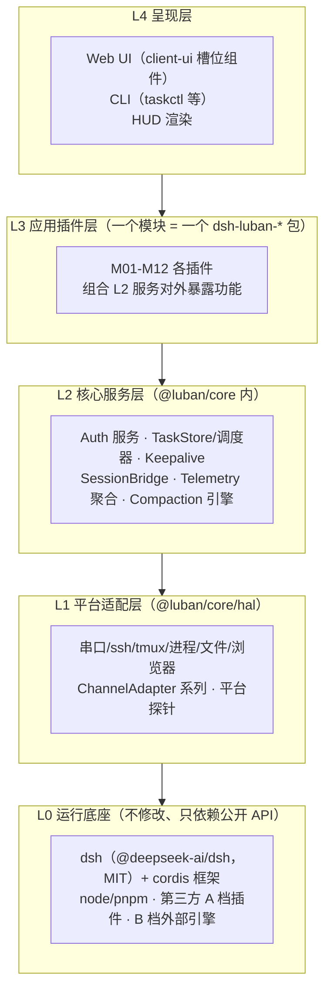
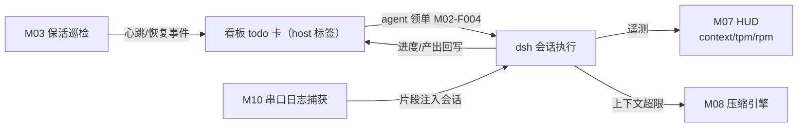

# 总体架构与分层设计

## 版本记录

| 版本 | 日期       | 作者  | 变更说明                                  |
| ---- | ---------- | ----- | ----------------------------------------- |
| v0.1 | 2026-08-29 | Maintainers | 初稿：L0-L4 分层、模块矩阵、双端公用原则 |

## 1. 分层模型（L0-L4）

分层是本项目的第一原则：**依赖只能自上而下，横向协作必须经由契约**（详见 [02-principles](../02-principles/principles.md)）。

| 层 | 职责 | 形态 | 禁止事项 |
| --- | --- | --- | --- |
| L0 | dsh 本体、cordis、运行时、A 档原版插件、B 档外部引擎 | 外部依赖 | 不修改、不 fork、不内联其代码 |
| L1 | 收口一切平台差异：串口、ssh、tmux、进程、文件路径、浏览器 | `@luban/core/hal` | 不出现业务语义 |
| L2 | 纯逻辑服务：认证、任务状态机、调度、遥测聚合、压缩 | `@luban/core/services` | 不直接触 API/平台调用（经 L1） |
| L3 | dsh 插件包：把 L2 服务装配成 dsh 可挂载的功能 | `packages/dsh-luban-*` | 不绕过 L2 直接写存储 |
| L4 | Web 组件（client-ui 槽位）、CLI、HUD 渲染 | 各插件 `client/` 段 | 不含业务规则 |

## 2. 与 dsh 的对接机制（已核实）

- 每个插件是一个 npm 包，`package.json` 携带 `dsh` 字段：`engines.dsh`（版本对齐）、`bundle.patch`（指向随包的 `cordis.patch.yml`）、`client.inject`（web 端注入 client-runtime/locale/ui-slots）。
- 挂载：profile 的 `package.json` 依赖本包 → `dsh.profile.bundles` 有序追加 → 热启停靠 profile 的 `cordis.patch.yml` 写 `disabled`（约 1s HMR 生效）。
- 插件配置一律放在 patch 条目的 `config:` 段（顶层字段会被静默忽略，这是 cordis-plugin-loader 的已核实行为）。

## 3. 模块矩阵（双端公用 vs 平台专属）

| 模块 | 名称 | 层 | 平台属性 | 需求 |
| --- | --- | --- | --- | --- |
| M01 | auth 局域网认证 | L2+L3 | **双端公用** | R01, R10 |
| M02 | taskboard 任务看板 + 自主调度 | L2+L3+L4 | **双端公用**（任务带 host 标签） | R03 |
| M03 | keepalive 保活 | L1+L2 | 双端公用（tmux=ubuntu，计划任务/服务=win，经 HAL 收口） | R02 |
| M04 | plan 工作模式 | L2+L3 | 双端公用 | R05 |
| M05 | session-share 会话共享 | L2+L3 | 双端公用 | R06 |
| M06 | image-paste 粘贴图片 | L3+L4 | 双端公用 | R07 |
| M07 | HUD | L2+L4 | 双端公用 | R08 |
| M08 | context 上下文压缩 | L2 | 双端公用 | R09 |
| M09 | server-mode 服务器操作模式 | L3 | **ubuntu 专属** | R10 |
| M10 | win-debug 串口/远程/GDB/adb | L1+L3 | **win 专属** | R11 |
| M11 | browser 浏览器自动化 | L1+L3 | 双端公用（内核选择经 HAL） | R11 |
| M12 | market-release 发布基础设施 | 仓库设施 | 仓库级 | R04 |

**原则**：除 M09/M10 及各模块内标注「平台专属分支」的功能外，一切功能双端同源实现；平台差异只允许出现在 L1 适配器和配置中，不允许出现在 L2/L3 逻辑里。

## 4. 关键数据流

## 5. 部署形态与 profile

- **win-debug profile**：bundles = dsh-base + dsh-web-app + 本套件（M01-M08、M10、M11）+ A 档三插件。
- **ubuntu-server profile**：bundles = dsh-base + dsh-web-app + 本套件（M01-M08、M11）+ M09 + A 档三插件。
- profile 模板由 `scripts/deploy/` 生成（见 05-deployment），不自改官方 preset。

## 6. 开放问题

- dsh client-ui 槽位的完整清单需在 M12-F001 脚手架阶段实测补全（当前仅核实 better-sidebar/market 使用的注入点）。
- HUD 部分指标（tpm/rpm/思考深度）的数据来源 API 需实测；M07 已按「多源 Provider 聚合」设计兜底。
