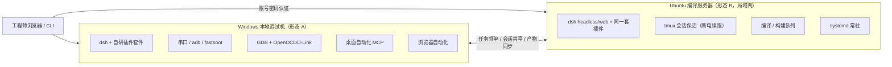

# 愿景与范围（Vision & Scope）

## 版本记录

| 版本 | 日期       | 作者  | 变更说明                          |
| ---- | ---------- | ----- | --------------------------------- |
| v0.1 | 2026-08-29 | Maintainers | 初稿：双模式拓扑、需求清单 R01-R11 |
| v0.2 | 2026-08-30 | Codex | 明确简单账号隔离与不做局域网安全加固 |

## 1. 一句话愿景

为嵌入式工程师提供一套 **DSH 定制工作台**：Windows 本地调试机与局域网 Ubuntu 编译服务器双端协同，任务可被 agent 自主认领推进，人只在关键节点验收。

## 2. 双模式拓扑

- **形态 A（Windows）**：dsh 本机运行；嵌入式的 debug、烧录、串口、adb/fastboot、桌面与浏览器自动化都在这里。
- **形态 B（Ubuntu）**：dsh 以 web/headless profile 常驻局域网服务器；浏览器直接使用网页；tmux 保证电脑重启、SSH 断开后任务继续跑到完成。
- 两端运行**同一套插件实现**（差异只在平台专属模块 M09/M10），通过局域网认证后互操作。

## 3. 原始需求清单（R01-R11，永久编号）

| 编号 | 需求 | 承接模块 |
| --- | --- | --- |
| R01 | Ubuntu 端可直接用网页操作 dsh | M01 认证、M09 服务器模式 |
| R02 | tmux 或其他保活手段；电脑重启后后台继续工作直到完成 | M03 保活 |
| R03 | 任务列表：todo / 执行中 / 已完成 | M02 任务看板 |
| R04 | 通过 GitHub Release 与 npm 发布插件包 | M12 发布基础设施 |
| R05 | plan 工作模式 | M04 plan |
| R06 | Ubuntu 与 Windows 能共享 session 与控制权限 | M05 会话共享 |
| R07 | 粘贴图片让 dsh 能访问 | M06 图片粘贴 |
| R08 | HUD：上下文 used/max/占比、workspace 名、模型、思考深度、tpm、rpm | M07 HUD |
| R09 | Codex 式上下文系统，参考 pi 压缩项目 | M08 上下文压缩 |
| R10 | 一套服务器端（Ubuntu）操作模式 | M09 服务器模式 |
| R11 | 一套 Windows 端操作模式：远程、debug、串口（含 adb/fastboot、桌面自动化） | M10 win-debug、M11 浏览器自动化 |

派生需求：任务看板支持 **agent 半夜自主领单研究**（并入 R03 的 M02 设计）；**browser-use 双端集成**（并入 R11 的 M11）。

## 4. 范围边界

**做**：dsh 插件形态的功能（cordis 插件 + client-ui 注入 + CLI）；双端部署脚本；发布基础设施。

**不做**：修改 dsh 本体或 fork 官方仓库；fork 任何第三方插件（A 档原版直装、C 档只功能参考，见 07-references）；商业化多租户；局域网攻击防护、复杂权限体系、企业身份源或供应链安全证明。

账号系统只服务于个人/小团队的使用边界：每个账号拥有独立的会话与上下文视图，默认不读取或修改其他账号的数据。局域网被视为可信运行环境，项目以功能正确和长时间稳定运行作为优先目标。

## 5. 干系人与使用场景

| 角色 | 场景 |
| --- | --- |
| 工程师（本人） | 白天：看板派活、review agent 产出、串口/GDB 调试 |
| agent（dsh 会话） | 夜间：从看板领 todo → 研究更新 → 回写产出，次日人审 |
| 局域网同事（可选） | 使用独立账号访问 Ubuntu 端网页，使用自己的会话与上下文 |

## 6. 成功判据

1. Ubuntu 端重启后，无需人工干预，未完成任务继续执行直至完成（R02）。
2. 看板上一张写清验收标准的 todo 卡，agent 能在无人值守窗口内领单并产出可 review 的结果（R03 派生）。
3. Win 端一条命令进入串口监视，日志片段可一键送入 dsh 会话分析（R11）。
4. 全部插件以 `dsh-luban-*` 包名发布 npm，并由同版本 GitHub Release 提供制品（R04）。
