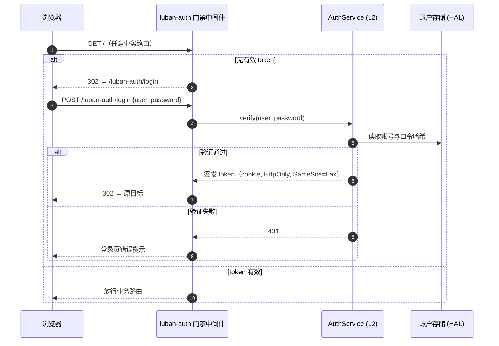

# M01 认证模块（luban-auth）设计

简单本地账号登录与上下文隔离：所有 dsh Web 功能使用统一登录入口，并按账号隔离任务、计划、附件、会话与运行记录。

## 版本记录

| 版本 | 日期       | 作者  | 变更说明                                    |
| ---- | ---------- | ----- | ------------------------------------------- |
| v0.1 | 2026-08-29 | Maintainers | 初稿：账户/会话/门禁/配置/锁定审计 全量设计 |
| v0.2 | 2026-08-30 | Codex | 采用认证 sidecar 保护 DSH 全部 Web 暴露面   |
| v0.3 | 2026-08-30 | Codex | 回填 sidecar、口令哈希与 Cordis 验证证据 |
| v0.4 | 2026-08-30 | Codex | 启动时核对 DSH upstream 地址与端口 |
| v0.5 | 2026-08-30 | Codex | 回填 canonical 登录入口本机验证 |
| v0.6 | 2026-08-30 | Codex | 收敛为简单账号登录与账号上下文隔离，废弃安全加固目标 |
| v0.7 | 2026-08-30 | Codex | 将来源地址降为临时诊断字段，不作为锁定、限速或审计验收 |

## 1. 概述与目标

- **解决**：提供简单本地账号登录；认证后的请求携带稳定 `accountId`，业务数据和 DSH session/context 默认只对所属账号可见、可写。
- **不解决**：局域网内恶意攻击防护、企业级权限治理、OAuth/LDAP 等身份源。公网部署由外层 HTTPS 反代负责。
- **需求映射**：R01（Ubuntu 网页可用）、R10（服务器模式）、R06（M05 控制权交接依赖本模块身份）。
- **平台属性**：双端公用（win/ubuntu 同一实现，M01-F006）。

## 2. 功能清单

| 编号 | 功能 | 优先级 | 里程碑 | 验收口径 |
| --- | --- | --- | --- | --- |
| M01-F001 | 用户账户体系：本地账户文件（yaml/json），口令哈希存储，首启动引导创建账号 | P0 | MS1 | 可创建账号并完成正确/错误口令登录测试 |
| M01-F002 | 登录会话与 token：登录签发 HTTP-only cookie token，可配 TTL，支持登出与全端下线 | P0 | MS1 | token 过期/登出后接口 401 |
| M01-F003 | 认证门禁中间件：未认证请求仅放行登录页/登录 API/静态资源，其余 302/401 | P0 | MS1 | 未登录访问任意业务路由被拦截 |
| M01-F004 | 端口与监听地址配置：`port`、`host` | P0 | MS1 | 改配置后按新地址和端口监听 |
| M01-F005 | **已废弃**：失败锁定、防爆破与安全审计不再作为本项目功能目标 | P1 | MS1 | `dropped`，不再阻塞认证功能 |
| M01-F006 | 双端部署适配：同一实现在 win/ubuntu 运行，差异仅存储路径（经 HAL） | P0 | MS1 | 双端均可启动、登录并访问业务 API |
| M01-F007 | HTTPS/反代适配：支持外层 TLS 终结后的登录跳转与 cookie | P3 | MS4 | 反代场景 cookie/redirect 正确 |
| M01-F008 | 账号上下文隔离：请求传播稳定 `accountId`，任务、计划、附件、会话、HUD/context、构建和浏览器任务默认按账号分区 | P0 | MS1 | alice 创建的数据与 DSH session/context 对 bob 不可见、不可写 |

## 3. 流程图



## 4. 接口设计（契约，详见 04-interfaces）

```typescript
/** AuthService —— L2 核心服务，供 M05/M02 等复用身份 */
export interface AuthService {
  /** sourceIp 只用于当前请求诊断，不参与锁定、限速或业务授权。 */
  verify(user: string, password: string, sourceIp: string): Promise<VerifyResult>;
  issueSession(user: string): Promise<SessionToken>;
  revoke(sessionId: string): Promise<void>;
  revokeAllFor(user: string): Promise<void>;
  /** 门禁中间件工厂：web 请求进入业务前调用 */
  middleware(): AuthMiddleware;
  authenticateRequest(request: IncomingMessage): Promise<RequestActor>;
  onChange(listener: (evt: AuthEvent) => void): Unsubscribe;
}

/** AuthGateway —— LAN 唯一入口；认证后反代内部 loopback DSH WebServer */
export interface AuthGateway {
  start(): Promise<{ publicUrl: string; upstreamUrl: string }>;
  stop(): Promise<void>;
}

export interface VerifyResult {
  ok: boolean;
  reason?: 'bad-credentials' | 'unknown-user';
}

export type AuthEvent =
  | { type: 'login'; user: string; sourceIp: string } // 短期诊断，不作为持久安全审计
  | { type: 'logout'; user: string };
```

## 5. 数据模型

见 `04-interfaces/data-models.md#auth`。要点：账户文件只存 `argon2id` 哈希与盐；token 为随机 256bit，服务端会话表以账号归属和过期时间为功能字段。来源地址仅作临时运行诊断，不是锁定、限速或长期审计需求。

## 6. 配置设计（cordis patch 的 `config:` 段）

```yaml
- insert:
    - id: luban-auth
      name: dsh-luban-auth
      config:
        port: 42600            # 默认端口（可自定义）
        host: 0.0.0.0
        upstream: "http://127.0.0.1:3080"  # DSH WebServer 地址
        sessionTtlHours: 72
        usersFile: "~/.dsh/luban/auth/users.json"   # 经 HAL 解析，win/ubuntu 各自 home
```

## 7. 依赖与边界

- 下层：口令哈希、HAL 文件适配器、Node HTTP/upgrade 反向代理；M02～M11 通过 `AuthService` 取得账号上下文。
- 复用档位：**C 档**——dsh-web-auth/dsh-web-lan-access（社区，license 未核实）仅作需求参考；登录页 UI 原创。
- 平台属性：双端公用。

## 8. 非功能与稳定性

- 账号、会话与账号到 DSH session 的归属表使用原子写；重启后归属不丢失。
- 账号标识由认证服务产生，业务请求不能从 body/query 覆盖 `accountId`。
- 账号数据的 list、单项读取、写入、SSE baseline/replay 均在服务端按 `accountId` 过滤。
- 未绑定账号的旧 session/data 进入显式迁移状态，不自动归给第一个访问者。

## 9. checklist 映射

M01-F001 ~ M01-F008 共 8 项；M01-F005 保留 ID 但状态为 `dropped`。

## 10. 实现与验证记录

- `AuthManager` 已覆盖首启、口令验证、会话过期、登出和全端下线；账户状态使用原子文件更新。
- `AuthSidecar` 代理 HTTP、SSE 与 WebSocket；唯一 canonical 登录入口为 `/luban-auth/login`。
- 后续实现以 `authenticateRequest()` 输出的账号身份作为 M01-F008 的唯一业务归属来源。
- `tests/cordis.integration.test.ts` 使用真实 Cordis Context 验证 `ctx.lubanAuth` 提供与 effect
  卸载；其余测试覆盖首启、登录/过期/登出和账号管理。
- 本机 Edge 已渲染唯一正向入口 `/luban-auth/login`；`/luban/auth/login` 不是支持的路由。
- 本地严格类型、ESLint、Prettier、构建、32 项测试及 pack 清单检查均通过；仍需在真实 Ubuntu
  profile 完成启动、登录和业务 API smoke，可选反代兼容性另行抽查。

## 11. 开放问题

- 旧版全局数据如何由用户显式迁移到某个账号；迁移不得通过首次读取隐式认领。
