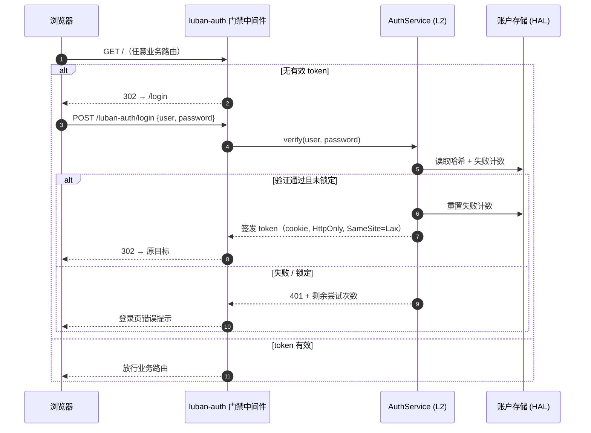

# M01 认证模块（luban-auth）设计

局域网访问的账号密码认证门禁：所有 dsh web 暴露面（双端）在 LAN 场景下的统一登录入口，端口与监听地址可配。

## 版本记录

| 版本 | 日期       | 作者  | 变更说明                                    |
| ---- | ---------- | ----- | ------------------------------------------- |
| v0.1 | 2026-08-29 | Maintainers | 初稿：账户/会话/门禁/配置/锁定审计 全量设计 |
| v0.2 | 2026-08-30 | Codex | 采用认证 sidecar 保护 DSH 全部 Web 暴露面   |

## 1. 概述与目标

- **解决**：dsh web profile 默认无认证暴露在局域网（社区同类插件 dsh-web 的 LAN 模式即无认证）；任何浏览器先登录才能使用看板、会话等功能。DSH 内部 WebServer 固定 loopback，M01 sidecar 是唯一 LAN 入口并代理全部 HTTP/WebSocket/SSE 流量。
- **不解决**：公网暴露（明确不支持，公网场景交给 HTTPS 反代 + M01-F007）；OAuth/LDAP 等企业级身份源。
- **需求映射**：R01（Ubuntu 网页可用）、R10（服务器模式）、R06（M05 控制权交接依赖本模块身份）。
- **平台属性**：双端公用（win/ubuntu 同一实现，M01-F006）。

## 2. 功能清单

| 编号 | 功能 | 优先级 | 里程碑 | 验收口径 |
| --- | --- | --- | --- | --- |
| M01-F001 | 用户账户体系：本地账户文件（yaml/json），口令 argon2id 哈希存储，首启动引导创建管理员 | P0 | MS1 | 明文口令不出现在任何存储与日志中 |
| M01-F002 | 登录会话与 token：登录签发 HTTP-only cookie token，可配 TTL，支持登出与全端下线 | P0 | MS1 | token 过期/登出后接口 401 |
| M01-F003 | 认证门禁中间件：未认证请求仅放行登录页/登录 API/静态资源，其余 302/401 | P0 | MS1 | 未登录访问任意业务路由被拦截 |
| M01-F004 | 端口与监听地址配置：`port`、`host`（默认 0.0.0.0）、可选绑定网段白名单 | P0 | MS1 | 改配置后按新端口监听 |
| M01-F005 | 失败锁定与审计：连续失败 N 次锁定 M 分钟；审计日志记录时间/用户/来源 IP/结果（不含口令） | P1 | MS1 | 爆破场景被锁定并留痕 |
| M01-F006 | 双端部署适配：同一实现在 win/ubuntu 运行，差异仅存储路径（经 HAL） | P0 | MS1 | 双端 CI 均通过 |
| M01-F007 | HTTPS/反代适配：`trustProxy` 选项与反向代理头识别，支持外层 TLS 终结 | P3 | MS4 | 反代场景 cookie/redirect 正确 |

## 3. 流程图



## 4. 接口设计（契约，详见 04-interfaces）

```typescript
/** AuthService —— L2 核心服务，供 M05/M02 等复用身份 */
export interface AuthService {
  verify(user: string, password: string, sourceIp: string): Promise<VerifyResult>;
  issueSession(user: string): Promise<SessionToken>;
  revoke(sessionId: string): Promise<void>;
  revokeAllFor(user: string): Promise<void>;
  /** 门禁中间件工厂：web 请求进入业务前调用 */
  middleware(): AuthMiddleware;
  onChange(listener: (evt: AuthEvent) => void): Unsubscribe;
}

/** AuthGateway —— LAN 唯一入口；认证后反代内部 loopback DSH WebServer */
export interface AuthGateway {
  start(): Promise<{ publicUrl: string; upstreamUrl: string }>;
  stop(): Promise<void>;
}

export interface VerifyResult {
  ok: boolean;
  reason?: 'bad-credentials' | 'locked' | 'unknown-user';
  retryAfterSec?: number;
}

export type AuthEvent =
  | { type: 'login'; user: string; sourceIp: string }
  | { type: 'logout'; user: string }
  | { type: 'lockout'; user: string; sourceIp: string };
```

## 5. 数据模型

见 `04-interfaces/data-models.md#auth`。要点：账户文件只存 `argon2id` 哈希与盐；token 为随机 256bit，服务端存会话表（含过期与来源）。

## 6. 配置设计（cordis patch 的 `config:` 段）

```yaml
- insert:
    - id: luban-auth
      name: dsh-luban-auth
      config:
        port: 42600            # 默认端口（可自定义）
        host: 0.0.0.0
        upstream: "http://127.0.0.1:3080"  # 内部 DSH WebServer，必须仅 loopback
        sessionTtlHours: 72
        maxFailures: 5         # 连续失败锁定阈值
        lockoutMinutes: 15
        usersFile: "~/.dsh/luban/auth/users.yaml"   # 经 HAL 解析，win/ubuntu 各自 home
```

## 7. 依赖与边界

- 下层：argon2（哈希）、HAL 文件适配器、Node HTTP/upgrade 反向代理；上层的 M05 权限分级复用 `AuthService`。
- 复用档位：**C 档**——dsh-web-auth/dsh-web-lan-access（社区，license 未核实）仅作需求参考；登录页 UI 原创。
- 平台属性：双端公用。

## 8. 非功能与安全

- 口令策略：最少 8 位；账户文件权限 0600（win 下 ACL 提示）。
- 登录接口限速（每 IP 每分钟 ≤ 10 次）+ 恒定时间比较防时序侧信道。
- 审计日志滚动保留 30 天；日志不含口令与 token 原文（P6.4）。
- 明确的部署警告：LAN 明文 HTTP 有风险，公网必须走 TLS 反代（M01-F007）。

## 9. checklist 映射

M01-F001 ~ M01-F007 共 7 项，与 `checklist.json` 一一对应（脚本校验）。

## 10. 开放问题

- **已决**：DSH 0.1.1 的 `WebServer` 无全局 middleware，普通插件无法拦截既有 exact/prefix/fallback 路由；采用本模块 sidecar + 内部 loopback DSH 的部署形态。M12-F001 必须验证 `/api` WebSocket、SSE、插件 bundle 与 SPA fallback 均可透传。
- 是否需要多管理员/只读账户：M05-F004 权限分级落地时统一设计角色表。
