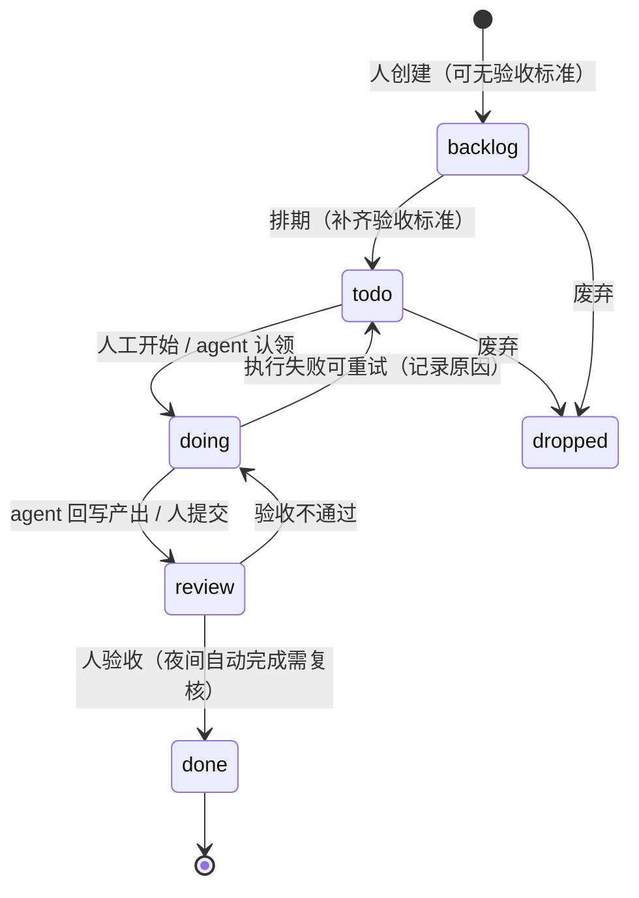
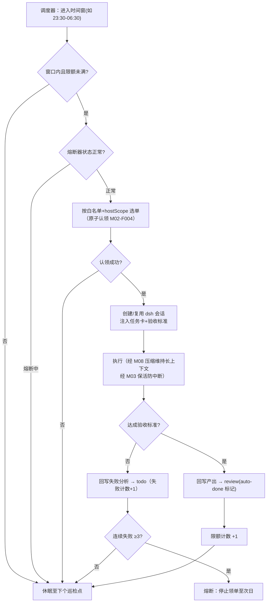

# M02 任务看板与自主调度模块（luban-taskboard）设计

本项目最核心模块：既是人用的任务看板（todo/执行中/已完成），也是 **agent 可自主领单的工作队列**——agent 在无人值守窗口（如半夜）自己挑任务、研究、回写产出，次日人审。

## 版本记录

| 版本 | 日期       | 作者  | 变更说明                                                     |
| ---- | ---------- | ----- | ------------------------------------------------------------ |
| v0.1 | 2026-08-29 | Maintainers | 初稿：看板/范围标签/领单/夜间调度/回写复核/CLI/导入 全量设计 |
| v0.2 | 2026-08-30 | Codex | 回填 rc2 AgentRegistry 适配、认证 API、实现与测试证据 |

## 1. 概述与目标

- **解决**：R03 的任务管理 + 派生需求「agent 半夜自主找未完成/todo 项目去研究更新」。任务不是静态卡片，而是**机器可消费的工作单元**：有验收标准、可原子认领、有并发防护、有产出回写闭环。
- **不解决**：项目管理的甘特图/依赖图；跨机任务同步（MS4 前两端各自独立账本，M05-F002 落地后再议聚合视图）。
- **需求映射**：R03。
- **平台属性**：双端公用；任务通过 `hostScope` 标签区分归属（win 挂 debug/串口类，ubuntu 挂编译/优化类），**同一实现、各自账本**。

## 2. 功能清单

| 编号 | 功能 | 优先级 | 里程碑 | 验收口径 |
| --- | --- | --- | --- | --- |
| M02-F001 | 任务 CRUD 与状态机：六列 `backlog/todo/doing/review/done/dropped`，迁移规则引擎校验 | P0 | MS1 | 非法迁移被拒绝并提示 |
| M02-F002 | 看板 Web UI：列视图、拖拽、按 host/workspace/标签过滤，移动端可用 | P0 | MS1 | 拖拽改状态即时落盘 |
| M02-F003 | 任务范围标签：`hostScope`（win/ubuntu/any）、`workspace`、`priority`、`acceptance`（验收标准，agent 领单前置条件） | P0 | MS1 | 无验收标准的任务不可被 agent 认领 |
| M02-F004 | agent 领单 API：按过滤条件原子认领（乐观锁版本号 + CAS），绑定 dsh 会话，防双端抢占 | P1 | MS2 | 并发认领只有一方成功 |
| M02-F005 | 夜间自主调度器：时间窗、每日限额、任务白名单、失败熔断，窗口内自动选单→建会话→执行 | P2 | MS3 | 窗口外不执行；熔断后次日恢复 |
| M02-F006 | 产出回写与次日复核：执行产出（笔记/commit/产物路径）回写任务卡；夜间完成的卡打 `auto-done` 标记，人复核后转正 | P2 | MS3 | 次日人可一眼区分人工完成与夜间自动完成 |
| M02-F007 | SSE 事件广播：任务/评论/状态变更实时推送到看板，断线重连全量刷新 | P1 | MS2 | 双浏览器同看实时一致 |
| M02-F008 | taskctl CLI：与 Web 同源 HTTP API 的命令行（list/add/claim/update/done） | P2 | MS2 | CLI 与 UI 操作互见 |
| M02-F009 | 数据导入器：dashi-taskboard / cloader 导出 JSON → luban 格式一次性导入 | P3 | MS2 | 导入报告（成功/跳过/失败） |
| M02-F010 | 存储层：JSON 文件存储（默认，git-diff 友好）+ 存储适配器接口（后续可换 SQLite） | P0 | MS1 | 崩溃后文件不损坏（原子写） |

## 3. 流程图

### 3.1 任务状态机



### 3.2 夜间自主循环（核心场景）



## 4. 接口设计

```typescript
/** TaskStore —— L2 核心服务（契约详见 04-interfaces/api-overview.md） */
export interface TaskStore {
  create(input: TaskCreateInput): Promise<Task>;
  update(id: TaskId, patch: TaskPatch, expectedVersion: number): Promise<Task>; // 乐观锁
  transition(id: TaskId, to: TaskStatus, actor: Actor, note?: string): Promise<Task>;
  get(id: TaskId): Promise<Task | null>;
  query(filter: TaskQuery): Promise<Task[]>;
  subscribe(listener: (evt: TaskEvent) => void): Unsubscribe; // SSE 的数据源
}

/** AgentClaimService —— agent 领单 */
export interface AgentClaimService {
  /** 原子认领：过滤 → CAS 置 doing → 绑定会话；并发安全 */
  claim(filter: ClaimFilter, session: ClaimSession): Promise<ClaimResult>;
  /** 执行完毕回写产出并转 review */
  reportProgress(id: TaskId, progress: TaskProgress): Promise<void>;
  complete(id: TaskId, output: TaskOutput, opts: { autoDone: boolean }): Promise<Task>;
  fail(id: TaskId, reason: string): Promise<void>;
}

/** NightScheduler —— M02-F005 */
export interface NightScheduler {
  start(): void;
  status(): SchedulerStatus;   // { windowActive, quotaUsed, circuit: 'ok'|'open' }
  triggerOnce(): Promise<void>; // 手动触发一轮（供 CLI/调试）
}
```

## 5. 数据模型

见 `04-interfaces/data-models.md#task`。要点字段：`hostScope`、`workspace`、`acceptance`（验收标准 markdown）、`version`（乐观锁）、`claim`（认领会话/时间）、`outputs[]`（产出引用）、`autoDone`、`nightRunId`。

## 6. 配置设计

```yaml
- insert:
    - id: luban-taskboard
      name: dsh-luban-taskboard
      config:
        store: { type: json, dir: "~/.dsh/luban/taskboard" }
        hostScope: auto          # auto=按当前机器类型推断；可强制 win/ubuntu
        claim:
          requireAcceptance: true  # 无验收标准不可被 agent 领
        night:
          enabled: false           # 默认关闭，显式开启（P6 安全默认）
          window: "23:30-06:30"
          dailyQuota: 5
          hostScopeWhitelist: ["ubuntu"]   # 夜间只跑编译服务器侧任务
          tagWhitelist: ["auto-ok"]        # 仅白名单标签任务可夜间领
          circuitBreaker: { maxConsecutiveFailures: 3 }
```

## 7. 依赖与边界

- 下层：M01 认证（写操作需登录）、HAL 文件适配器；协作：M03（夜间执行的保活）、M08（长任务压缩）、M11（浏览器类任务自动执行）。
- 复用档位：**C 档**——dashi-taskboard（Apache-2.0，只参考功能：任务版本化乐观锁、SSE 广播、CLI 与 UI 同源）、cloader/dsh-taskboard（认领-验收流，license 待核实）、maochiy/dsh-taskboard-plugin（六列交互，license 待核实）。全部只读其公开文档，实现原创。
- 平台属性：双端公用。

## 8. 非功能与安全

- 存储原子写（tmp + rename）；账本文件每日滚动备份保留 7 份。
- 夜间模式默认**关闭**；白名单 + 限额 + 熔断三重防失控；夜间会话使用的模型与工具范围单独配置。
- 所有写操作经 M01 认证；审计日志记录 actor（人 / agent 会话 id）。

## 9. checklist 映射

M02-F001 ~ M02-F010 共 10 项，与 `checklist.json` 一一对应。

## 10. 实现与验证记录

- Host 使用 DSH `0.1.1-rc.2` 已发布的 `AgentRegistry.create()`、`followup()` 与
  `whenIdle()`；每轮结束释放活动 handle，会话 id 与产出引用保留在任务账本。
- Host API 统一挂载在 `/luban-taskboard`，所有入口复用 M01 身份，写请求由外层
  sidecar 校验 Origin/`x-luban-csrf`。Web 与 CLI 不自行复制认证逻辑。
- `tests/task-store.test.ts` 覆盖状态机、版本冲突、并发原子认领、回写复核、失败与
  幂等导入；`tests/scheduler.test.ts` 覆盖时间窗、限额、白名单、熔断次日恢复与 rc2
  agent 适配；`tests/http-api.test.ts` 覆盖鉴权 CRUD、导入、实时 SSE 与断档基线；
  `tests/client-cli.test.ts` 覆盖客户端槽位、拖拽写 API 与 CLI 同源调用。
- 发布包生成 Host ESM、`taskctl` 与 rc2 lazy-CJS `client.js`/`client.d.ts`；夜间模式
  继续默认关闭，真实无人值守执行需在目标 profile 进行部署验收后才启用。

## 11. 开放问题

- 多机聚合视图：等 M05 落地后按需在 MS4+ 评估。
