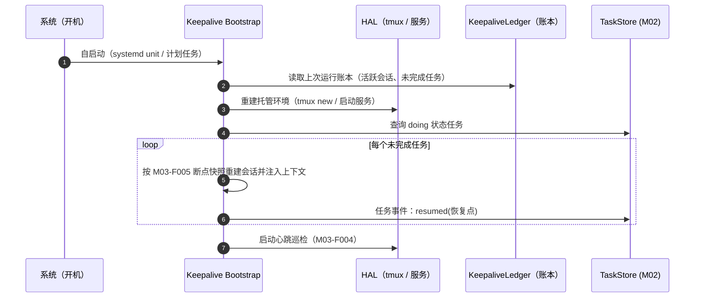

# M03 保活模块（luban-keepalive）设计

保证 dsh 任务在断连、注销、重启后**继续工作直到完成**：Ubuntu 用 tmux，Windows 用计划任务/后台服务，差异经 HAL 收口。

## 版本记录

| 版本 | 日期       | 作者  | 变更说明                                    |
| ---- | ---------- | ----- | ------------------------------------------- |
| v0.1 | 2026-08-29 | Maintainers | 初稿：tmux 托管/win 保活/重启恢复/巡检/断点 |
| v0.2 | 2026-08-30 | Codex | 回填双平台 HAL、持久恢复与检查点实现验证 |
| v0.3 | 2026-08-30 | Codex | 接通异常健康事件到 M07 HUD 的脱敏实时投影 |
| v0.4 | 2026-08-30 | Codex | 增加可恢复里程碑执行器与跳过已完成步骤验证 |
| v0.5 | 2026-08-30 | Codex | 补齐卸载排空与 Windows 原生只读探针验证 |
| v0.6 | 2026-08-30 | Codex | 固化 systemd 精确哨兵强制恢复语义并补 Cordis 生命周期验证 |
| v0.7 | 2026-08-30 | Codex | 增加 Windows 注销/重启分阶段实机验收 |
| v0.8 | 2026-08-30 | Codex | 收敛为保活、恢复与实机功能验收 |
| v0.9 | 2026-08-30 | Codex | 按 heartbeat、boot marker、checkpoint 与 owned cleanup 收口验收口径 |
| v1.0 | 2026-08-30 | Codex | 移除计划任务权限级别证明，只保留保活与恢复功能证据 |
| v1.1 | 2026-08-30 | Codex | 托管会话、断点、健康事件与看板告警保留账号归属 |

## 1. 概述与目标

- **解决**：R02——电脑重启、SSH 断开、窗口关闭后，后台任务继续跑到完成；开机后自动恢复现场。
- **不解决**：进程内状态的无限期保存（配合 M02-F006 产出回写与 M03-F005 断点记录做到续跑）；物理断电期间的任务执行。
- **需求映射**：R02；为 M02 夜间自主循环提供生存基础。
- **平台属性**：双端公用模块，双实现经 HAL 选择（ubuntu=tmux，win=scheduled task / nssm 服务）。

## 2. 功能清单

| 编号 | 功能 | 优先级 | 里程碑 | 验收口径 |
| --- | --- | --- | --- | --- |
| M03-F001 | tmux 会话托管（ubuntu）：`luban-<task>` 命名会话创建/附加/分离/列表，dsh 在 tmux 内运行 | P0 | MS1 | SSH 断开后会话与任务存活 |
| M03-F002 | Windows 保活替代：dsh 注册为计划任务（登录前/开机）或 NSSM 服务；`--patch` 配置不变 | P0 | MS1 | 注销后进程存活 |
| M03-F003 | 重启恢复：开机自启 → 恢复 tmux/服务 → 按账本重建未完成会话 → 续跑 | P0 | MS1 | 重启后无需人工干预 |
| M03-F004 | 心跳巡检与健康上报：周期巡检会话/进程存活，异常写入看板事件 + HUD | P1 | MS1 | 掉线 5 分钟内可见告警 |
| M03-F005 | 长任务断点记录：执行器按里程碑写进度快照（步骤清单 + 当前步骤），恢复后续跑而非重头 | P3 | MS4 | 断点续跑不重复已完成步骤 |

## 3. 流程图（重启恢复）



## 4. 接口设计

```typescript
/** KeepaliveAdapter —— L1 HAL 契约（tmux 实现 / windows-service 实现） */
export interface KeepaliveAdapter {
  create(spec: SessionSpec): Promise<ManagedSession>;
  attach(id: string): Promise<void>;          // 供人接管（本地终端/ssh）
  list(): Promise<ManagedSession[]>;
  isAlive(id: string): Promise<boolean>;
  /** 仅删除账本明确记录为本插件创建的会话；归属不明时保留并提示。 */
  destroy(spec: SessionSpec): Promise<void>;
}

/** KeepaliveService —— L2 */
export interface KeepaliveService {
  ensureAlive(spec: SessionSpec): Promise<ManagedSession>; // 幂等：在则复用
  patrol(): Promise<HealthReport>;                         // 巡检一轮
  onEvent(listener: (evt: KeepaliveEvent) => void): Unsubscribe;
  /** 断点：执行器调用 */
  saveCheckpoint(id: string, cp: Checkpoint): Promise<void>;
  loadCheckpoint(id: string): Promise<Checkpoint | null>;
}

// 新建用户任务的 SessionSpec、ManagedSession、Checkpoint 与 HealthReport row 都携带
// accountId；仅部署维护会话和 M01-F008 之前的旧账本允许缺省。

/** 进程内长任务执行器：currentStep 表示下一个待执行步骤。 */
runCheckpointedTask({
  keepalive,
  sessionId,
  taskId,
  steps,
  signal,
}): Promise<Checkpoint>;
```

## 5. 数据模型

见 `04-interfaces/data-models.md#keepalive`。要点：`ManagedSession`（id、host、kind: tmux|service、ownerTaskId）、`Checkpoint`（stepList、currentStep、artifacts）。

## 6. 配置设计

```yaml
- insert:
    - id: luban-keepalive
      name: '@yin52133/dsh-luban-keepalive'
      config:
        strategy: auto            # auto | tmux | service
        patrolIntervalSec: 60
        ledgerFile: "~/.dsh/luban/keepalive/ledger.json"
        bootRestore: true
        alertToTaskboard: true    # 健康异常写入 M02 事件流
```

`bootRestore` 是 profile 的普通配置。M09 生成的 Ubuntu systemd unit 可注入精确哨兵
`LUBAN_BOOT_RESTORE=1`：即使 profile 配置为 `bootRestore: false`，也会强制执行启动恢复。
只有字符串 `1` 具有该覆盖语义；`true`、`yes`、`01`、带空白的 `1` 等值均不生效。
原配置为 `true` 时不会被其他环境值关闭。

## 7. 依赖与边界

- 下层：HAL（tmux 命令行、Windows `schtasks`/服务控制、进程探针）；协作：M02（健康事件、断点来源任务）、M07（消费健康事件并展示）、M09（systemd 单元由其启动器注册）。
- 复用档位：tmux（B 档外部工具）、NSSM（B 档，license 待核实，可退化为原生 `schtasks`）。
- 平台属性：双端公用（差异全在 HAL）。

## 8. 非功能与稳定性

- 巡检与恢复日志有界，不保存完整会话内容。
- `luban.keepalive.health` 的 `detail` 限长，最多保留 256 个当前异常会话，避免异常风暴拖垮 HUD。
- 账本在 spec、runtime session 与 checkpoint 三处保存同一 `accountId` 并在读写时核对；健康事件与
  TaskStore 告警沿用该账号。缺少账号的旧记录仍可由启动恢复维护，但不会自动进入任一用户的 HUD 或看板。
- 恢复策略幂等：重复调用不产生重复会话；账本损坏时降级为「只列出孤儿会话待人工处理」而非自作主张清理。
- Windows 计划任务采用部署账号可用的启动方式，并记录失败原因以便恢复。

## 9. checklist 映射

M03-F001 ~ M03-F005 共 5 项，与 `checklist.json` 一一对应。

## 10. 开放问题

- 内置里程碑执行器会校验恢复点的 task/有序 step plan，从 `currentStep` 指向的首个未完成步骤继续；
  每步成功后才原子保存下一位置和去重产物。步骤仍须幂等，以覆盖副作用完成但检查点尚未落盘时断电的窗口。
- 终端内容不进入保活账本；需在目标 Ubuntu 主机完成 SSH 断开、重启和真实 tmux attach 验收。
- Windows 采用内置 `schtasks.exe`，不引入 NSSM；需在目标账户完成计划任务注册、注销与开机恢复验收。

## 11. 实现与验证记录

- Linux HAL 以严格 `luban-*` 命名空间管理 tmux 创建、精确探测、附加、列表和销毁；
  shell-command 经过 POSIX 单引号编码，宿主命令均使用参数数组、超时和取消信号。
- Windows HAL 使用当前账户的 ONSTART Scheduled Task，保留原始 DSH
  `--patch` 参数；命令行按 `CommandLineToArgvW` 规则编码，不经过 Node shell。
- 原子账本记录 session spec、账号归属和里程碑检查点；启动时只恢复账本拥有的缺失会话，
  账本损坏时仅报告孤儿而不删除或重建。
- `runCheckpointedTask()` 在恢复时跳过持久化完成步骤，任务或 step plan 不匹配时中止并提示；
  测试覆盖中段恢复、完成后重入、步骤失败不推进和启动前取消。
- 巡检发布带 `accountId` 的 `luban.keepalive.health`，可选 `lubanTaskStore` 在同一账号内告警去重；M07 通过 Cordis
  事件松耦合消费，健康变化立即进入认证 snapshot/SSE，并在 Web 状态栏与 CLI 首行显示。
  有限任务可通过 `release()` 销毁会话并清除账本，供 M09 worker 完成后收口；插件卸载会
  排空在途巡检与告警 sink，返回后不再写入 TaskStore 或发布健康事件。
- 真实 Cordis mount 测试覆盖 HUD 先加载、异常/恢复事件、REST 投影、客户端提示与卸载；
  detail 采用有界摘要，避免异常风暴拖慢响应。
- 真实 Cordis 生命周期测试以 `bootRestore: false` 挂载插件，证明精确环境值
  `LUBAN_BOOT_RESTORE=1` 仍会调用一次 `restore()`；其他类 truthy 文本不会取得强制恢复语义。
- Windows 计划任务的命令构造、UTF-16 XML、状态回读、注销后心跳和恢复流程由自动化测试与实机抽查覆盖。
- Ubuntu 已验证 linger、user systemd、SSH 断连后 heartbeat 继续推进，以及 tmux attach/detach。
- Windows 与 Ubuntu 均已验证重启后的托管会话恢复；日常配置验收优先重启服务，不重复要求整机重启。
- 实机账号、地址、绝对路径、启动标识和临时验收文件只保留在本地运维环境，不写入仓库。
