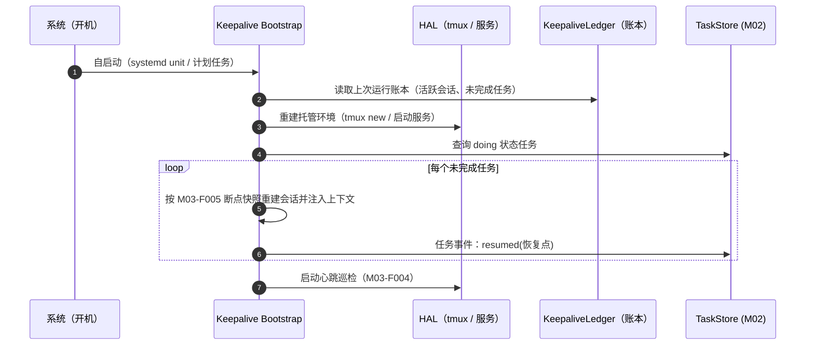

# M03 保活模块（luban-keepalive）设计

保证 dsh 任务在断连、注销、重启后**继续工作直到完成**：Ubuntu 用 tmux，Windows 用计划任务/后台服务，差异经 HAL 收口。

## 版本记录

| 版本 | 日期       | 作者  | 变更说明                                    |
| ---- | ---------- | ----- | ------------------------------------------- |
| v0.1 | 2026-08-29 | Maintainers | 初稿：tmux 托管/win 保活/重启恢复/巡检/断点 |

## 1. 概述与目标

- **解决**：R02——电脑重启、SSH 断开、窗口关闭后，后台任务继续跑到完成；开机后自动恢复现场。
- **不解决**：进程内状态的无限期保存（配合 M02-F006 产出回写与 M03-F005 断点记录做到续跑）；物理断电期间的任务执行。
- **需求映射**：R02；为 M02 夜间自主循环提供生存基础。
- **平台属性**：双端公用模块，双实现经 HAL 选择（ubuntu=tmux，win=scheduled task / nssm 服务）。

## 2. 功能清单

| 编号 | 功能 | 优先级 | 里程碑 | 验收口径 |
| --- | --- | --- | --- | --- |
| M03-F001 | tmux 会话托管（ubuntu）：`luban-<task>` 命名会话创建/附加/分离/列表，dsh 在 tmux 内运行 | P0 | MS1 | SSH 断开后会话与任务存活 |
| M03-F002 | Windows 保活替代：dsh 注册为计划任务（登录前/开机）或 NSSM 服务；`--patch` 配置不变 | P0 | MS1 | 注销后进程存活 |
| M03-F003 | 重启恢复：开机自启 → 恢复 tmux/服务 → 按账本重建未完成会话 → 续跑 | P0 | MS1 | 重启后无需人工干预 |
| M03-F004 | 心跳巡检与健康上报：周期巡检会话/进程存活，异常写入看板事件 + HUD | P1 | MS1 | 掉线 5 分钟内可见告警 |
| M03-F005 | 长任务断点记录：执行器按里程碑写进度快照（步骤清单 + 当前步骤），恢复后续跑而非重头 | P3 | MS4 | 断点续跑不重复已完成步骤 |

## 3. 流程图（重启恢复）



## 4. 接口设计

```typescript
/** KeepaliveAdapter —— L1 HAL 契约（tmux 实现 / windows-service 实现） */
export interface KeepaliveAdapter {
  create(spec: SessionSpec): Promise<ManagedSession>;
  attach(id: string): Promise<void>;          // 供人接管（本地终端/ssh）
  list(): Promise<ManagedSession[]>;
  isAlive(id: string): Promise<boolean>;
  destroy(id: string): Promise<void>;
}

/** KeepaliveService —— L2 */
export interface KeepaliveService {
  ensureAlive(spec: SessionSpec): Promise<ManagedSession>; // 幂等：在则复用
  patrol(): Promise<HealthReport>;                         // 巡检一轮
  onEvent(listener: (evt: KeepaliveEvent) => void): Unsubscribe;
  /** 断点：执行器调用 */
  saveCheckpoint(id: string, cp: Checkpoint): Promise<void>;
  loadCheckpoint(id: string): Promise<Checkpoint | null>;
}
```

## 5. 数据模型

见 `04-interfaces/data-models.md#keepalive`。要点：`ManagedSession`（id、host、kind: tmux|service、ownerTaskId）、`Checkpoint`（stepList、currentStep、artifacts）。

## 6. 配置设计

```yaml
- insert:
    - id: luban-keepalive
      name: dsh-luban-keepalive
      config:
        strategy: auto            # auto | tmux | service
        patrolIntervalSec: 60
        ledgerFile: "~/.dsh/luban/keepalive/ledger.json"
        bootRestore: true
        alertToTaskboard: true    # 健康异常写入 M02 事件流
```

## 7. 依赖与边界

- 下层：HAL（tmux 命令行、Windows `schtasks`/服务控制、进程探针）；协作：M02（健康事件、断点来源任务）、M09（systemd 单元由其启动器注册）。
- 复用档位：tmux（B 档外部工具）、NSSM（B 档，license 待核实，可退化为原生 `schtasks`）。
- 平台属性：双端公用（差异全在 HAL）。

## 8. 非功能与安全

- 巡检与恢复日志脱敏（不含会话内容，只含元数据）。
- 恢复策略幂等：重复调用不产生重复会话；账本损坏时降级为「只列出孤儿会话待人工处理」而非自作主张清理。
- Windows 计划任务以当前用户或 SYSTEM 运行在部署文档中给出选择建议与安全差异。

## 9. checklist 映射

M03-F001 ~ M03-F005 共 5 项，与 `checklist.json` 一一对应。

## 10. 开放问题

- dsh headless 模式在 tmux 内的输出捕获方式（决定 M03-F005 的断点粒度）。
- Windows 下 NSSM 是否引入：若 `schtasks` 满足需求则不新增依赖（P5.2 最小实现）。
