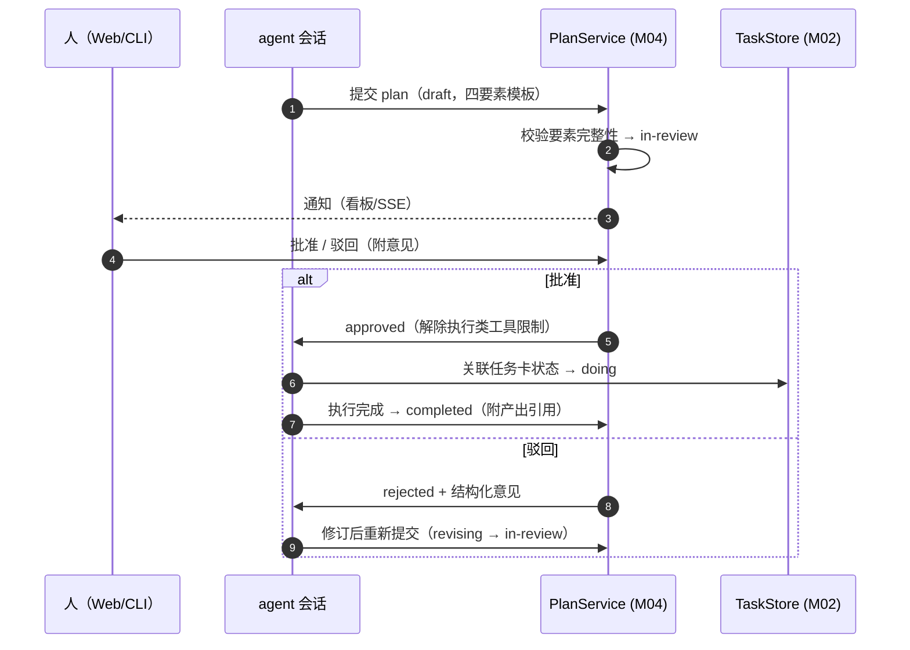

# M04 Plan 工作模式模块（luban-plan）设计

在动手改代码前先出计划、人批准后再执行的工作模式：plan 文档化、可审批、可追溯，并与任务看板打通。

## 版本记录

| 版本 | 日期       | 作者  | 变更说明                                    |
| ---- | ---------- | ----- | ------------------------------------------- |
| v0.1 | 2026-08-29 | Maintainers | 初稿：状态机/落盘/审批交互/模板与检查单     |
| v0.2 | 2026-08-30 | Codex | 回填 rc2 工具门禁、认证审批链路与实现验证   |
| v0.3 | 2026-08-30 | Codex | 补齐任务卡文档直达与 Web 四要素修订交互验证 |
| v0.4 | 2026-08-30 | Codex | 补齐 canonical/junction 路径身份与 Cordis 验证 |
| v0.5 | 2026-08-30 | Codex | 补齐驳回反馈进入持久会话及重放的直接证据 |
| v0.6 | 2026-08-30 | Codex | 非功能口径改为稳定性，并补充账号默认隔离 |

## 1. 概述与目标

- **解决**：R05——重要变更先 plan 后执行；夜间自主任务（M02-F005）也先 plan 再动手，便于次日复核。
- **不解决**：替 dsh 内建的工具审批机制（不 hack L0）。
- **需求映射**：R05。
- **平台属性**：双端公用。

## 2. 功能清单

| 编号 | 功能 | 优先级 | 里程碑 | 验收口径 |
| --- | --- | --- | --- | --- |
| M04-F001 | plan 模式状态机：`draft → in-review → approved → executing → completed`（+`rejected`/`revising`），约束会话行为：非 approved 不允许执行类工具 | P2 | MS3 | 状态迁移非法时拒绝并提示 |
| M04-F002 | plan 文档落盘与引用：plan 存为 workspace 内 `docs/plans/<date>-<slug>.md`，任务卡/会话可引用其路径 | P2 | MS3 | plan 可从看板卡直达 |
| M04-F003 | 审批交互：Web UI 批准/驳回/修订意见回传会话；agent 收到结构化反馈 | P2 | MS3 | 驳回意见进入会话上下文 |
| M04-F004 | plan 模板与检查清单：影响范围/修改位置/验证方式四要素模板（源自全局工作规约），缺失要素时提醒 | P3 | MS3 | 模板生成的 plan 四要素齐全 |

## 3. 流程图



## 4. 接口设计

```typescript
export interface PlanService {
  submit(input: PlanInput): Promise<Plan>;                 // agent 或人提交
  decide(id: PlanId, decision: PlanDecision, reviewer: Actor): Promise<Plan>;
  get(id: PlanId): Promise<Plan | null>;
  listFor(taskId?: TaskId): Promise<Plan[]>;
  /** 会话行为门禁：工具调用前询问（agent 侧适配器） */
  guard(): PlanGuard;
}
export interface PlanGuard {
  assertExecutable(tool: string, plan: Plan | null): { ok: boolean; reason?: string };
}
```

## 5. 数据模型

见 `04-interfaces/data-models.md#plan`。要点：四要素（背景/影响范围/修改位置/验证方式）、关联 `taskId`、`decisions[]` 审批历史。

## 6. 配置设计

```yaml
- insert:
    - id: luban-plan
      name: dsh-luban-plan
      config:
        plansDir: "docs/plans"          # 相对 workspace
        requireApprovalFor: ["edit", "bash", "write"]   # 受门禁工具清单
        autoApproveFor: []              # 夜间模式下可豁免的工具（默认空）
        template: bundled-default
```

## 7. 依赖与边界

- 下层：无（纯 L2 状态机 + 文档落盘）；协作：M02（plan 与任务卡互链）、M01（审批人身份）。
- 复用档位：**C 档**——参考 dsh/codex 类工具的 plan-approve 交互模式（需求级），实现原创。
- 平台属性：双端公用。

## 8. 非功能与稳定性

- plan 文档属于 workspace 仓库内容，遵循用户现有 git 流程；索引、列表、文档和审批默认按 `accountId` 隔离。
- 夜间自主任务的 plan 审批策略单独配置（默认：夜间任务必须有 plan，但「执行豁免清单」为空，即全走人审——若无人在线则只做研究不落改动，M02-F006 复核时一并处理）。

## 9. checklist 映射

M04-F001 ~ M04-F004 共 4 项，与 `checklist.json` 一一对应。

## 10. 开放问题

- 已使用 DSH `0.1.1-rc.2` 的单调 `ctx.tools.guard()` 挂接工具门禁；目标 DSH Web profile
  的浏览器交互仍作为部署 smoke test 保留，不影响下述显式验收证据。

## 11. 实现与验证记录

- `PlanRepository` 以原子 JSON 索引为事实源，在 workspace 内生成私有权限 Markdown 投影；
  路径必须留在目标 workspace；同日同 slug 不覆盖既有文档，乐观版本冲突会明确返回错误。
- `FilePlanService` 实现完整状态机、四要素校验、审批历史、会话当前 plan 以及可选
  `lubanTaskStore` 联动；批准 `todo` 关联任务时推进为 `doing`。
- 真实 `FilePlanService` 的 submit/reject 事件经 rc2 `AgentRegistry` 写入目标 `Session`/`Inbox`
  的持久 `next-turn`，驳回意见同时进入 next-step 状态；新建会话视图可从
  `agent/inbox/spliced` 事件重放，且非目标会话保持隔离。
- `/luban-plan` 提供认证 REST/SSE API，Settings lazy-CJS 客户端提供提交、批准、驳回、
  `rejected/revising` 四要素修订和文档入口；修订携带当前 `expectedVersion`，冲突错误进入页面告警。
- M02 看板通过现有 `GET /luban-plan/plans` 与共享 `taskId` 归组关联项，任务卡直接打开对应的认证
  Markdown 文档端点；未安装 M04 时的 404 作为无关联项降级，不引入包级耦合。
- 真实 Cordis mount 覆盖 rc2 `ctx.tools.guard()`、AgentRegistry 反馈和客户端路由；本地 Prettier、
  ESLint、严格类型检查、构建及 18 项测试通过。测试覆盖真实 HTTP `reject → revise → in-review`
  状态/版本/冲突、React 修订控件与路径身份防护，未调用外部服务。
