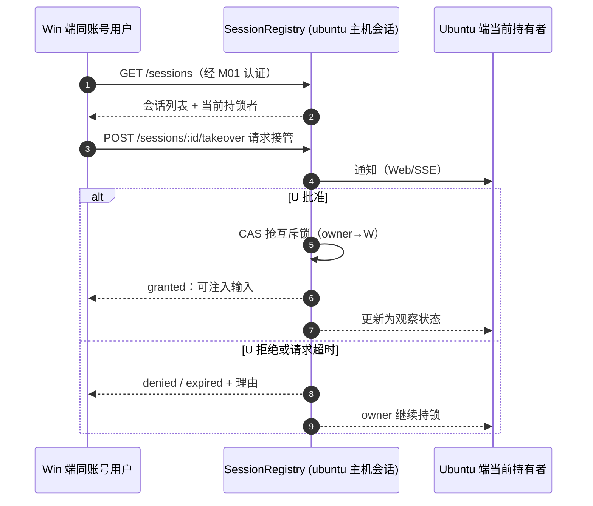

# M05 会话共享模块（luban-session-share）设计

让 Windows 与 Ubuntu 两侧对同一 dsh 会话建立共享视图：一方能观察另一方的会话，必要时请求控制权交接（互斥）。

## 版本记录

| 版本 | 日期       | 作者  | 变更说明                              |
| ---- | ---------- | ----- | ------------------------------------- |
| v0.1 | 2026-08-29 | Maintainers | 初稿：注册表/控制权交接/状态同步/权限 |
| v0.2 | 2026-08-30 | Codex | 回填 rc2 注册表、认证联邦与 SSE 验证证据 |
| v0.3 | 2026-08-30 | Codex | 补齐双 loopback peer 联邦与控制权链路验证 |
| v0.4 | 2026-08-30 | Codex | 改为账号默认会话隔离，废弃三级权限功能 |
| v0.5 | 2026-08-30 | Codex | 落实强制账号契约、late-bind 恢复与 SSE/peer 隔离验证 |

## 1. 概述与目标

- **解决**：R06——同一账号可在 Windows 与 Ubuntu 查看自己的 session 并交接控制权；其他账号默认不可见。显式跨账号共享另行设计。
- **不解决**：会话内容跨机迁移执行（会话进程仍在原主机；共享的是**视图与控制权**，不是进程搬家）。
- **需求映射**：R06。
- **平台属性**：双端公用；依赖 M01 认证与 M03 托管会话。

## 2. 功能清单

| 编号 | 功能 | 优先级 | 里程碑 | 验收口径 |
| --- | --- | --- | --- | --- |
| M05-F001 | 会话注册表：按账号显示双端会话清单（host 归属、任务关联、健康状态） | P3 | MS4 | 同一账号两侧互见，其他账号不可见 |
| M05-F002 | 跨机控制权交接：观察 → 请求接管 → 对方批准/超时自动 → 互斥锁保证同一会话同一时刻只有一个操作者 | P3 | MS4 | 并发接管请求被互斥拒绝 |
| M05-F003 | 会话状态同步：会话事件流（输出片段/状态变化）向观察端转发，断线重连补发 | P3 | MS4 | 观察端重连后补齐缺失片段 |
| M05-F004 | **已废弃**：`owner / operator / observer` 三级权限不再作为功能目标 | P3 | MS4 | `dropped`，不再阻塞会话共享 |

## 3. 流程图（控制权交接）



## 4. 接口设计

```typescript
export interface SessionRegistry {
  list(accountId: AccountId, filter?: { host?: HostId; taskId?: TaskId }): Promise<SharedSession[]>;
  subscribe(id: SessionId, accountId: AccountId): AsyncIterable<SessionEvent>; // 同账号观察流
  requestTakeover(id: SessionId, by: AccountActor): Promise<TakeoverResult>;
  release(id: SessionId, by: AccountActor): Promise<void>;
  onRegistryChange(accountId: AccountId, listener: (evt: RegistryEvent) => void): Unsubscribe;
}
```

## 5. 数据模型

见 `04-interfaces/data-models.md#session`。要点：`SharedSession`（host、accountId、ownerTaskId、controlHolder）、`TakeoverRequest`（超时策略字段）。

## 6. 配置设计

```yaml
- insert:
    - id: luban-session-share
      name: dsh-luban-session-share
      config:
        host: auto
        ownerUser: owner          # 测试/旧装配 fallback；生产归属只读取 M01 session map
        takeoverTimeoutSec: 120
        peerRefreshSec: 10
        requestTimeoutSec: 10
        replayLimit: 256
        peers:                    # 局域网对端（互指）
          - name: win-debug
            baseUrl: "http://<win-lan-host>:42600"
            credentialEnv: LUBAN_SESSION_SHARE_WIN_COOKIE
```

## 7. 依赖与边界

- 下层：M01（认证与身份）、M03（托管会话句柄）、HAL（跨机 HTTP 客户端）；协作：M02（会话↔任务互链）。
- 复用档位：无直接参考项目，原创设计；SSE 转发参考自身 M02-F007 机制。
- 平台属性：双端公用。

## 8. 非功能与稳定性

- 会话注册时持久记录 `accountId`；列表、事件、接管与输入默认只对同一账号开放。
- 控制权交接需对端确认；超时保持原持有者，CAS 与 per-session mutex 防止双端同时取得控制权。
- 只共享 `AgentRegistry.roots()` 返回的 live 顶层 Agent；durable lineage 不作为 runtime ownership，
  同时保留 `header.origin !== subagent` 的 durable fence；任何非 root 或 durable subagent Agent
  都不进入注册表，也不能由输入桥直接驱动。
- assistant 输出按 turn 使用 64 KiB 有界缓冲；慢订阅者达到队列上限时断开，并通过 `Last-Event-ID` 或 baseline 恢复。

## 9. checklist 映射

M05-F001 ~ M05-F004 共 4 项；M05-F004 保留 ID 但状态为 `dropped`。

## 10. 实现与验证记录

- `DshSessionBridge` 基于 rc2 `AgentRegistry`、`agent/status`、`session/event` 与
  `Agent.followup` 投影顶层会话；生产只注册 M01 session map 已绑定的会话，M02 task claim 触发
  late-bind 重查；旧无归属会话保持不可见，M03 task link 仅在账号一致时合并。
- 本机会话接管在 per-session mutex 内执行账号归属检查、对端确认、过期检查与 version CAS；peer mutation 使用真实 HTTP transport。
- registry 与 per-session SSE 都有有界 replay/baseline；baseline 加载期间的同账号事件先排队再按序发送；
  peer 建连有超时，缺失/冲突 `accountId` 的旧 peer snapshot 被拒绝，单帧上限 1 MiB，
  peer refresh single-flight，dispose/remove 会终止流并释放历史。
- Session ID 在配置的主机间必须全局唯一；跨 registry origin 的碰撞会 fail closed，保留既有条目
  并报告 `session-id-collision`，避免将 stream 或 mutation 路由到错误主机。
- 两个真实 loopback HTTP peer 已跑通 federation 注册、控制权请求/批准和输出同步；
  本地 Prettier、严格类型、ESLint、构建、45 项 M05 测试、release metadata 与 pack dry-run
  通过。真实 Windows/Ubuntu 双主机断线与接管仍保留为目标环境验收。

## 11. 开放问题

- 是否增加显式跨账号共享；当前仅支持同一账号跨主机共享，其他账号默认不可见。
