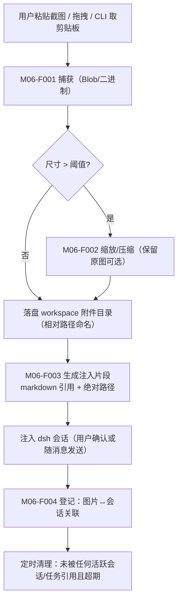

# M06 图片粘贴模块（luban-image-paste）设计

把剪贴板里的截图/图片变成 dsh 可访问的文件：粘贴 → 落盘到 workspace 附件目录 → 以 dsh 可读的路径/引用注入会话。

## 版本记录

| 版本 | 日期       | 作者  | 变更说明                              |
| ---- | ---------- | ----- | ------------------------------------- |
| v0.1 | 2026-08-29 | Maintainers | 初稿：捕获/落盘/注入/预览清理 四功能 |

## 1. 概述与目标

- **解决**：R07——「粘贴图片让 dsh 能访问」：硬件原理图截图、报错弹窗、示波器波形照片等直接进会话分析。
- **不解决**：OCR/图像理解本身（模型能力）；相机扫描类重度图像处理。
- **需求映射**：R07。
- **平台属性**：双端公用（win/ubuntu 同一实现）。

## 2. 功能清单

| 编号 | 功能 | 优先级 | 里程碑 | 验收口径 |
| --- | --- | --- | --- | --- |
| M06-F001 | 剪贴板图片捕获：Web 端 Ctrl+V 粘贴、拖拽文件、CLI `luban-img` 从系统剪贴板取图 | P2 | MS3 | 三种来源均可产出待注入图片 |
| M06-F002 | 图片落盘与命名：存 workspace `<attach-dir>/YYYYMMDD-<slug>-<n>.<ext>`，自动压缩超大图（可配） | P2 | MS3 | 文件在 workspace 内、相对路径可 git 管理 |
| M06-F003 | 会话引用注入：向 dsh 会话注入 `` markdown 与绝对路径两种形式，确认 dsh 工具可读 | P2 | MS3 | 会话中模型能读取该文件 |
| M06-F004 | 预览与清理策略：最近图片条 + 按会话关联清理（N 天后清未引用附件） | P3 | MS3 | 被会话引用的图片不被清理 |

## 3. 流程图



## 4. 接口设计

```typescript
export interface ImageIngestService {
  fromBlob(blob: Blob, meta?: { nameHint?: string }): Promise<IngestedImage>;
  fromClipboard(): Promise<IngestedImage>;              // CLI 场景（经 HAL 剪贴板适配器）
  inject(sessionId: SessionId, img: IngestedImage, style: 'markdown' | 'path'): Promise<void>;
  recent(filter?: { sessionId?: SessionId }): Promise<IngestedImage[]>;
  cleanup(dryRun?: boolean): Promise<CleanupReport>;
}
```

## 5. 数据模型

见 `04-interfaces/data-models.md#image`。要点：`IngestedImage`（相对路径、绝对路径、sha256、来源、引用它的会话集合、创建时间）。

## 6. 配置设计

```yaml
- insert:
    - id: luban-image-paste
      name: dsh-luban-image-paste
      config:
        attachDir: ".luban/attachments"   # 相对 workspace，进 git 可选
        maxSidePx: 2000                    # 超出自动缩放
        retainDays: 14
        injectStyle: markdown
```

## 7. 依赖与边界

- 下层：HAL（文件、剪贴板、图像缩放——优先用系统工具/轻量库，避免重依赖）；上层：dsh web 会话通道。
- 复用档位：无直接参考项目（dsh 官方客户端若有原生粘贴能力则以实测为准，本模块退化为「CLI 取剪贴板 + 注入」补位）。
- 平台属性：双端公用；剪贴板适配器分 win/ubuntu 两实现（HAL）。

## 8. 非功能与安全

- 上传大小限制（默认 ≤ 10MB/张）与类型白名单（png/jpeg/webp）。
- 附件目录可配 `.gitignore`（用户决定是否入库）；清理只动自己目录，绝不碰 workspace 其他文件。

## 9. checklist 映射

M06-F001 ~ M06-F004 共 4 项，与 `checklist.json` 一一对应。

## 10. 开放问题

- dsh 会话注入 API 的确切形态（M12-F001 实测后回填 M06-F003 实现细节）。
