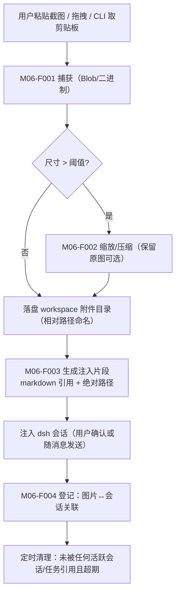

# M06 图片粘贴模块（luban-image-paste）设计

把剪贴板里的截图/图片变成 dsh 可访问的文件：粘贴 → 落盘到 workspace 附件目录 → 以 dsh 可读的路径/引用注入会话。

## 版本记录

| 版本 | 日期       | 作者  | 变更说明                              |
| ---- | ---------- | ----- | ------------------------------------- |
| v0.1 | 2026-08-29 | Maintainers | 初稿：捕获/落盘/注入/预览清理 四功能 |
| v0.2 | 2026-08-30 | Codex | 回填 rc2 注入、附件安全边界与验证证据 |
| v0.3 | 2026-08-30 | Codex | 补齐 Settings 挂载、paste/drop 路由与多文件边界验证 |
| v0.4 | 2026-08-30 | Codex | 补齐 ReactDOM 客户端与真实 Sharp resize 验证 |
| v0.5 | 2026-08-30 | Codex | 增加 mounted live 视觉读图验收与证据边界 |

## 1. 概述与目标

- **解决**：R07——「粘贴图片让 dsh 能访问」：硬件原理图截图、报错弹窗、示波器波形照片等直接进会话分析。
- **不解决**：OCR/图像理解本身（模型能力）；相机扫描类重度图像处理。
- **需求映射**：R07。
- **平台属性**：双端公用（win/ubuntu 同一实现）。

## 2. 功能清单

| 编号 | 功能 | 优先级 | 里程碑 | 验收口径 |
| --- | --- | --- | --- | --- |
| M06-F001 | 剪贴板图片捕获：Web 端 Ctrl+V 粘贴、拖拽文件、CLI `luban-img` 从系统剪贴板取图 | P2 | MS3 | 三种来源均可产出待注入图片 |
| M06-F002 | 图片落盘与命名：存 workspace `<attach-dir>/YYYYMMDD-<slug>-<n>.<ext>`，自动压缩超大图（可配） | P2 | MS3 | 文件在 workspace 内、相对路径可 git 管理 |
| M06-F003 | 会话引用注入：向 dsh 会话注入 `` markdown 与绝对路径两种形式，确认 dsh 工具可读 | P2 | MS3 | 会话中模型能读取该文件 |
| M06-F004 | 预览与清理策略：最近图片条 + 按会话关联清理（N 天后清未引用附件） | P3 | MS3 | 被会话引用的图片不被清理 |

## 3. 流程图



## 4. 接口设计

```typescript
export interface ImageIngestService {
  fromBlob(blob: Blob, meta?: { readonly nameHint?: string }): Promise<IngestedImage>;
  fromClipboard(): Promise<IngestedImage>; // CLI，经固定命令 HAL
  inject(
    sessionId: SessionId,
    image: IngestedImage,
    style: 'markdown' | 'path',
  ): Promise<void>;
  recent(filter?: { readonly sessionId?: SessionId }): Promise<readonly IngestedImage[]>;
  cleanup(dryRun?: boolean): Promise<CleanupReport>;
}
```

## 5. 数据模型

见 `04-interfaces/data-models.md#image`。要点：`IngestedImage`（相对路径、绝对路径、sha256、来源、引用它的会话集合、创建时间）。

## 6. 配置设计

```yaml
- insert:
    - id: luban-image-paste
      name: dsh-luban-image-paste
      config:
        workspaceRoot: .
        attachDir: .luban/attachments
        maxBytes: 10485760
        maxSidePx: 2000
        compression: true
        compressionQuality: 82
        retainDays: 14
        recentLimit: 50
        cleanupIntervalMinutes: 60
        injectStyle: markdown
        clipboardTimeoutMs: 10000
```

## 7. 依赖与边界

- 下层：Node 文件系统、固定参数剪贴板命令和可选 `sharp` peer；上层：M01 认证 WebServer
  与 rc2 `AgentRegistry`/`Agent.followup`。
- Windows 使用固定 `powershell.exe -Sta` 脚本；Ubuntu 只尝试 `wl-paste`、`xclip`，均以参数数组、
  `shell: false`、超时和输出上限执行，其他平台显式拒绝。
- 平台属性：双端公用；剪贴板适配器分 win/ubuntu 两实现（HAL）。

## 8. 非功能与安全

- 上传大小限制（默认 ≤ 10MB/张）与类型白名单（png/jpeg/webp）。
- 附件目录可配 `.gitignore`（用户决定是否入库）；清理只动自己目录，绝不碰 workspace 其他文件。
- `attachDir` 必须是 canonical workspace 子目录；运行期校验目录设备/inode/birthtime 身份，目录被替换、
  symlink 逃逸或文件哈希不符时 fail closed。临时文件用 hard-link 原子发布，启动仅回收满足严格命名与宽限期的孤儿。
- `attachDir` 是插件专用目录，不应混放手工命名文件；孤儿恢复按插件日期命名规则识别陈旧 crash artifact。
- 开启压缩时 `sharp` 必须完成整图解码并验证最终尺寸；仅 metadata 可读的截断图、缺少 peer、解码或缩放失败均不落盘。
- 注入只允许同一 canonical workspace 的 live rc2 root，并额外拒绝 durable `origin=subagent` 与
  `delegationDepth > 0`；不在插件内重建 cold session。

## 9. checklist 映射

M06-F001 ~ M06-F004 共 4 项，与 `checklist.json` 一一对应。

## 10. 实现与验证记录

- `/luban-image-paste` 提供认证上传、最近列表、原图预览、注入、删除与 TTL cleanup；M01 统一处理
  Cookie/CSRF，内部 DSH WebServer 必须保持 loopback。
- Web Settings 客户端通过 `settings.section` 插槽挂载，覆盖 paste/drop、预览、注入、删除和 cleanup；
  多文件输入会跳过类型不符、空文件和超限文件再选择首个合法图片。`luban-img` 从环境读取 Cookie/CSRF，
  可只上传或立即注入 Markdown/绝对路径引用。
- 附件索引记录 SHA-256、压缩报告与 `referencedBy`。注入在 per-image/session mutex 内先登记引用，
  `followup` 失败则回滚；被引用附件无论年龄都不会被自动或手动删除。
- 客户端测试使用真实 ReactDOM/jsdom 覆盖 paste/drop、预览、删除、cleanup 与刷新；真实 Sharp
  resize/整图解码探针验证截断输入 fail closed。本地 Prettier、严格类型、ESLint、构建、
  Cordis route/timer 卸载、release metadata 与 pack dry-run 通过；具体测试数以当前门禁输出为准。
- `ctx.lubanImageVisualAcceptance.run({ live: true, sessionId })` 在已挂载 Cordis 中执行生产
  `AttachmentRepository → FileImageIngestService → DshImageSessionInjector.followup` 链路。runner
  要求 clean Git、Windows/Ubuntu、空 idle inbox 与 top-level live session；像素 nonce 不进入 prompt、
  文件名或证据，并绑定精确 message→turn、单一实际 provider/model route 及模型 image capability。
  turn 未确定结束时不取消其他 inbox 工作且保留 fixture，只有确定 settlement 后才清理自己目录。
- standalone CLI 不重建 Host 拥有的模型/工具组合；注入 fake 的结果永久标记 `simulated`，不能升级为
  live pass。当前 runner 仅使验收可执行，尚无真实视觉 provider session 的 direct evidence。

## 11. 目标环境验收

- 仍需在真实 Windows/Ubuntu profile 抽查系统剪贴板、浏览器 paste/drop 与长期 TTL；M06-F003 的
  明确 blocker 是尚无 mounted live 视觉 provider 读图 pass。
- 最近列表返回数量受 `recentLimit` 限制，但当前 UI 读取原图而非缩略图；大图工作区应调低该值，缩略图列入后续优化。
- Web 与 CLI API 请求均有 10 秒完整 deadline；该期限覆盖 headers 与 JSON body，JSON 响应另有显式字节上限。
