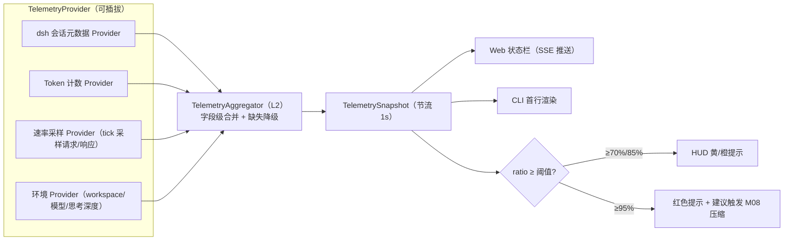

# M07 HUD 模块（luban-hud）设计

常驻状态显示器：上下文用量（used/max/占比）、workspace 名、模型、思考深度、tpm、rpm 一屏可见。数据经多源 Provider 聚合，缺失的数据源降级显示。

## 版本记录

| 版本 | 日期       | 作者  | 变更说明                              |
| ---- | ---------- | ----- | ------------------------------------- |
| v0.1 | 2026-08-29 | Maintainers | 初稿：遥测聚合/用量/环境/速率/展示/阈值 |

## 1. 概述与目标

- **解决**：R08——随时知道「还剩多少上下文、跑得多快、在哪个 workspace、用哪个模型」。
- **不解决**：上下文治理本身（M08 负责）；历史报表分析（数据先落盘，报表后置）。
- **需求映射**：R08。
- **平台属性**：双端公用；web 状态栏（client-ui 槽位）+ CLI 头部两种呈现。

## 2. 功能清单

| 编号 | 功能 | 优先级 | 里程碑 | 验收口径 |
| --- | --- | --- | --- | --- |
| M07-F001 | TelemetryProvider 多源聚合接口：dsh 内部遥测、token 计数、速率采样等 Provider 插拔式注册，字段级缺失降级 | P2 | MS3 | 某一 Provider 缺失时其余字段正常显示 |
| M07-F002 | context 用量：`used / max / ratio`，来源优先级：会话元数据 > token 计数器估算 | P2 | MS3 | 与 dsh 会话显示的用量一致（±5%） |
| M07-F003 | 环境信息：workspace 名（相对路径展示）、模型名、思考深度（reasoning effort 档位） | P2 | MS3 | 切 workspace/模型即刷新 |
| M07-F004 | 速率指标：tpm/rpm 滑动窗口（1min/5min 两档）统计 | P2 | MS3 | 与账单侧 token 流水口径可对账 |
| M07-F005 | HUD 展示：web 常驻状态栏（紧凑模式/完整模式）+ CLI 首行渲染 | P2 | MS3 | 双端、双形态均可见 |
| M07-F006 | 阈值提醒：占比超 70%/85%/95% 分级提示，95% 时给出 M08 压缩建议 | P3 | MS3 | 超阈值事件推送看板/HUD |

## 3. 流程图



## 4. 接口设计

```typescript
export interface TelemetryProvider {
  readonly id: string;
  capabilities(): TelemetryField[];          // 声明可提供哪些字段
  sample(): Promise<Partial<TelemetrySnapshot>>;
}

export interface TelemetryAggregator {
  register(p: TelemetryProvider): void;
  snapshot(): Promise<TelemetrySnapshot>;     // 字段级合并，缺失字段标 unknown
  subscribe(listener: (s: TelemetrySnapshot) => void): Unsubscribe;
}

export interface TelemetrySnapshot {
  context: { used: number | 'unknown'; max: number | 'unknown'; ratio: number | 'unknown' };
  workspace: { name: string | 'unknown' };
  model: { name: string | 'unknown'; thinkingDepth: string | 'unknown' };
  rates: { tpm1m: number | 'unknown'; tpm5m: number | 'unknown'; rpm1m: number | 'unknown'; rpm5m: number | 'unknown' };
  at: number; // epoch ms
}
```

## 5. 数据模型

见 `04-interfaces/data-models.md#telemetry`。要点：快照不可变、带时间戳；历史快照环形缓冲（默认保留 1h）供 HUD 迷你趋势图。

## 6. 配置设计

```yaml
- insert:
    - id: luban-hud
      name: dsh-luban-hud
      config:
        refreshSec: 1
        thresholds: { warn: 0.70, danger: 0.85, critical: 0.95 }
        display: { fields: ["context", "workspace", "model", "thinking", "tpm", "rpm"], compact: false }
        history: { enabled: true, retainMinutes: 60 }
```

## 7. 依赖与边界

- 下层：dsh 公开遥测点（实测确定；拿不到的字段由估算 Provider 兜底）；协作：M08（critical 提示触发压缩建议）。
- 复用档位：**C 档**——参考各类 coding-agent 状态栏的需求形态（ccusage/状态栏插件的字段口径），实现原创。
- 平台属性：双端公用。

## 8. 非功能与安全

- 遥测只含元数据（数字、名称），不含会话内容；快照不落敏感字段。
- 采样器避免高频计时器泄漏（页面隐藏时暂停 web 端订阅）。

## 9. checklist 映射

M07-F001 ~ M07-F006 共 6 项，与 `checklist.json` 一一对应。

## 10. 开放问题

- `thinkingDepth` 的数据来源是否在 dsh 会话元数据中暴露（实测；否则显示 unknown 并在 UI 标注「数据源缺失」——不允许编造）。
