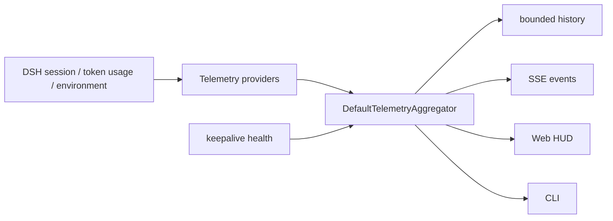

# M07 HUD 模块（luban-hud）设计

常驻状态显示器：集中展示上下文用量、workspace、模型、思考深度、TPM 和 RPM。数据按字段聚合，单个来源缺失时其余字段继续工作。

## 版本记录

| 版本 | 日期 | 作者 | 变更说明 |
| --- | --- | --- | --- |
| v1.0 | 2026-09-01 | Codex | 收敛到功能与稳定性，移除 provider 对账、构建证明和独立证据链 |

## 1. 目标与边界

- 解决 R08：让用户快速了解当前会话的上下文、环境和速率状态。
- 上下文压缩由 M08 负责；HUD 只展示状态和提示。
- 历史仅保留有界内存窗口，不承担计费、账单或跨重启报表。
- Web 与 CLI 共用同一聚合结果，并按登录账号隔离会话数据。

## 2. 功能清单

| 编号 | 功能 | 优先级 | 里程碑 | 验收口径 |
| --- | --- | --- | --- | --- |
| M07-F001 | TelemetryProvider 多源聚合与字段级降级 | P2 | MS3 | 任一 Provider 缺失时其余字段正常 |
| M07-F002 | context used/max/ratio | P2 | MS3 | 与 DSH 会话投影一致 |
| M07-F003 | workspace、模型和思考深度 | P2 | MS3 | 会话切换后刷新 |
| M07-F004 | 1 分钟与 5 分钟 TPM/RPM 滑动窗口 | P2 | MS3 | 单调时钟窗口、去重和未知 usage 测试通过 |
| M07-F005 | Web 状态栏与 CLI 首行 | P2 | MS3 | 两种展示读取同一快照 |
| M07-F006 | 70%/85%/95% 分级提醒 | P3 | MS3 | 阈值变化推送 HUD，critical 可联动看板 |

## 3. 数据流

## 4. 接口与路由

核心接口位于 `dsh-luban-core`，实现位于 `packages/dsh-luban-hud/src`。Provider 可以返回部分字段，聚合器按优先级合并并生成统一 `TelemetrySnapshot`。

HTTP 路由：

- `GET /luban-hud/snapshot`：当前账号的最新快照；
- `GET /luban-hud/history`：当前账号的有界历史；
- `GET /luban-hud/events`：SSE 更新。

所有路由复用 `lubanAuth`。CLI 通过相同 HTTP API 获取快照，不维护第二套状态。

## 5. 关键实现

- `DshSessionTelemetryProvider` 从当前 session/agent 读取 workspace、模型和思考深度。
- context 优先使用官方 session projection，缺失时回退到 token 估算。
- `DshRateCollector` 将成功响应的 usage 写入 `SlidingRateWindow`。
- 滑动窗口使用单调时钟和半开区间，按事件身份去重，分别计算 request 与 token。
- 聚合和历史均按 `accountId` 分区；全局 keepalive 健康只投影必要字段。
- 95% critical episode 只创建一次看板提示，恢复后允许下次再次触发。

## 6. 验证

- 聚合优先级、缺失降级、session 定向采样；
- 1m/5m 滑动窗口、跨 fork 去重、未知 usage；
- HTTP 认证、SSE、CLI 渲染和 Cordis 生命周期；
- React HUD 的 compact/full 展示与阈值样式；
- keepalive 告警和账号隔离。

验收以当前自动化测试和实际界面行为为准，不要求第三方账单逐请求对账。
