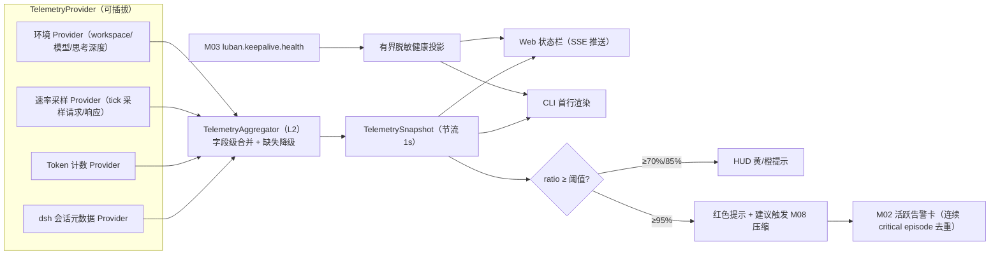

# M07 HUD 模块（luban-hud）设计

常驻状态显示器：上下文用量（used/max/占比）、workspace 名、模型、思考深度、tpm、rpm 一屏可见。数据经多源 Provider 聚合，缺失的数据源降级显示。

## 版本记录

| 版本 | 日期       | 作者  | 变更说明                              |
| ---- | ---------- | ----- | ------------------------------------- |
| v0.1 | 2026-08-29 | Maintainers | 初稿：遥测聚合/用量/环境/速率/展示/阈值 |
| v0.2 | 2026-08-30 | Codex | 回填 rc2 遥测口径、SSE、降级与验证证据 |
| v0.3 | 2026-08-30 | Codex | 增加会话定向新鲜采样，消除多 agent 缓存串扰 |
| v0.4 | 2026-08-30 | Codex | 接入 M03 健康状态与 M02 critical 去重告警 |
| v0.5 | 2026-08-30 | Codex | 补齐 ReactDOM 可见性与 loopback CLI 热刷新验证 |
| v0.6 | 2026-08-30 | Codex | 对齐 rc2 SessionProjection context pressure 官方口径 |
| v0.7 | 2026-08-30 | Codex | 增加挂载式速率 ledger 与认证窗口导出 |
| v0.8 | 2026-08-30 | Codex | live runner 接入挂载 HUD，并显式保留 provider adapter 阻塞边界 |
| v0.9 | 2026-08-30 | Codex | 延长有界采集保留期并补齐运行诊断 |
| v0.10 | 2026-08-30 | Codex | 接入 provider request-ID adapter，按真实请求身份导出与对账 |
| v0.11 | 2026-08-30 | Codex | 补齐挂载式双端验收与 provider 流水边界 |
| v0.12 | 2026-08-30 | Codex | 收口为真实 provider/账单与双平台功能验收 |

## 1. 概述与目标

- **解决**：R08——随时知道「还剩多少上下文、跑得多快、在哪个 workspace、用哪个模型」。
- **不解决**：上下文治理本身（M08 负责）；跨重启持久化与历史报表分析（本版仅保留有界内存历史）。
- **需求映射**：R08。
- **平台属性**：双端公用；web 状态栏（client-ui 槽位）+ CLI 头部两种呈现。

## 2. 功能清单

| 编号 | 功能 | 优先级 | 里程碑 | 验收口径 |
| --- | --- | --- | --- | --- |
| M07-F001 | TelemetryProvider 多源聚合接口：dsh 内部遥测、token 计数、速率采样等 Provider 插拔式注册，字段级缺失降级 | P2 | MS3 | 某一 Provider 缺失时其余字段正常显示 |
| M07-F002 | context 用量：`used / max / ratio`，来源优先级：会话元数据 > token 计数器估算 | P2 | MS3 | 与 dsh 会话显示的用量一致（±5%） |
| M07-F003 | 环境信息：workspace 名（相对路径展示）、模型名、思考深度（reasoning effort 档位） | P2 | MS3 | 切 workspace/模型即刷新 |
| M07-F004 | 速率指标：tpm/rpm 滑动窗口（1min/5min 两档）统计 | P2 | MS3 | 与账单侧 token 流水口径可对账 |
| M07-F005 | HUD 展示：web 常驻状态栏（紧凑模式/完整模式）+ CLI 首行渲染 | P2 | MS3 | 双端、双形态均可见 |
| M07-F006 | 阈值提醒：占比超 70%/85%/95% 分级提示，95% 时给出 M08 压缩建议 | P3 | MS3 | 超阈值事件推送看板/HUD |

## 3. 流程图



## 4. 接口设计

```typescript
export interface TelemetryProvider {
  readonly id: string;
  capabilities(): TelemetryField[];          // 声明可提供哪些字段
  sample(): Promise<Partial<TelemetrySnapshot>>;
  sampleForSession?(sessionId: SessionId): Promise<Partial<TelemetrySnapshot>>;
}

export interface TelemetryAggregator {
  register(p: TelemetryProvider): Unsubscribe;
  snapshot(): Promise<TelemetrySnapshot>;     // 字段级合并，缺失字段标 unknown
  snapshotFor(sessionId: SessionId): Promise<TelemetrySnapshot>; // 不复用全局 HUD 缓存
  subscribe(listener: (s: TelemetrySnapshot) => void): Unsubscribe;
}

export interface TelemetrySnapshot {
  context: { used: number | 'unknown'; max: number | 'unknown'; ratio: number | 'unknown' };
  workspace: { name: string | 'unknown' };
  model: { name: string | 'unknown'; thinkingDepth: string | 'unknown' };
  rates: { tpm1m: number | 'unknown'; tpm5m: number | 'unknown'; rpm1m: number | 'unknown'; rpm5m: number | 'unknown' };
  at: number; // epoch ms
}
```

## 5. 数据模型

见 `04-interfaces/data-models.md#telemetry`。要点：快照不可变、带时间戳；历史快照采用按时间裁剪的
内存环形序列（默认保留 1h），经认证 `/history` 提供诊断。本版 Web HUD 展示当前值，不承诺跨重启持久化或趋势报表。

## 6. 配置设计

```yaml
- insert:
    - id: luban-hud
      name: dsh-luban-hud
      config:
        refreshSec: 1
        thresholds: { warn: 0.70, danger: 0.85, critical: 0.95 }
        display: { fields: ["context", "workspace", "model", "thinking", "tpm", "rpm"], compact: false }
        history: { enabled: true, retainMinutes: 60 }
```

## 7. 依赖与边界

- 下层：dsh 公开遥测点（实测确定；拿不到的字段由估算 Provider 兜底）；协作：M03（健康事件）、可选 M02 `lubanTaskStore`（critical 告警）、M08（critical 提示触发压缩建议）。M07 只依赖 Core 契约和已登记 Cordis 事件，不 import 其他模块实现。
- 复用档位：**C 档**——参考各类 coding-agent 状态栏的需求形态（ccusage/状态栏插件的字段口径），实现原创。
- 平台属性：双端公用。

## 8. 运行约束

- 遥测只含元数据（数字、名称），不含会话内容；快照不落敏感字段。
- 采样器避免高频计时器泄漏（页面隐藏时暂停 web 端订阅）。
- `refreshSec` 下限 1 秒；Provider 并发采样有 timeout，历史保留上限 1440 分钟，SSE replay 固定 256 条。
- Provider 任意异常仅以固定公共文案进入 API，内部日志先脱敏；非法/溢出 token usage 保持 `unknown/partial`，不伪装为 0。
- REST/SSE 全部经 M01 认证；对外 SSE 只使用已登记的 `luban.telemetry.snapshot` 事件名和共享递增 ID。
- 速率 ledger 为精确 1min/5min 指标保留最近十五分钟、最多 10000 条 assistant 元数据，使五分钟
  窗口结束后仍能读取 provider 流水并完成对账；不记录会话正文或 replay state 原文。启动、保留期/
  容量淘汰或 wall/monotonic 时钟漂移导致覆盖不完整时返回明确错误。
- M07 live runner 读取仓库外 provider export 的精确窗口，再通过已认证的 loopback HTTP 调用实际挂载的
  `/luban-hud/rate-capture`。认证 Cookie 仅从 `LUBAN_SESSION_COOKIE` 环境变量读取，不写入结果；请求采用
  10 秒 deadline 和 10 MiB 响应上限，并校验响应 schema、coverage 与窗口一致性。
- M03 健康异常作为 `HudSnapshotResponse.keepalive` 可选扩展字段加入；旧响应/旧客户端仍可工作。
  健康 detail 去控制字符、凭据脱敏、单条限长，异常集合上限 256；卸载后不再接受事件或推送。
- M02 后置加载时通过可选 Cordis injection 自动接通。critical 告警只含比例元数据，不含 workspace、
  模型或会话内容；同一连续 critical episode 串行查询并复用活跃卡，卸载竞态在 create 前复查。

## 9. checklist 映射

M07-F001 ~ M07-F006 共 6 项，与 `checklist.json` 一一对应。

## 10. 实现与验证记录

- rc2 Session Provider 优先读取 `SessionProjectionRegistry` 的 `contextPressure`：used 取
  `projectedTokens ?? pressureTokens`，max 取 `contextWindow`，比例由两者计算；projection 已存在但
  字段不完整时保持 `unknown`，不以估算值伪装官方口径。projection key/service 缺失或卸载时才回退
  `assistant/message.usage`、`request/context.contextWindow` 与内容估算；model/reasoning 仍取 request header。
- context pressure 口径为 input + cache read + cache write；TPM 使用 input + output + cache read + cache write，
  reasoning token 已包含在 output 中不重复计数。1m/5m 均使用 monotonic 的半开区间 `[start,end)`
  滑动窗口，历史事件按 wall-clock age 映射；对账的 5% 容差逐 request ID、逐 token 分类校验，
  不允许多条请求的正负误差在 aggregate 中相互抵消。
- production `DshRateCollector` 会将历史回放和实时 `assistant/message` 交给挂载的
  `HudRateLedger`；ledger 只处理 post-mount coverage 内具有稳定 message identity 的记录，collector
  对 HUD 滑动窗口跨 fork 去重。认证 `/luban-hud/rate-capture` 导出同一半开 UTC 窗口内的 usage 与
  session/event/turn/step/message/provider/model 元数据，不读取 adapter-private replay state；非法 usage
  标为 `unknownTokens=1`。同 ID 内容冲突、启动覆盖缺口、容量淘汰或时钟不连续时返回明确错误。真实
  Cordis/WebServer 集成测试证明端点来自实际挂载实例，并会拒绝挂载初期尚不完整的窗口。
- `scripts/acceptance/m07-rate-reconcile.mjs` 的 mounted 模式先读取独立 provider 文件，再用其精确
  1min/5min 窗口调用挂载 capture。provider wire adapter 为每条 session/message 提供真实 provider
  request ID 与 token 分类；最多 8 路并发且整个批次 10 秒超时。ledger revision 变化、request ID
  重复或窗口不一致时停止本次对账，私有 replay state 始终不参与。
- fixture 与 simulated runner 只验证采集、窗口和误差算法；M07-F004 的现场验收必须使用真实 provider
  adapter、provider 账单流水以及 Windows/Ubuntu 上实际挂载的 HUD。
- `DefaultTelemetryAggregator` 并发采样、按 Provider 注册顺序做字段级 first-wins 合并；generation 防止注册/卸载竞态提交陈旧结果。
- `snapshotFor(sessionId)` 对指定 live agent 重新采样，不读取或替换全局 HUD 缓存，也不向订阅者发布；
  M08 因而不会把 initiator/running/newest 的全局选择结果误用于另一个刚进入 idle 的会话。
- Web 使用官方 `shell.overlay` slot，并在页面隐藏时关闭 SSE；CLI 从环境读取 Cookie，输出单行去控制字符，HTTP 10 秒超时。
- SSE 支持共享 ID、`Last-Event-ID`、256 条 replay 与断档 baseline；API/stream 在插件卸载竞态中 fail closed。
- M03 异常/恢复会立即复用现有 SSE envelope 推送，Web 无论紧凑/完整模式均显示红色
  `keepalive N down`，CLI 首行同步显示异常会话 id；字段缺失时保持旧 envelope 兼容。
- 可选 `lubanTaskStore` 在服务后置出现时动态接通；critical episode 通过串行 active-tag 查询去重，
  恢复后才开启下一 episode，TaskStore 失败只写脱敏诊断且不影响遥测。
- 真实 ReactDOM/jsdom 覆盖 partial provider、warn/danger/critical 展示和页面隐藏时 SSE
  close/reopen；loopback CLI 验证 provider 热刷新。真实 rc2 `SessionProjectionRegistry + TokenMeter + Session`
  在初始、surface 追加和 compaction 后与 HUD 的 used/max/ratio 精确一致（满足 ±5% 口径），Cordis mount
  另覆盖 projection 服务动态发现与卸载回退。本地 Prettier、严格类型、ESLint、构建、HUD 包全量测试及
  acceptance runner 定向测试通过。

## 11. 目标环境验收

- 仍需在真实 Windows/Ubuntu DSH profile 核对 workspace/model/reasoning 切换、Web 常驻 HUD、CLI 首行与页面隐藏重连。
- HUD 侧 request-ID 对账接口已经完成；rc2 公共成功事件仍不直接暴露 provider request ID，因此现场
  验收还需安装实际 provider 的 wire adapter，并以真实 Provider/账单流水在 Windows/Ubuntu 各完成一次
  1m/5m 对账。剩余条件属于外部 provider 能力与目标环境，M07-F004 按 `statusLegend` 标记为
  `blocked`；本地 fixture 或 mounted capture 不能替代该功能验收。
- 真实长会话可继续抽查 M08 的会话定向采样与压缩质量。
- 仍需在真实掉线长任务中核对 M03 巡检到 HUD/Taskboard 的端到端可见时延。
