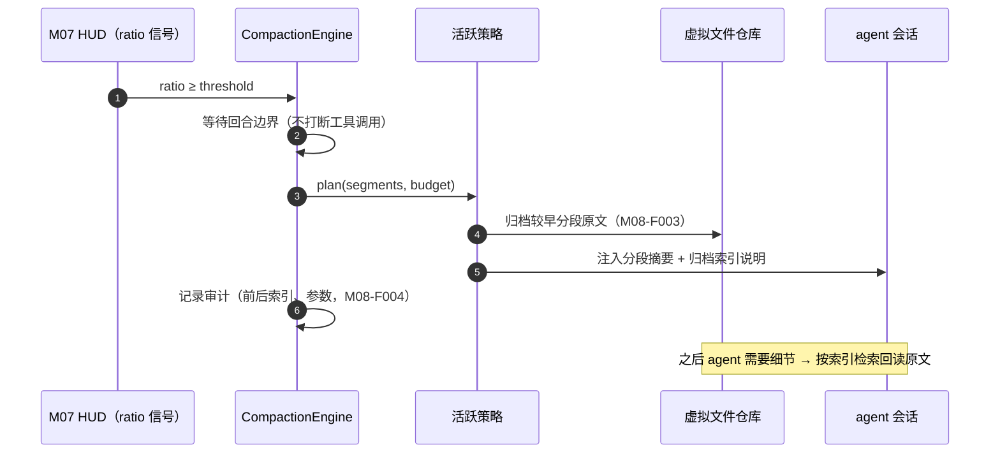

# M08 上下文压缩模块（luban-context）设计

Codex 式上下文工程的本地实现：阈值触发自动压缩 + 旧上下文外置为可检索的虚拟文件，参考 pi 生态的 agentic compaction 思路（C 档：只参考需求与策略形态，不接触代码）。

## 版本记录

| 版本 | 日期       | 作者  | 变更说明                              |
| ---- | ---------- | ----- | ------------------------------------- |
| v0.1 | 2026-08-29 | Maintainers | 初稿：策略接口/自动压缩/虚拟文件/审计/协同 |

## 1. 概述与目标

- **解决**：R09——长会话/夜间长任务不因上下文打满而中断；历史上下文可外置检索而非粗暴截断。
- **不解决**：跨会话的长期记忆（那是 A 档插件 dsh-memory 的职责，不在本套件重做）。
- **需求映射**：R09；服务 M02 夜间循环与 M03 长任务。
- **平台属性**：双端公用。

## 2. 功能清单

| 编号 | 功能 | 优先级 | 里程碑 | 验收口径 |
| --- | --- | --- | --- | --- |
| M08-F001 | 压缩策略接口（策略模式）：`SummarizeStrategy`（分段摘要）/`VirtualFileStrategy`（外置归档）可插拔可组合 | P2 | MS3 | 新策略可零侵入注册 |
| M08-F002 | 阈值触发自动压缩：占比 ≥ 阈值时对「较早分段」做摘要，保留近期原文与关键决策；压缩在回合边界执行 | P2 | MS3 | 压缩后任务上下文连续性保持（关键约束不丢失） |
| M08-F003 | 虚拟文件归档：被压缩的原文写入 `.luban/context-archive/<session>/<seg>.md`，索引可被 agent 主动检索回读 | P3 | MS3 | agent 需要细节时可检索回原文 |
| M08-F004 | 压缩审计与回放：每次压缩记录前后快照索引、策略、参数；支持按段回放验证 | P3 | MS3 | 审计记录足以解释「为什么模型记得 A 忘了 B」 |
| M08-F005 | 与长任务/夜间模式协同：向 M02 调度器暴露压缩节奏策略（夜间任务用更激进的阈值与预算） | P2 | MS3 | 夜间任务全程无人工干预不触顶 |

## 3. 流程图



## 4. 接口设计

```typescript
export interface CompactionStrategy {
  readonly id: string;
  /** 给定分段与 token 预算，产出压缩计划（纯函数，可单测） */
  plan(input: { segments: ContextSegment[]; budgetTokens: number }): CompactionPlan;
  /** 执行计划（副作用收敛于归档与注入） */
  execute(plan: CompactionPlan, ctx: CompactionContext): Promise<CompactionResult>;
}

export interface CompactionEngine {
  register(s: CompactionStrategy): void;
  use(strategyId: string, scope?: { taskScope?: 'night' | 'day' }): void;
  maybeCompact(session: SessionRef, telemetry: TelemetrySnapshot): Promise<void>;
  audit(sessionId: SessionId): Promise<CompactionAuditRecord[]>;
}
```

## 5. 数据模型

见 `04-interfaces/data-models.md#compaction`。要点：`ContextSegment`（起止消息序号、token 估算、主题标签）、`CompactionPlan`（保留/摘要/归档三分法）、审计记录。

## 6. 配置设计

```yaml
- insert:
    - id: luban-context
      name: dsh-luban-context
      config:
        trigger: { ratio: 0.80, minGapRounds: 4 }   # 触发阈值 + 最小间隔回合
        strategy: summarize+virtualfile
        keepRecentTokens: 24000                     # 近期原文保留预算
        archiveDir: ".luban/context-archive"
        nightProfile: { trigger: { ratio: 0.70 }, keepRecentTokens: 16000 }
```

## 7. 依赖与边界

- 下层：M07 遥测（触发信号）、HAL 文件（归档）；协作：M02（夜间策略）、M03（压缩点也是断点保存点）。
- 复用档位：**C 档**——pi-agentic-compaction / pi-mono（参考「虚拟文件系统式上下文外置」的需求与策略形态，license 落实前不读其源码，台账登记）；实现原创。
- 平台属性：双端公用。

## 8. 非功能与安全

- 压缩期间会话不可被打断（回合边界保证）；失败重试一次后降级为「只归档不摘要」并告警。
- 归档目录遵守 P6.1：不含密钥等敏感内容（归档来源本就是会话内容，正常情况下无密钥；仍做正则扫描打码）。

## 9. checklist 映射

M08-F001 ~ M08-F005 共 5 项，与 `checklist.json` 一一对应。

## 10. 开放问题

- dsh 会话消息的读取/注入 API 形态（决定分段切分的实现层）；实测前本模块只做策略纯函数与存储，不接会话。
