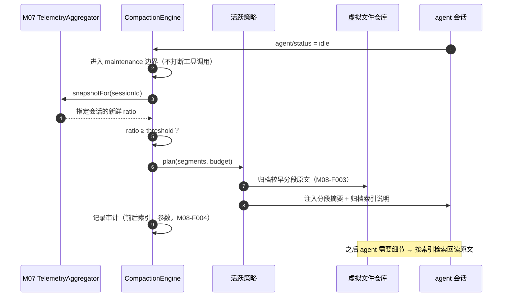

# M08 上下文压缩模块（luban-context）设计

Codex 式上下文工程的本地实现：阈值触发自动压缩 + 旧上下文外置为可检索的虚拟文件，参考 pi 生态的 agentic compaction 思路（C 档：只参考需求与策略形态，不接触代码）。

## 版本记录

| 版本 | 日期       | 作者  | 变更说明                              |
| ---- | ---------- | ----- | ------------------------------------- |
| v0.1 | 2026-08-29 | Maintainers | 初稿：策略接口/自动压缩/虚拟文件/审计/协同 |
| v0.2 | 2026-08-30 | Codex | 回填 rc2 回合边界、可审计归档与降级实现验证 |
| v0.3 | 2026-08-30 | Codex | 补齐会话定向遥测与卸载期间维护任务收口 |
| v0.4 | 2026-08-30 | Codex | 补齐版本化前后 surface 快照索引与夜间连续性链路验证 |

## 1. 概述与目标

- **解决**：R09——长会话/夜间长任务不因上下文打满而中断；历史上下文可外置检索而非粗暴截断。
- **不解决**：跨会话的长期记忆（那是 A 档插件 dsh-memory 的职责，不在本套件重做）。
- **需求映射**：R09；服务 M02 夜间循环与 M03 长任务。
- **平台属性**：双端公用。

## 2. 功能清单

| 编号 | 功能 | 优先级 | 里程碑 | 验收口径 |
| --- | --- | --- | --- | --- |
| M08-F001 | 压缩策略接口（策略模式）：`SummarizeStrategy`（分段摘要）/`VirtualFileStrategy`（外置归档）可插拔可组合 | P2 | MS3 | 新策略可零侵入注册 |
| M08-F002 | 阈值触发自动压缩：占比 ≥ 阈值时对「较早分段」做摘要，保留近期原文与关键决策；压缩在回合边界执行 | P2 | MS3 | 压缩后任务上下文连续性保持（关键约束不丢失） |
| M08-F003 | 虚拟文件归档：被压缩的原文写入 `.luban/context-archive/<session>/<seg>.md`，索引可被 agent 主动检索回读 | P3 | MS3 | agent 需要细节时可检索回原文 |
| M08-F004 | 压缩审计与回放：每次压缩记录前后快照索引、策略、参数；支持按段回放验证 | P3 | MS3 | 审计记录足以解释「为什么模型记得 A 忘了 B」 |
| M08-F005 | 与长任务/夜间模式协同：向 M02 调度器暴露压缩节奏策略（夜间任务用更激进的阈值与预算） | P2 | MS3 | 夜间任务全程无人工干预不触顶 |

## 3. 流程图



## 4. 接口设计

```typescript
export interface CompactionStrategy {
  readonly id: string;
  /** 给定分段与 token 预算，产出压缩计划（纯函数，可单测） */
  plan(input: { segments: ContextSegment[]; budgetTokens: number }): CompactionPlan;
  /** 执行计划（副作用收敛于归档与注入） */
  execute(plan: CompactionPlan, ctx: CompactionContext): Promise<CompactionResult>;
}

export interface CompactionEngine {
  register(s: CompactionStrategy): void;
  use(strategyId: string, scope?: { taskScope?: 'night' | 'day' }): void;
  maybeCompact(session: SessionRef, telemetry: TelemetrySnapshot): Promise<void>;
  audit(sessionId: SessionId): Promise<CompactionAuditRecord[]>;
}
```

## 5. 数据模型

见 `04-interfaces/data-models.md#compaction`。要点：`ContextSegment`（起止消息序号、token 估算、主题标签）、`CompactionPlan`（保留/摘要/归档三分法）、审计记录。

## 6. 配置设计

```yaml
- insert:
    - id: luban-context
      name: dsh-luban-context
      config:
        trigger: { ratio: 0.80, minGapRounds: 4 }   # 触发阈值 + 最小间隔回合
        strategy: summarize+virtualfile
        keepRecentTokens: 24000                     # 近期原文保留预算
        archiveDir: ".luban/context-archive"
        nightProfile: { trigger: { ratio: 0.70 }, keepRecentTokens: 16000 }
```

## 7. 依赖与边界

- 下层：M07 遥测（触发信号）、HAL 文件（归档）；协作：M02（夜间策略）、M03（压缩点也是断点保存点）。
- 复用档位：**C 档**——pi-agentic-compaction / pi-mono（参考「虚拟文件系统式上下文外置」的需求与策略形态，license 落实前不读其源码，台账登记）；实现原创。
- 平台属性：双端公用。

## 8. 非功能与安全

- 压缩期间会话不可被打断（回合边界保证）；失败重试一次后降级为「只归档不摘要」并告警。
- 插件卸载先拒绝新维护任务和 HTTP 请求；遥测等待中的任务在进入 engine 前取消，已进入 engine 的任务由
  disposer 排空后才完成卸载，避免卸载返回后继续修改会话 surface。
- 归档目录遵守 P6.1：不含密钥等敏感内容（归档来源本就是会话内容，正常情况下无密钥；仍做正则扫描打码）。

## 9. checklist 映射

M08-F001 ~ M08-F005 共 5 项，与 `checklist.json` 一一对应。

## 10. 开放问题

- 已适配 DSH `0.1.1-rc.2` 的 Session surface 与 `agent.runMaintenance()`；仍需在目标
  win/ubuntu profile 中用真实长会话验证摘要质量、token 估算和无人值守节奏。

## 11. 实现与验证记录

- `SummarizeStrategy`、`VirtualFileStrategy` 与组合策略通过统一注册接口运行，按完整消息段保留近期原文；
  telemetry 比例未知时安全跳过，达到阈值与最小回合间隔后才进入维护边界。
- DSH 适配器只替换旧 surface 的连续前缀，保留近期消息；摘要提取决策、约束和验收条件，
  原始持久事件日志保持不变。
- workspace 内归档先脱敏再原子写入，以内容摘要唯一命名并建立 SHA-256 索引；重复重试幂等，
  多轮复用同一临时序号时仍保留各代文件，可按范围取最新或按索引路径精确回放。
- 每条新审计记录都在 strategy 执行前后抓取真实 live Session surface，保存 event sequence、segment
  和 token 总量索引；旧记录缺少该字段时解码为显式 `legacy`，不伪造 after identity，也不改变
  `CompactionStrategy`/`CompactionResult` 契约。
- 主策略失败重试一次，再降级为仅归档；day/night profile 可独立选策略、阈值和预算，
  `/luban-context` 提供认证审计、索引、回放和 scope API。
- idle coordinator 通过 `snapshotFor(sessionId)` 强制读取准确且不走 HUD 缓存的会话快照；卸载竞态覆盖
  auth 等待、engine 前取消、已运行 engine 排空与卸载后拒绝新任务。
- 另有 1 项跨模块集成场景使用确定性中英双语长会话语料跑通
  `DefaultNightScheduler → DshAgentNightExecutor → Cordis → M08` 生产链及 archive/audit/replay；
  本地 Prettier、ESLint、严格类型检查、构建、22 项 M08 包测试、发布元数据与 npm pack
  白名单审计通过，未调用外部模型或服务。
