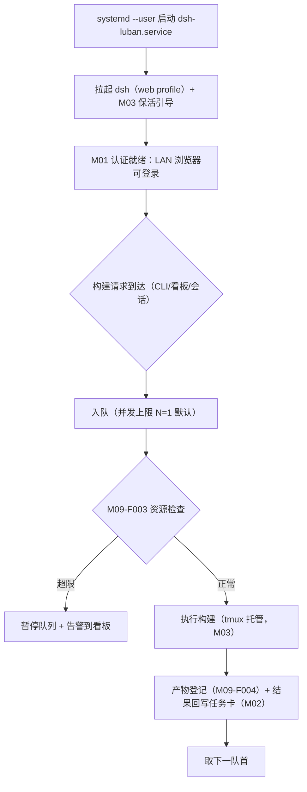

# M09 服务器操作模式模块（luban-server-mode）设计（Ubuntu 专属）

Ubuntu 编译服务器的 dsh 常驻与操作模式：systemd 托管启动、编译/构建队列命令集、资源看护、构建产物管理。

## 版本记录

| 版本 | 日期       | 作者  | 变更说明                              |
| ---- | ---------- | ----- | ------------------------------------- |
| v0.1 | 2026-08-29 | Maintainers | 初稿：systemd 启动器/命令集/看护/产物 |

## 1. 概述与目标

- **解决**：R01 + R10——「ubuntu 可以直接用网页」+「一套服务器端的操作模式」：dsh 以服务形态常驻，浏览器经 M01 登录即用；构建类操作有统一命令集与产物出口。
- **不解决**：多用户资源配额（个人/小团队服务器，先到先得 + 看护告警）。
- **需求映射**：R01、R10。
- **平台属性**：**ubuntu 专属**（包内做平台守卫，win 安装时提示禁用）。

## 2. 功能清单

| 编号 | 功能 | 优先级 | 里程碑 | 验收口径 |
| --- | --- | --- | --- | --- |
| M09-F001 | systemd 启动器：安装/卸载 `dsh-luban.service`（user 级 unit），拉起 dsh web/headless profile + M03 保活，开机自启 | P0 | MS1 | `systemctl --user status dsh-luban` 正常；重启后自恢复 |
| M09-F002 | 服务器命令集：构建队列（排队/并发上限）、常用编译命令模板、错误日志摘录进会话 | P3 | MS4 | 队列任务串行/受限并发，失败日志可一键入会话 |
| M09-F003 | 资源看护：磁盘水位、负载、单构建超时；超限动作（暂停队列/告警到看板） | P3 | MS4 | 磁盘超阈值时队列暂停并告警 |
| M09-F004 | 构建产物管理：产物目录规范、保留策略、经认证的下载链接 | P3 | MS4 | 产物可从网页下载且需登录 |

## 3. 流程图（服务启动与构建队列）



## 4. 接口设计

```typescript
export interface ServerModeService {
  install(opts: { user: string; profile: 'ubuntu-server' }): Promise<void>;
  uninstall(): Promise<void>;
  enqueue(job: BuildJobInput): Promise<BuildJob>;
  queue(): Promise<BuildJob[]>;
  artifacts(jobId: string): Promise<ArtifactRef[]>;
  resourceReport(): Promise<ResourceReport>;
}
```

## 5. 数据模型

见 `04-interfaces/data-models.md#build`。要点：`BuildJob`（状态机 queued/running/failed/done、tmux 会话引用、产物列表）、`ResourceReport`（disk/load/timeout 配额）。

## 6. 配置设计

```yaml
- insert:
    - id: luban-server-mode
      name: dsh-luban-server-mode
      config:
        service: { name: dsh-luban, user: "" }   # user 级 unit；留空=当前用户
        build: { maxConcurrent: 1, defaultTimeoutMin: 30 }
        guard: { diskMinGb: 10, loadMax: 8 }
        artifacts: { dir: "~/builds", retainRuns: 10 }
```

## 7. 依赖与边界

- 下层：M03（构建跑在托管会话里）、M01（产物下载经认证）、HAL（linux 进程/systemctl/磁盘探测）。
- 复用档位：systemd（B 档系统组件）。
- 平台属性：**ubuntu 专属**；包内 `process.platform` 守卫，非 linux 环境插件自禁并提示。

## 8. 非功能与安全

- unit 使用 user 级（`systemctl --user`）+ `loginctl enable-linger`，避免 root；文档写明 linger 的意义。
- 构建命令模板禁止内嵌凭据（P6.1）；产物下载链接带认证与过期。

## 9. checklist 映射

M09-F001 ~ M09-F004 共 4 项，与 `checklist.json` 一一对应。

## 10. 开放问题

- 交叉编译工具链（用户的实际 MCU 工具链清单）在 MS4 前确认，命令模板按清单落地。
