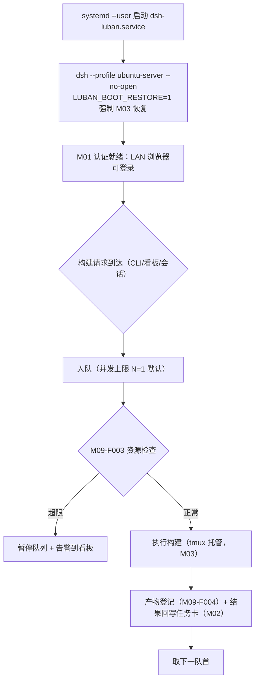

# M09 服务器操作模式模块（luban-server-mode）设计（Ubuntu 专属）

Ubuntu 编译服务器的 dsh 常驻与操作模式：systemd 托管启动、编译/构建队列命令集、资源看护、构建产物管理。

## 版本记录

| 版本 | 日期       | 作者  | 变更说明                              |
| ---- | ---------- | ----- | ------------------------------------- |
| v0.1 | 2026-08-29 | Maintainers | 初稿：systemd 启动器/命令集/看护/产物 |
| v0.2 | 2026-08-30 | Codex | 回填持久构建队列、资源门禁与认证产物实现验证 |
| v0.3 | 2026-08-30 | Codex | 补齐失败日志会话注入与重启后 SSE baseline 验证 |
| v0.4 | 2026-08-30 | Codex | 补齐探针超时与真实子进程终止/排空边界验证 |
| v0.5 | 2026-08-30 | Codex | 增加 workspace/collect/artifact 路径与防覆盖检查 |
| v0.6 | 2026-08-30 | Codex | 收口队列 drain、告警与启停并发生命周期 |
| v0.7 | 2026-08-30 | Codex | 记录全工作区门禁通过与真实 Ubuntu 工具链阻塞边界 |
| v0.8 | 2026-08-30 | Codex | 修正 systemd 启动参数并固化 M03 强制恢复哨兵 |
| v0.9 | 2026-08-30 | Codex | 增加 systemd 安装、重启自启与 owned cleanup 的分阶段实机验收 |
| v0.10 | 2026-08-30 | Codex | 增加可恢复副作用账本与 InvocationID 重启核对 |
| v0.11 | 2026-08-30 | Codex | 使用 lockfile 约束的隔离离线 pnpm 构建 |
| v0.12 | 2026-08-30 | Codex | 固定 pnpm 版本并补齐完整运行依赖 |
| v0.13 | 2026-08-30 | Codex | 补齐分阶段 runner 的临时目录与恢复边界 |
| v0.14 | 2026-08-30 | Codex | 收口为 systemd/reboot 与恢复功能验收 |
| v0.15 | 2026-08-30 | Codex | 构建恢复、产物保留与资源告警按账号分区 |

## 1. 概述与目标

- **解决**：R01 + R10——「ubuntu 可以直接用网页」+「一套服务器端的操作模式」：dsh 以服务形态常驻，浏览器经 M01 登录即用；构建类操作有统一命令集与产物出口。
- **不解决**：多用户资源配额（个人/小团队服务器，先到先得 + 看护告警）。
- **需求映射**：R01、R10。
- **平台属性**：**ubuntu 专属**（包内做平台守卫，win 安装时提示禁用）。

## 2. 功能清单

| 编号 | 功能 | 优先级 | 里程碑 | 验收口径 |
| --- | --- | --- | --- | --- |
| M09-F001 | systemd 启动器：安装/卸载 `dsh-luban.service`（user 级 unit），执行 `dsh --profile ubuntu-server --no-open` 并通过 M03 恢复，开机自启 | P0 | MS1 | `systemctl --user status dsh-luban` 正常；重启后自恢复 |
| M09-F002 | 服务器命令集：构建队列（排队/并发上限）、常用编译命令模板、错误日志摘录进会话 | P3 | MS4 | 队列任务串行/受限并发，失败日志可一键入会话 |
| M09-F003 | 资源看护：磁盘水位、负载、单构建超时；超限动作（暂停队列/告警到看板） | P3 | MS4 | 磁盘超阈值时队列暂停并告警 |
| M09-F004 | 构建产物管理：产物目录规范、保留策略、经认证的下载链接 | P3 | MS4 | 产物可从网页下载且需登录 |

## 3. 流程图（服务启动与构建队列）



## 4. 接口设计

```typescript
export interface ServerModeService {
  install(opts: { user: string; profile: 'ubuntu-server' }): Promise<void>;
  uninstall(): Promise<void>;
  enqueue(job: BuildJobInput): Promise<BuildJob>;
  queue(): Promise<BuildJob[]>;
  artifacts(jobId: string): Promise<ArtifactRef[]>;
  resourceReport(): Promise<ResourceReport>;
}
```

## 5. 数据模型

见 `04-interfaces/data-models.md#build`。要点：`BuildJob`（状态机 queued/running/failed/done、tmux 会话引用、产物列表）、`ResourceReport`（disk/load/timeout 配额）。

## 6. 配置设计

```yaml
- insert:
    - id: luban-server-mode
      name: dsh-luban-server-mode
      config:
        service: { name: dsh-luban, user: "" }   # user 级 unit；留空=当前用户
        build: { maxConcurrent: 1, defaultTimeoutMin: 30 }
        guard: { diskMinGb: 10, loadMax: 8 }
        artifacts: { dir: "~/builds", retainRuns: 10 }
```

生成的 user unit 以独立参数执行 `dsh --profile ubuntu-server --no-open`，并设置精确哨兵
`LUBAN_BOOT_RESTORE=1`。该哨兵即使在 profile 中配置 `bootRestore: false` 也会强制 M03
执行恢复；只有字符串 `1` 生效。

## 7. 依赖与边界

- 下层：M03（构建跑在托管会话里）、M01（产物下载经认证）、HAL（linux 进程/systemctl/磁盘探测）。
- 复用档位：systemd（B 档系统组件）。
- 平台属性：**ubuntu 专属**；包内 `process.platform` 守卫，非 linux 环境插件自禁并提示。

## 8. 运行约束

- unit 使用 user 级（`systemctl --user`）+ `loginctl enable-linger`，避免 root；启动参数以 argv
  形式固定，并以精确 `LUBAN_BOOT_RESTORE=1` 哨兵触发 M03 开机恢复。
- 构建命令模板禁止内嵌凭据（P6.1）；产物下载链接带认证与过期。

## 9. checklist 映射

M09-F001 ~ M09-F004 共 4 项，与 `checklist.json` 一一对应。

## 10. 开放问题

- 内置 pnpm/CMake 模板与严格的用户模板配置已落地；仍需按目标服务器的 MCU/交叉编译工具链
  清单补充 profile 配置，并执行真实 systemd、linger、编译器和浏览器下载验收。

## 11. 实现与验证记录

- `UserSystemdInstaller` 原子生成 user unit，其 `ExecStart` 执行
  `dsh --profile ubuntu-server --no-open` 并注入 `LUBAN_BOOT_RESTORE=1`；安装流程使用参数数组
  执行 `loginctl` 与 `systemctl --user`，需显式调用，非 Linux 平台不注册服务或路由。
- 原子 build ledger 与 FIFO queue 实现并发上限、重启恢复和稳定状态迁移；构建参数只能进入
  argv/cwd/collect，workspace 与产物源受根目录约束，Node 不启用 shell。
- 新构建必须携带认证账号；重启时无账号归属的旧 queued/running job 会转为 `failed` 并保留明确原因，
  不再自动执行。完成产物按账号分别应用 `retainRuns`，资源暂停告警也按当前排队 job 的账号写入看板。
- M03 托管的独立 worker 以私有 spec/result 文件交接，执行超时、日志尾部和文件数有界；超时或
  取消先发送 TERM 并等候进程关闭和管道排空，一秒后升级 KILL，再以一秒最终关闭边界收敛并
  清理 timer/listener。重启时复用存活 worker 或持久结果，终态销毁托管会话并清除保活账本。
- 磁盘/负载探针由调度器施加五秒上限；探针拒绝或超时均 fail closed，暂停新任务并可写 TaskStore
  告警；失败摘要可由
  Settings 页面注入当前 DSH 会话，客户端契约测试覆盖会话选择、日志 API 路由与 queued prompt。
- 产物收集跳过符号链接，按完成时间保留；`/luban-server-mode` 认证 API/SSE 提供有界重放与
  baseline；workspace、collect、artifact discover/secure/prune 均校验 canonical realpath 与目录
  身份，junction/symlink 换位或逃逸时 fail closed。服务重启后旧浏览器游标高于新序列时立即返回
  新 baseline；下载要求有效的 M01 会话并使用同源链接。
- 本地 Prettier、ESLint、严格类型检查、构建、65 项测试通过；队列测试覆盖 completion 主动唤醒、
  drain/告警排空、start/dispose 串行化及 launch ledger transition 停机竞态；资源测试包含本机文件系统探测，
  进程测试使用当前 `process.execPath` 验证超时/取消后 PID 已退出和 stdout/stderr 已排空，并以可控 child
  验证 spawn 同步失败、永不 close、TERM/KILL 最终边界、abort/timeout 首因及清理。未安装 systemd
  unit、运行外部编译器或下载真实产物。
- 全工作区 format/lint/typecheck/build、包测试与跨模块集成检查覆盖队列、资源探针、进程回收和 HTTP 生命周期。
- Ubuntu 部署通过正式 systemd operator 管理 user unit；日常验收使用 `systemctl --user restart`、`is-enabled`、`is-active` 与 HTTP 健康检查。
- 开机恢复已在实机验证，但不是每次配置更新的必需步骤。runner 不负责启用 linger、重启、注销或断开连接。
- 实机部署参数、账号、地址、绝对路径和系统启动标识只保留在本地运维环境，不写入仓库。
