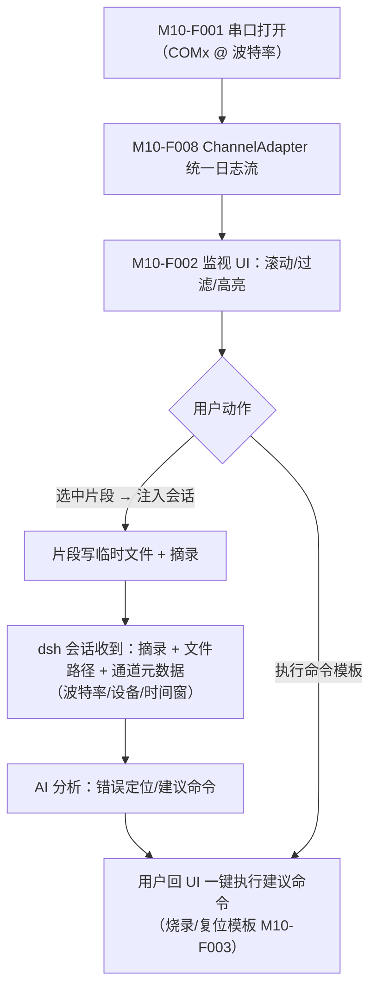

# M10 Windows Debug 模块（luban-win-debug）设计（Windows 专属）

嵌入式工程师的 Windows 侧作战面板：串口日志、烧录/复位、GDB、adb/fastboot、远程设备、桌面自动化——全部收敛到统一的 ChannelAdapter 通道层，日志片段可一键送入 dsh 会话。

## 版本记录

| 版本 | 日期       | 作者  | 变更说明                                             |
| ---- | ---------- | ----- | ---------------------------------------------------- |
| v0.1 | 2026-08-29 | Maintainers | 初稿：串口/烧录/GDB/adb-fastboot/桌面自动化/远程/通道层 |
| v0.2 | 2026-08-30 | Codex | 回填通道层、工具模板与会话注入实现验证               |
| v0.3 | 2026-08-30 | Codex | 补齐设备占用预检与 DSH MCP 工具注册/调用闭环      |
| v0.4 | 2026-08-30 | Codex | 补齐串口生命周期与真实 MCP/TCP 本机集成验证        |
| v0.5 | 2026-08-30 | Codex | 补齐串口片段进入持久会话及重放的直接证据           |
| v0.6 | 2026-08-30 | Codex | 将约束聚焦于防误操作、会话隔离与真实设备验收       |
| v0.7 | 2026-08-30 | Codex | 通道、日志、片段、GDB、SSE 与会话注入按认证账号隔离 |
| v0.8 | 2026-08-30 | Codex | Desktop MCP 输出与生命周期控制绑定账号 owner      |

## 1. 概述与目标

- **解决**：R11——win 端 debug 与串口操作成体系；日志/寄存器/断点信息能直接进 dsh 会话让 AI 参与排障。
- **不解决**：图形化 IDE（Keil/IAR/Eclipse）的替代；示波器等仪器控制（后置扩展）。
- **需求映射**：R11。
- **平台属性**：**win 专属**（平台守卫同 M09；linux 下禁用并提示）。

## 2. 功能清单

| 编号 | 功能 | 优先级 | 里程碑 | 验收口径 |
| --- | --- | --- | --- | --- |
| M10-F001 | 串口通道适配器：COM 口枚举、参数配置（波特率等）、开关与热插拔感知、日志流 | P1 | MS2 | 拔插设备后列表自动更新 |
| M10-F002 | 串口日志监视 UI：实时滚动、关键字过滤/高亮、时间戳、选中片段一键注入会话 | P1 | MS2 | 选中片段以文件+摘录形式进会话 |
| M10-F003 | 烧录/复位命令编排：openocd / J-Link / esptool / STM32CubeProgrammer 命令模板化，一键执行，输出解析为结构化结果 | P1 | MS2 | 烧录失败时错误行高亮并可直接问 AI |
| M10-F004 | GDB 调试会话托管：openocd+gdb 会话起停、断点/变量/寄存器快照导出进会话 | P2 | MS2 | 快照为结构化文本可被会话引用 |
| M10-F005 | adb/fastboot 通道：设备列表、常用刷机流程模板、状态解析 | P1 | MS2 | 设备 offline/ unauthorized 状态可辨识 |
| M10-F006 | 桌面自动化适配：Windows-MCP / CursorTouch 类能力以 B 档接入（MCP 服务配置与启停封装） | P2 | MS2 | 可经 dsh 调用桌面自动化工具 |
| M10-F007 | 远程设备通道：ssh 到开发板、telnet、网络串口服务器（TCP 透传） | P2 | MS2 | 网络串口与本地串口在 UI 无差别 |
| M10-F008 | ChannelAdapter 统一通道接口：所有通道实现同一契约（开/关/读写/命令/生命周期/事件），UI 与会话注入不感知通道类型 | P1 | MS2 | 新增通道类型零 UI 改动 |

## 3. 流程图（串口日志 → 会话排障）



## 4. 接口设计

```typescript
/** ChannelAdapter —— L1 HAL 契约（串口/adb/gdb/ssh/tcp 全部实现它） */
export interface ChannelAdapter {
  readonly kind: 'serial' | 'adb' | 'fastboot' | 'gdb' | 'ssh' | 'telnet' | 'tcp-serial';
  list(): Promise<ChannelEndpoint[]>;
  open(endpoint: ChannelEndpoint, opts: OpenOptions): Promise<ChannelHandle>;
}

export interface ChannelHandle {
  write(data: Uint8Array | string): Promise<void>;
  readEvents(): AsyncIterable<ChannelDataEvent>;   // 数据/状态变化统一走事件
  exec?(cmd: string): Promise<ExecResult>;          // 命令型通道（adb/gdb/ssh）
  close(): Promise<void>;
}

/** WinDebugService —— L3 装配：模板、监视、会话注入 */
export interface WinDebugService {
  open(accountId: AccountId, endpointId: string, opts?: OpenOptions): Promise<ManagedChannel>;
  lines(accountId: AccountId, channelId: string, filter?: FilterOptions): readonly ChannelLine[];
  captureById(accountId: AccountId, channelId: string, range: SnippetRange): Promise<AccountSnippetFile>;
  injectToSession(sessionId: SessionId, snippet: SnippetFile): Promise<void>;
  runTemplate(templateId: string, params: Record<string, string>): Promise<ExecResult>;
}
```

## 5. 数据模型

见 `04-interfaces/data-models.md#channel`。要点：`ChannelEndpoint` 是部署级物理资源；
`ManagedChannel`、`ChannelLine`、`AccountSnippetFile` 与 GDB/template artifact 携带 `accountId`。
片段按账号子目录落盘，只有相同账号拥有的 DSH session 可以接收注入。

## 6. 配置设计

```yaml
- insert:
    - id: luban-win-debug
      name: '@yin52133/dsh-luban-win-debug'
      config:
        serial: { defaultBaud: 115200, timestamp: true }
        # 首批烧录/调试模板由插件内置；外部 profile 扩展暂未开放
        snippet: { dir: ".luban/snippets", maxLines: 500 }
        desktopMcp:                      # M10-F006：B 档 MCP 接入
          enabled: false
          command: ""                    # 具体命令写在本地配置，不入库
          args: []
          tools: []                       # 启用时必须显式列出 DSH tool 名称
```

## 7. 依赖与边界

- 下层：serialport（或系统 API 封装）、外部工具链 openocd/J-Link/esptool/adb/fastboot/gdb（全部 **B 档**外部引擎，逐个登记 license 与版本）；M06 复用其注入通道。
- 复用档位：C 档参考各类串口监视器的过滤/高亮交互（需求级）；通道层为原创抽象。
- 平台属性：**win 专属**；串口枚举等 HAL 实现留 linux 接口（网络串口在 ubuntu 也可能用），仅 UI 面板 win 专属。

## 8. 运行约束

- 串口独占冲突：重复打开显示 Luban channel id；Windows 独占打开失败统一提示可能占用者类型；
  串口烧录前执行一次有界 open/close 独占探测。烧录/GDB 对同一目标持有进程内 lease，冲突时
  拒绝并返回占用提示；外部进程抢占仍以 Windows 串口独占错误为准。
- 模板命令执行前回显确认（危险命令如 erase 二次确认）；日志片段只写入所选会话的本地片段目录，
  并保留账号归属。
- 外部工具路径经配置解析，缺失时给出安装指引而非崩溃。
- endpoint 列表、设备占用和 OpenOCD/GDB/Desktop MCP 生命周期属于部署级共享物理状态；账号只看到
  自己打开的 channel、日志、片段、GDB 与 Desktop MCP 输出。跨账号操作会被拒绝且不返回对方内容；
  GDB/Desktop MCP 归属冲突使用明确的 `E_ACCOUNT_SCOPE_MISMATCH`/403，便于定位实际问题。历史无账号
  片段不自动归属任何用户。

## 9. checklist 映射

M10-F001 ~ M10-F008 共 8 项，与 `design/checklist.json` 一一对应。

## 10. 开放问题

- 首批 OpenOCD、J-Link、esptool 与 STM32CubeProgrammer 模板已落地；仍需按目标硬件 profile
  登记并验证调试探针、芯片、工具版本和参数组合。
- `serialport` 13 作为可选依赖按需动态加载，并已在 pnpm + Node.js 22 环境安装与构建；仍需目标
  Windows 主机、Node ABI、真实 COM 设备的拔插与占用冲突验收。

## 11. 实现与验证记录

- 七类 `ChannelAdapter` 统一实现开关、读写、命令、生命周期和事件契约；Windows 平台守卫在非
  Windows 主机 fail closed，网络通道虽使用可移植抽象但不会跨平台挂载本插件。
- 可选 `serialport` HAL 提供 COM 枚举、参数化打开、有界数据流和非重入热插拔轮询；缺少原生模块时
  返回明确安装指引，不影响其他通道加载。打开支持 timeout/abort，迟到连接会被关闭；热插拔 stop
  排空在途轮询并用 generation 阻止卸载后发布。
- Settings 面板提供实时滚动、时间戳、文本/正则过滤、高亮和范围选择；片段经有界截取、
  按账号目录原子落盘后，以文件路径、摘录、通道元数据和时间窗写入同账号真实 DSH `Session`/`Inbox` 的持久
  `next-turn`；非目标会话保持隔离，新会话视图可从 `agent/inbox/spliced` 事件重放。
- OpenOCD、J-Link、esptool、STM32CubeProgrammer、adb 与 fastboot 内置模板使用配置的工具和
  参数数组；擦除等危险操作要求精确二次确认，错误行结构化返回。
- OpenOCD/GDB 托管、adb/fastboot 状态、SSH 命令白名单、telnet/TCP 透传及默认关闭的 stdio MCP
  均复用有界输出、超时、取消和生命周期清理，并可将快照注入会话。
- `dsh-tools` 0.1.2-rc.1 已公开 `ctx.tools.register(ToolDefinition)`；启用 Desktop MCP 时，插件把本地
  allowlist 中每个名称注册为真实 DSH tool。首次调用或显式启动时通过 MCP 2024-11-05 stdio
  完成 `initialize -> tools/list -> tools/call`，服务端未发布 allowlist 任一项即拒绝连接；协议
  消息、stderr、生命周期和取消均有界。集成测试启动真实 Node stdio MCP 子进程完成
  initialize/list/call/stop，并以真实 loopback TCP server 验证网络串口读写关闭。
- Desktop MCP 物理 stdio runtime 保持单实例，但 starting/running/stopping 全程绑定账号 owner；
  非 owner 看不到 `recentOutput`，也不能启动、停止或调用该上下文。DSH tool 调用通过已绑定账号的
  session 解析 owner，正常停止或进程退出后释放；启动与停止的原始结构化错误继续传给调用者。
- `/luban-win-debug` REST/SSE 只采用 M01 middleware 给出的 `accountId`，不接受 query/body 覆盖；
  channel 列表、日志、写入、命令、片段、关闭及 SSE replay/live 都按账号过滤。每个账号使用独立的
  replay cursor/ring；断档时客户端收到 `resync` 并重新读取当前状态与日志。客户端使用 DSH
  lazy-CJS 加载器，服务注册为 `ctx.lubanWinDebug`。GDB owner 可读取输出、生成快照和停止进程；
  其他账号只看到部署级 running/stopped 状态。
- 本机原生 `serialport` 枚举读取到 Microsoft COM3/COM4（只读，未打开端口）。本地 Prettier、
  ESLint、严格类型检查、构建、70 项 M10 测试、发布元数据和 npm pack 内容检查通过；
  未连接真实目标板、调试器或外部网络设备。
