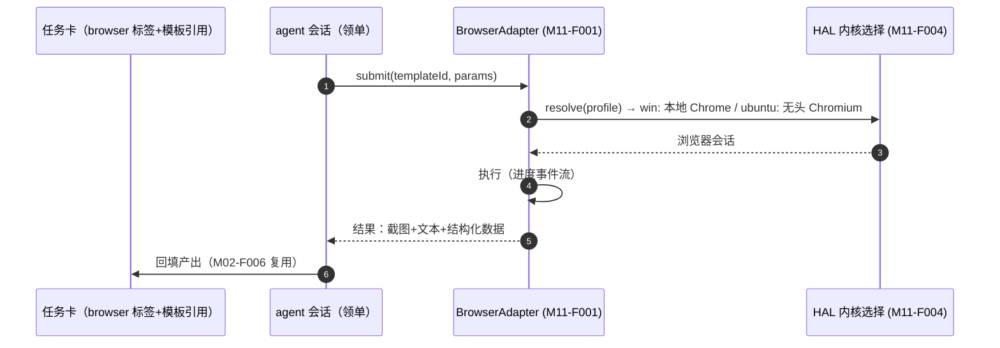

# M11 浏览器自动化模块（luban-browser）设计（双端）

以 **B 档依赖集成**方式接入 browser-use：win 与 ubuntu 都能用浏览器自动化完成信息采集、网页操作类任务；与任务看板联动，让「查资料/抓页面」类 todo 可被自动执行。

## 版本记录

| 版本 | 日期       | 作者  | 变更说明                              |
| ---- | ---------- | ----- | ------------------------------------- |
| v0.1 | 2026-08-29 | Maintainers | 初稿：适配层/任务模板/看板联动/内核收口 |

## 1. 概述与目标

- **解决**：R11 扩展——browser-use 在 windows 与 ubuntu 双端集成；网页类任务（查 datasheet、抓 issue、监控页面变化）可交给 agent。
- **不解决**：反爬对抗、需要复杂登录态的灰色场景；不重写浏览器自动化引擎（B 档纪律）。
- **需求映射**：R11（用户明确要求 win/ubuntu 双端集成）。
- **平台属性**：双端公用；浏览器内核差异收口在 HAL（M11-F004）。

## 2. 功能清单

| 编号 | 功能 | 优先级 | 里程碑 | 验收口径 |
| --- | --- | --- | --- | --- |
| M11-F001 | browser-use 适配层：进程/服务生命周期管理、任务下发（自然语言+URL+约束）、结果（截图/文本/结构化）回收 | P1 | MS2 | 双端各一条端到端任务成功 |
| M11-F002 | 浏览器任务模板：站点清单（登录态保持策略、超时、输出 schema），模板 yaml 化用户可增补 | P2 | MS2 | 新站点 5 分钟内可加模板 |
| M11-F003 | 看板联动自动执行：任务卡打 `browser` 标签 + 模板引用 → agent 领单后按模板自动执行并回填 | P3 | MS3 | 夜间窗口可跑浏览器类白名单任务 |
| M11-F004 | 双平台浏览器内核收口：HAL 决定 win（本地 Chrome/Edge）与 ubuntu（无头 Chromium）的启动差异 | P2 | MS2 | 同一任务定义双端可跑 |

## 3. 流程图



## 4. 接口设计

```typescript
export interface BrowserAdapter {
  start(profile?: BrowserProfile): Promise<BrowserSession>;
  run(task: BrowserTaskSpec): AsyncIterable<BrowserEvent>; // progress / screenshot / result / error
  stop(): Promise<void>;
  templates(): Promise<BrowserTemplate[]>;
}
export interface BrowserTaskSpec {
  templateId?: string;            // 有模板走模板
  goal: string;                   // 无模板走自然语言目标
  startUrl?: string;
  constraints?: { maxSteps?: number; allowDomains?: string[]; timeoutSec?: number };
}
```

## 5. 数据模型

见 `04-interfaces/data-models.md#browser`。要点：`BrowserTaskSpec`、`BrowserResult`（截图文件引用、提取文本、结构化 JSON、耗时/步数）。

## 6. 配置设计

```yaml
- insert:
    - id: luban-browser
      name: dsh-luban-browser
      config:
        engine: browser-use        # B 档，唯一引擎；接口留多引擎余地但不过度设计
        kernel: auto               # auto | chrome | edge | chromium-headless
        templatesDir: "browser-templates"
        defaults: { maxSteps: 30, timeoutSec: 300, allowDomains: [] }
```

## 7. 依赖与边界

- 下层：browser-use（**B 档**：python 侧服务/子进程接入或其 node 桥，实施时按其 license 与集成成本定形态；license 核实结果登记 07-references）；HAL 浏览器内核。
- 协作：M02（任务卡联动）、M10（win 桌面侧可与浏览器任务互补）。
- 平台属性：双端公用。

## 8. 非功能与安全

- 域名白名单默认为空=仅手动触发；夜间自动执行必须模板 + 域名白名单齐备（继承 M02 夜间三重防护）。
- 登录态凭据只存系统凭据管理器/环境变量，绝不入仓库与模板文件（P6.1）。

## 9. checklist 映射

M11-F001 ~ M11-F004 共 4 项，与 `checklist.json` 一一对应。

## 10. 开放问题

- browser-use 在 ubuntu 无桌面环境下的 headless 稳定性实测；若依赖 playwright，其浏览器下载与离线部署方式写入部署文档。
