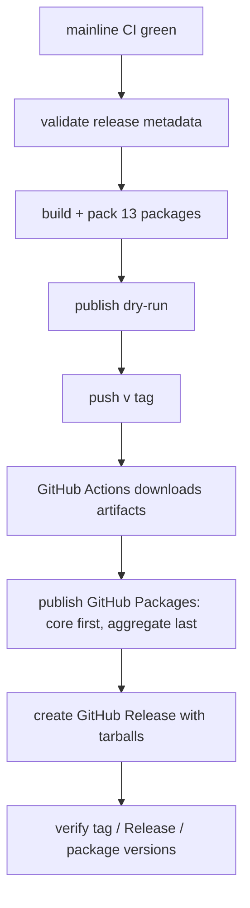

# M12 发布基础设施（legacy filename: market-release）

仓库级发布设施：插件脚手架、manifest 规范、第三方插件安装器，以及 tag → GitHub Packages → GitHub Release 的标准发布流程。插件市场注册与 npmjs 发布已退出当前目标。

## 版本记录

| 版本 | 日期 | 作者 | 变更说明 |
| --- | --- | --- | --- |
| v1.0 | 2026-09-01 | Codex | 收敛发布设施，移除市场交接、恢复账本和证据编排 |
| v1.1 | 2026-09-01 | Codex | 12 包改为 `@yin52133/*` 并发布到 GitHub Packages |
| v1.2 | 2026-09-02 | Codex | 增加完整套件包、CI 前置门禁与 topic 可发现性 |

## 1. 目标与边界

- 统一 13 个 `@yin52133/dsh-luban*` 包的版本、manifest、README 和发布文件清单。
- 同时支持完整套件 `@yin52133/dsh-luban` 与独立插件按需安装。
- 用一个 tag 按 core-first、聚合包最后的顺序发布同版本 GitHub Packages 包，再生成 GitHub Release。
- 发布前运行项目质量门禁、制品校验和 dry-run。
- 多包发布失败时立即停止，人工确认 registry 状态后从标准命令重试。
- 不建设插件市场、不自动提交市场 PR，也不维护自定义发布事务或证明系统。

## 2. 功能清单

| 编号 | 功能 | 优先级 | 里程碑 | 验收口径 |
| --- | --- | --- | --- | --- |
| M12-F001 | 包脚手架与 DSH manifest 规范 | P0 | MS1 | 生成包可构建，host/client manifest 可校验 |
| M12-F002 | **已废弃**：市场注册 PR 与 topic 打标 | P1 | MS2 | `dropped`，不进入发布范围 |
| M12-F003 | tag → GitHub Packages → GitHub Release 流水线 | P1 | MS2 | tag、Release、Packages 版本和制品一致 |
| M12-F004 | Windows/Ubuntu 第三方插件安装脚本 | P1 | MS2 | pinned 安装幂等且安装后核验通过 |
| M12-F005 | **已废弃**：独立安全加固门禁 | P0 | MS1 | `dropped`；files/dry-run 作为发布稳定性检查 |
| M12-F006 | README、版本、CHANGELOG 与 engines.dsh 规范 | P1 | MS2 | 校验器和包模板通过 |
| M12-F007 | GitHub `dsh-plugin` topic 可发现性 | P1 | MS2 | 仓库可被 topic 目录检索，且与版本 tag 分开管理 |

## 3. 发布流程



`.github/workflows/release.yml` 只在 `v*` tag 触发。publish job 使用仓库自带的
`GITHUB_TOKEN` 和 `packages: write` 权限，不需要 npmjs 账号、`NPM_TOKEN` 或额外仓库 secret；
工作流只在受保护的 release environment 中设置 `LUBAN_RELEASE_APPROVED=true`。

核心命令：

```bash
node scripts/release/validate-release.mjs
node scripts/release/pack-artifacts.mjs --prepare --tag v0.1.1 --output .release-artifacts/v0.1.1
node scripts/release/publish.mjs --dry-run --artifacts .release-artifacts/v0.1.1
```

发布脚本校验 manifest、GitHub Packages registry、tarball SHA-256、scoped 包名、版本和
core-first、聚合包最后的顺序。真实模式会先查询 registry：同版本已存在则跳过，不存在才发布；任一错误立即停止。

## 4. 包规范

所有包必须：

- 使用统一 SemVer；
- 声明 MIT、repository、Node 与 `engines.dsh`；
- 通过 `files` 只发布运行产物、README、LICENSE、notices 和 patch；
- 将 Cordis/DSH/React 等宿主依赖保持为 external/peer dependency；
- client bundle 使用 DSH loader 需要的 lazy-CJS 格式。

`@yin52133/dsh-luban-core` 先发布，其他包依赖 `workspace:^` 并在 pack 阶段解析为实际版本。

## 5. 第三方插件安装

`scripts/install-3rd-party.ps1` 与 `scripts/install-3rd-party.sh` 共用固定版本清单。默认 dry-run；apply 要求显式目标 profile/DSH_HOME。安装器连续执行两次以验证幂等，并核对 plugin list、dump-config、manifest、LICENSE 与必要原生模块。

## 6. 失败处理

GitHub Packages 多包发布不是事务：

1. 当前包失败时立即停止后续包；
2. 用 `npm view <package>@<version> --registry https://npm.pkg.github.com` 判断版本是否已经存在；
3. 不存在则修复原因后重新运行；已存在则由脚本跳过；
4. 不使用 unpublish、覆盖版本或复杂的本地恢复账本；
5. 完成后核对 GitHub Release 与 GitHub Packages 的实际版本。

## 7. 验证

发布前至少通过：

- format、lint、typecheck、build、unit/integration tests；
- uv lock、Ruff、Python tests 和 compileall；
- design/checklist/architecture 校验；
- 13 包 audit、pack 和 publish dry-run；
- README 与 CHANGELOG 版本一致性。

具体测试数量以当次门禁输出为准，不固化在设计文档中。
