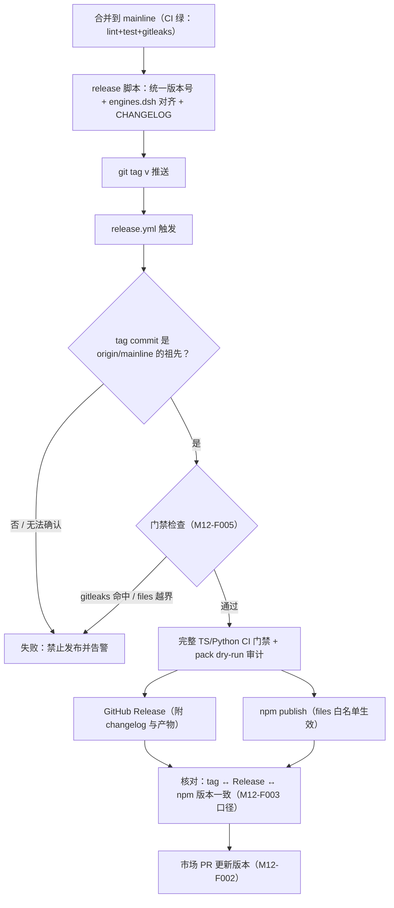
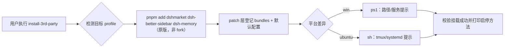

# M12 市场与发布模块（market-release）设计

发布基础设施（非插件）：包脚手架与 dsh manifest 规范、插件市场注册、tag→GitHub Release→npm 同步流水线、A 档第三方插件安装脚本、安全门禁。发布原则全文见 [06-release](../06-release/release-principles.md)。

## 版本记录

| 版本 | 日期       | 作者  | 变更说明                              |
| ---- | ---------- | ----- | ------------------------------------- |
| v0.1 | 2026-08-29 | Maintainers | 初稿：脚手架/市场/流水线/安装脚本/门禁/规范 |
| v0.2 | 2026-08-30 | Codex | 对齐 DSH 0.1.1 bundle/client 与 lazy-CJS 契约 |
| v0.3 | 2026-08-30 | Codex | 回填可复现发布、安全门禁与人工市场边界验证 |
| v0.4 | 2026-08-30 | Codex | 补齐 tag 发布工作流的独立全历史扫描与合成泄漏证明 |
| v0.5 | 2026-08-30 | Codex | 补齐双端 profile 安全生成器及隔离配置解析验证 |
| v0.6 | 2026-08-30 | Codex | 要求 tag 来源于 mainline，并让制品构建复用完整 TS/Python CI 门禁 |

## 1. 概述与目标

- **解决**：R04——插件能被市场发现、安装、升级；发布过程可信（不出敏感信息、版本可追溯、GitHub 与 npm 同步）。
- **不解决**：自建插件市场站点（用官方 awesome-dsh-plugin 注册表）。
- **需求映射**：R04。
- **平台属性**：仓库级设施。

## 2. 功能清单

| 编号 | 功能 | 优先级 | 里程碑 | 验收口径 |
| --- | --- | --- | --- | --- |
| M12-F001 | 包脚手架与 manifest 规范：生成 `dsh-luban-*` 包骨架（顶层 `engines.dsh`、`dsh.bundle.patch`、可选 `dsh.client` + `exports["./client"]`；cordis.patch.yml 模板），在一个最简 host/client 插件上验证双端可挂载/可热启停 | P0 | MS1 | 最简插件在双端 profile 挂载成功，client bundle 可加载 |
| M12-F002 | 市场注册：向 awesome-dsh-plugin 仓库提 PR（entry），GitHub 仓库打 `dsh-plugin` 等 topic | P1 | MS2 | 市场检索可见并可安装 |
| M12-F003 | 发布流水线：git tag → CI 构建 → GitHub Release（changelog）→ npm publish，同 tag 同内容；版本号全仓统一 | P1 | MS2 | tag 与 npm 版本一一对应 |
| M12-F004 | A 档第三方安装脚本：win(.ps1)/ubuntu(.sh) 直装 dshmarket、dsh-better-sidebar、dsh-memory 原版到目标 profile（版本锁定可选 latest） | P1 | MS2 | 双端脚本一键装齐且可重复执行 |
| M12-F005 | 安全门禁：gitleaks pre-commit + CI 扫描；npm `files` 白名单；publish 前 dry-run 检查 | P0 | MS1 | 模拟含密钥提交被拦截 |
| M12-F006 | README 与版本记录规范落地：每包 README 模板、`engines.dsh` 对齐表、CHANGELOG 生成约定 | P1 | MS2 | 新包从模板创建即合规 |

## 3. 流程图

### 3.1 发布流水线（含安全门禁）



### 3.2 A 档安装脚本



## 4. 接口设计（脚本与配置约定，非运行时 API）

```text
scripts/release/publish.mjs [--dry-run] [--packages <glob>]
scripts/install-3rd-party.ps1 [-Profile win-debug] [-Version latest|<pin>]
scripts/install-3rd-party.sh  [--profile ubuntu-server] [--version latest|<pin>]
```

包 manifest 基线（全部包必须满足，CI 校验）：

```json
{
  "name": "dsh-luban-<module>",
  "version": "<全仓统一>",
  "type": "module",
  "main": "./dist/index.js",
  "types": "./dist/index.d.ts",
  "license": "MIT",
  "repository": "github:yin52133/dsh-luban",
  "engines": { "node": "^22.19.0 || >=24.0.0", "dsh": ">=0.1.1-rc.1" },
  "exports": {
    ".": { "types": "./dist/index.d.ts", "default": "./dist/index.js" },
    "./client": { "types": "./dist/client/index.d.ts", "default": "./dist/client.js" },
    "./package.json": "./package.json"
  },
  "dsh": {
    "bundle": { "patch": "./cordis.patch.yml" },
    "client": { "platform": "web", "inject": ["@deepseek-ai/dsh-client-runtime"] }
  }
}
```

`dsh.client.inject` 按模块填写真实 Cordis client 服务依赖；React、Cordis、slots 等 Web Shell 基线模块不得重复打包。浏览器产物必须是 `window.__ModuleLoader__.load({ id, factory })` lazy-CJS 格式，实际存在于 `exports["./client"]` 指向的位置。`cordis.patch.yml` 只插入一次 host 包行，client 由 Loader 从同包 manifest 自动发现。

## 5. 数据模型

见 `04-interfaces/data-models.md#release`。要点：`ReleaseRecord`（tag、npmVersion、dshBaseline、artifact 清单、marketPrUrl）。

## 6. 配置设计

- `.github/workflows/release.yml` 触发条件 `tags: ['v*']`；npm token 存 GitHub Secrets（P6.1：token 不落盘不入文档）。
- 第三方版本锁定文件 `scripts/install-3rd-party.versions.json`（pin 模式用）。

## 7. 依赖与边界

- 下层：npm registry、GitHub Actions、awesome-dsh-plugin 注册表（市场侧）；A 档三插件（只安装，不修改）。
- 平台属性：仓库级；脚本双平台成对提供。

## 8. 非功能与安全

- 全部红线见 06-release：key/.env 禁提交（P6.1）、files 白名单、gitleaks、泄漏即 rotate。
- 发布原子性：npm publish 失败可重发同版本前必须先 unpublish/deprecate 处理，流水线给出明确指引，避免半发布状态。

## 9. checklist 映射

M12-F001 ~ M12-F006 共 6 项，与 `checklist.json` 一一对应。

## 10. 开放问题

- awesome-dsh-plugin PR 的 entry 字段细则与审核周期须在获准执行 M12-F002 时，以届时上游贡献
  说明为准；仓库只生成待人工审核的候选 entry，不自动调用 GitHub 或修改 topic。
- client-ui 槽位按模块从官方 SlotMap 选择并做 profile 实测；脚手架只提供 lazy-CJS 构建、manifest 与生命周期模板，不虚构通用页面槽位。

## 11. 实现与验证记录

- `scripts/create-plugin.mjs` 默认 dry-run、拒绝路径穿越和覆盖，生成统一版本、`engines.dsh`、
  `dsh.bundle.patch`、可选 `dsh.client`、`./client` export、lazy-CJS 构建与 host/client 生命周期测试。
- 市场 entry 工具只输出预览；写文件必须同时提供显式批准与批准人，且仍不创建 PR 或修改 topic。
  本轮未执行任何外部市场、GitHub topic 或发布操作。
- tag 工作流先在只读权限 job 中显式拉取 `origin/mainline`，并以 `git merge-base --is-ancestor`
  fail closed 地拒绝不属于 mainline 历史的 tag；通过后才执行校验、构建并产出带 SHA-256 manifest
  的不可变 tarball。受保护的 release environment 先创建可恢复 draft Release，再发布同一 tarball
  到 npm，成功后才公开 Release。
- Windows/Ubuntu 包装脚本共享固定的三项 A 档版本锁，默认 dry-run，只有 `--apply` 才以参数数组调用
  `dsh plugin --profile ... add`；本轮两个平台计划均已验证，未安装外部插件。
- `scripts/deploy/setup-windows.ps1` 与 `setup-ubuntu.sh` 共享 allowlist 生成器，默认仅输出计划，
  显式 apply 才创建 profile；已有目标一律拒绝覆盖，失败时只回滚本次新建目录。
- gitleaks pre-commit、mainline CI 与 tag 发布工作流均固定扫描器版本；tag job 在生成任何 tarball
  前独立执行全历史扫描与带校验和的合成密钥拒绝证明，并固定 uv `0.11.8` 复跑
  format/lint/typecheck/build/test、uv lock、ruff、9 项 Python 测试、compileall 与发布校验。npm
  `files` 白名单、pack dry-run、tag/版本/CHANGELOG/README/DSH 基线验证均已落地；发布入口在本地和
  未批准 CI 中 fail closed。
- M12 的 15 项脚手架、profile 生成、安装、安全、市场与不可变发布测试通过；真实 Ubuntu profile、
  完整插件挂载、CI tag、npm、
  GitHub Release、市场 PR 与 topic 仍需在获得明确授权后验收。
