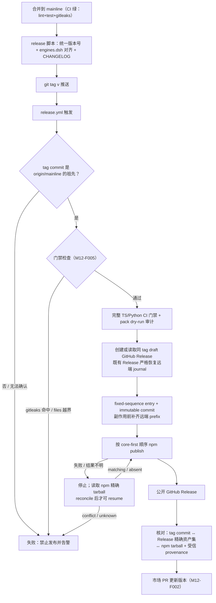
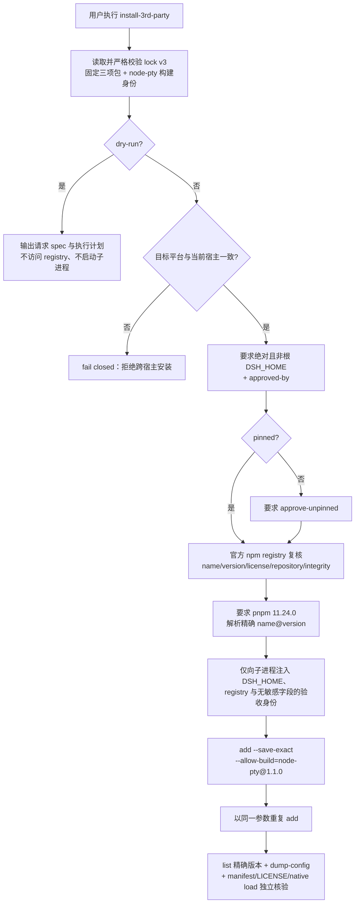

# M12 市场与发布模块（market-release）设计

发布基础设施（非插件）：包脚手架与 dsh manifest 规范、插件市场注册、tag→GitHub Release→npm 同步流水线、A 档第三方插件安装脚本、安全门禁。发布原则全文见 [06-release](../06-release/release-principles.md)。

## 版本记录

| 版本 | 日期       | 作者  | 变更说明                              |
| ---- | ---------- | ----- | ------------------------------------- |
| v0.1 | 2026-08-29 | Maintainers | 初稿：脚手架/市场/流水线/安装脚本/门禁/规范 |
| v0.2 | 2026-08-30 | Codex | 对齐 DSH 0.1.1 bundle/client 与 lazy-CJS 契约 |
| v0.3 | 2026-08-30 | Codex | 回填可复现发布、安全门禁与人工市场边界验证 |
| v0.4 | 2026-08-30 | Codex | 补齐 tag 发布工作流的独立全历史扫描与合成泄漏证明 |
| v0.5 | 2026-08-30 | Codex | 补齐双端 profile 安全生成器及隔离配置解析验证 |
| v0.6 | 2026-08-30 | Codex | 要求 tag 来源于 mainline，并让制品构建复用完整 TS/Python CI 门禁 |
| v0.7 | 2026-08-30 | Codex | 增加原子 staging 发布与可加载脚手架/profile 验证 |
| v0.8 | 2026-08-30 | Codex | 记录本地完整发布、安全与 uv 锁定门禁证据 |
| v0.9 | 2026-08-30 | Codex | 固化 A 档 lock v2、安装授权门禁与目标宿主 profile smoke |
| v0.10 | 2026-08-30 | Codex | 将 A 档锁升级为 schema v3，并补齐原生构建、幂等安装与安装后独立核验 |
| v0.11 | 2026-08-30 | Codex | 将双端 profile smoke 绑定到 expected Git SHA 与同一 CI run/attempt，并固定证据检查集合与输入摘要 |
| v0.12 | 2026-08-30 | Codex | 固化市场上游 schema/ref，并增加 clean-mainline 绑定的确定性交接物与人工批准边界 |
| v0.13 | 2026-08-30 | Codex | 增加远端追加式发布账本、失败对账/重跑恢复及 tag/Release/npm provenance 一致性核验 |
| v0.14 | 2026-08-30 | Codex | 将发布恢复协议同步为固定序号 entry、逐序号不可变 commit、无 clobber 远端前缀与逐包 workflow attempt provenance |

## 1. 概述与目标

- **解决**：R04——插件能被市场发现、安装、升级；发布过程可信（不出敏感信息、版本可追溯、GitHub 与 npm 同步）。
- **不解决**：自建插件市场站点（用官方 awesome-dsh-plugin 注册表）。
- **需求映射**：R04。
- **平台属性**：仓库级设施。

## 2. 功能清单

| 编号 | 功能 | 优先级 | 里程碑 | 验收口径 |
| --- | --- | --- | --- | --- |
| M12-F001 | 包脚手架与 manifest 规范：生成 `dsh-luban-*` 包骨架（顶层 `engines.dsh`、`dsh.bundle.patch`、可选 `dsh.client` + `exports["./client"]`；cordis.patch.yml 模板），在一个最简 host/client 插件上验证双端可挂载/可热启停 | P0 | MS1 | 最简插件在双端 profile 挂载成功，client bundle 可加载 |
| M12-F002 | 市场注册：向 awesome-dsh-plugin 仓库提 PR（entry），GitHub 仓库打 `dsh-plugin` 等 topic | P1 | MS2 | 市场检索可见并可安装 |
| M12-F003 | 发布流水线：git tag → CI 构建 → GitHub Release（changelog）→ npm publish，同 tag 同内容；版本号全仓统一 | P1 | MS2 | tag 与 npm 版本一一对应 |
| M12-F004 | A 档第三方安装脚本：win(.ps1)/ubuntu(.sh) 安装 `dshmarket@1.36.0`、`dsh-better-sidebar@0.17.1`、`@furongjun1999/dsh-memory@0.4.0` 原版到目标 profile；默认 lock v3 pinned，并精确约束 `node-pty@1.1.0` 原生构建，latest/显式 semver 需二次批准 | P1 | MS2 | 双端脚本一键装齐、重复执行结果一致，且安装后独立核验通过 |
| M12-F005 | 安全门禁：gitleaks pre-commit + CI 扫描；npm `files` 白名单；publish 前 dry-run 检查 | P0 | MS1 | 模拟含密钥提交被拦截 |
| M12-F006 | README 与版本记录规范落地：每包 README 模板、`engines.dsh` 对齐表、CHANGELOG 生成约定 | P1 | MS2 | 新包从模板创建即合规 |

## 3. 流程图

### 3.1 发布流水线（含安全门禁）



### 3.2 A 档安装脚本



## 4. 接口设计（脚本与配置约定，非运行时 API）

```text
node scripts/release/publish.mjs --dry-run [--artifacts <dir>]
node scripts/release/recover-release.mjs --artifacts <dir> --repository <owner/name> --repository-id <id> --repository-owner-id <id> --expected-sha <commit> [--ledger <path>] [--github-output <path>]
node scripts/release/publish.mjs --publish --artifacts <dir> --repository <owner/name> --expected-sha <commit> [--ledger <path>]
node scripts/release/publish.mjs --reconcile --artifacts <dir> --repository <owner/name> --expected-sha <commit> [--ledger <path>]
node scripts/release/publish.mjs --resume --artifacts <dir> --repository <owner/name> --expected-sha <commit> [--ledger <path>]
node scripts/release/verify-published-release.mjs --artifacts <dir> [--ledger <path>] --repository <owner/name> --repository-id <id> --repository-owner-id <id> --expected-sha <commit>
node scripts/release/prepare-market-handoff.mjs --package <dsh-luban-*> --category <upstream-slug> [--dry-run|--write]
scripts/install-3rd-party.ps1 [-Profile win-debug] [-Version pinned|latest|<semver>] [-DshHome <absolute>] [-ApprovedBy <actor>] [-ApproveUnpinned] [-DryRun|-Apply]
scripts/install-3rd-party.sh  [--profile ubuntu-server] [--version pinned|latest|<semver>] [--dsh-home <absolute>] [--approved-by <actor>] [--approve-unpinned] [--dry-run|--apply]
node scripts/acceptance/m12-profile-smoke.mjs [--live --expected-git-sha <sha> --workflow-run-id <id> --workflow-run-attempt <n>] [--output <new-json-path>]
node scripts/acceptance/m12-profile-smoke.mjs aggregate --windows <json> --ubuntu <json> --expected-git-sha <sha> --workflow-run-id <id> --workflow-run-attempt <n> --output <new-json-path>
```

安装器默认 dry-run；该路径只校验本地 lock 并输出计划，不访问 registry，也不启动 `dsh`。
`--apply`/`-Apply` 仅允许在与目标一致的宿主执行，并要求通过 `--dsh-home`/`-DshHome` 和
`--approved-by`/`-ApprovedBy` 显式提供绝对、非文件系统根目录的 DSH home 与非空批准人。
latest 或显式 semver 还必须提供 `--approve-unpinned`/`-ApproveUnpinned`；registry 复核后安装器
只把解析出的精确版本交给 `dsh plugin add`。apply 固定 pnpm `11.24.0`，以 `--save-exact` 保存
三项直接依赖，并只允许 `node-pty@1.1.0` 执行原生构建脚本；同一安装命令必须连续成功两次。
随后以 `plugin list --depth=0 --json`、`--dump-config` 和在目标 profile 内运行的独立 verifier
核对精确版本、bundle 唯一挂载、MIT manifest、常规 LICENSE 文件及其 SHA-256、精确
`allowBuilds` 与 `node-pty` 可加载性。`DSH_HOME`、官方 npm registry 和不含 integrity/repository
的验收身份只注入子进程，不修改父进程环境；子进程原始输出不进入失败消息。

M12 profile smoke 默认只输出无写入计划。`--live` 根据当前宿主选择 `win-debug` 或
`ubuntu-server`，要求项目本地 DSH `0.1.1-rc.2`，在忽略目录下创建隔离 `DSH_HOME`，离线安装
临时 host/client fixture，验证 config 唯一挂载、lazy-CJS client、热停/热启、进程重启和完整
dispose 序列，最后只清理其明确拥有的临时目录。注入 fake executor 的测试结果只能标记为
`simulated`，不能升级为 live acceptance；只有目标宿主的真实 `--live` pass 才是该平台证据。
live 证据还必须在执行前绑定显式 expected Git SHA、GitHub Actions run ID 与 run attempt；CI 以
`github.sha`、`github.run_id`、`github.run_attempt` 传入。双端聚合只接受同一 run attempt、同一
expected SHA、不同一次性 smoke run ID，且检查项必须与 canonical check ID 有序集合完全一致。
聚合物记录下载输入文件的原始 SHA-256，单端与聚合输出均使用 create-once 写入；因此旧 attempt
证据、重复 host run ID、增删/重排检查项和 SHA 漂移均 fail closed。

市场 handoff 默认只输出确定性 JSON 预览；`--write` 仅在 `origin` 与包的无凭据 GitHub 仓库一致、
本地 Git 工作树 clean 且 `HEAD` 等于 `refs/heads/mainline` 时，向忽略目录
`.luban/market-handoffs/` create-once 写入。交接物固定
`DshMarketPlace/awesome-dsh-plugin` 的不可变 commit
`2dea4eaad3c01782b9f650ec30d562ae80ad8622`，以及该 ref 下的
`data/curated.yml` → `categories[].plugins[]`（`repo` + 可选 `subpath`）schema；它把现有
`prepare-market-entry` 候选的 SHA-256 纳入派生链，同时记录实际上游 entry SHA-256、包版本、
当前 source Git SHA、PR title/body、topic add-only plan 与参数化命令。生成器不联网、不执行交接
物列出的命令，且本地 Git 检查只继承最小系统环境；带凭据的 `origin` 与 secret-like 内容直接拒绝。
测试注入 Git runner 只能产生 `test-only` 预览，不能写出可交付 artifact。所有
`gh`/push/PR/topic 操作保持 `executed: false`，每条命令都记录相对 `cwd` 与独立 argv；PR 命令
固定在 `awesome-dsh-plugin` fork worktree 执行。上游 `npm test` 会重生成 `README.md` 与
`README.zh-CN.md`，计划强制在 test 后先审查这两项与 `data/curated.yml` 的 diff，再只 stage 这三个
文件。非默认 GitHub HTTPS 端口与 `npm_` token 同样 fail closed。获权维护者执行前仍须复核届时
上游 schema、版本/tag/npm/Release 一致性与完整命令。

npm 多包发布使用与 `release-manifest.json` SHA-256、每个 tarball SHA-256 及不可变 release authority
绑定的追加式账本。初始 ledger 是 sequence 0；事件使用固定序号文件名 `00000001.json`、
`00000002.json`……，事件体通过 `previousDigest` 绑定前一 entry。每个 entry 另有同序号、create-once
的 `publish-ledger-commit-00000000.json`、`publish-ledger-commit-00000001.json`……；commit 同时绑定
entry 名称、大小、SHA-256、前一 entry SHA-256 与前一 commit SHA-256。初始文件、事件和 commit 都先
写入同目录临时文件并 `fsync`，再以原子 no-replace hard link 安装最终名；重放拒绝修改、缺口、
分叉、非 core-first 前缀和非法状态迁移。

远端 draft Release 只保存不可变 entry/commit assets，不保存 mutable head，也不使用 `--clobber`。
上传采用 read-before/create-once/read-after：同名且逐字节相同视为幂等重试，异字节一律视为 fork 并
fail closed。进程若在 entry 已写入或上传、对应 commit 完成前退出，恢复只允许“完整连续前缀 + 恰好
一个缺 commit 的尾部 entry”；两个 orphan、任意中间缺口、commit fork 或非法事件都拒绝。本地
`publish-ledger-head.json` 是可原子替换的 canonical head，仅用于修复本地“尾 commit 缺失、head
缺失或只落后一位”窗口，不上传到 Release，也不充当远端权威。

`--publish`、`--resume` 与 `--reconcile` 在任何官方 registry 读取或 `npm publish` 副作用前都执行
prefix barrier：按 sequence 重新确认每个本地 entry 及其 commit 已在 draft Release 中逐字节存在，
并先补齐唯一可证明的 orphan commit；checkpoint 未确认不得继续。每次 `npm publish` 前必须先持久化
唯一 `attempt-started` 及其 commit；子进程以错误、信号或异常结束均视为结果不明并立即停止。
public Release 不允许 orphan、gap、fork、未知资产或未达到 `published` 的账本。

`--reconcile` 只读固定的官方 npm registry。attempting 包只有在 registry tarball 与本地不可变制品
逐字节相同、SLSA v1 subject 的 PURL 与 tarball SHA-512 相同，并且 registry 返回的同一 Sigstore
bundle 通过 npm 随附的官方 Sigstore verifier 后，才可追加 `reconciled-matching`。验证同时精确绑定
repository 名称、repository ID、owner ID、release workflow path/tag ref、workflow ref、workflow SHA、
commit SHA、`push` event、GitHub-hosted runner、原 `runId` 与 `runAttempt`；Fulcio certificate identity
必须等于该 workflow ref，issuer 必须是 GitHub Actions OIDC。每个包把实际执行其 publish 的 attempt
authority 固化到账本，后续 workflow 重跑必须按该包原 attempt 核验 provenance，不能误绑当前
rerun。明确 404 才可追加
`reconciled-absent`；pending 包不得认领已有版本，conflict/unknown 一律停止。

发布后核验 CLI 以 immutable release authority 为根，解析 GitHub tag（含 annotated tag）到 commit，
要求 Release 非 draft、非 prerelease，且资产集合精确等于 manifest、全部 tarball、初始 ledger、所有
远端事件和对应逐序号 commit；远端不得出现本地 canonical head。CLI 逐项下载并核 SHA-256，再按每包
账本中保存的原 publish attempt 复核 npm tarball 与 provenance。全部通过后才在本地账本追加
`release-verified`；该审计事件及其 commit/head 只随 Actions artifact 归档，不追加到已公开 Release，
CLI 也不创建 tag、Release 或 npm 版本。workflow 重跑先从 Release 恢复：draft 只有完整前缀或唯一
可证明 orphan 才进入 `resume`，public 只有无 orphan/gap/fork 且状态为 `published` 才进入 `verify`。

包 manifest 基线（全部包必须满足，CI 校验）：

```json
{
  "name": "dsh-luban-<module>",
  "version": "<全仓统一>",
  "type": "module",
  "main": "./dist/index.js",
  "types": "./dist/index.d.ts",
  "license": "MIT",
  "repository": "github:yin52133/dsh-luban",
  "engines": { "node": "^22.19.0 || >=24.0.0", "dsh": ">=0.1.1-rc.1" },
  "exports": {
    ".": { "types": "./dist/index.d.ts", "default": "./dist/index.js" },
    "./client": { "types": "./dist/client/index.d.ts", "default": "./dist/client.js" },
    "./package.json": "./package.json"
  },
  "dsh": {
    "bundle": { "patch": "./cordis.patch.yml" },
    "client": { "platform": "web", "inject": ["@deepseek-ai/dsh-client-runtime"] }
  }
}
```

`dsh.client.inject` 按模块填写真实 Cordis client 服务依赖；React、Cordis、slots 等 Web Shell 基线模块不得重复打包。浏览器产物必须是 `window.__ModuleLoader__.load({ id, factory })` lazy-CJS 格式，实际存在于 `exports["./client"]` 指向的位置。`cordis.patch.yml` 只插入一次 host 包行，client 由 Loader 从同包 manifest 自动发现。

## 5. 数据模型

见 `04-interfaces/data-models.md#release`。要点：`ReleaseRecord`（tag、npmVersion、dshBaseline、artifact 清单、marketPrUrl），以及 create-once `PublishLedger`、fixed-sequence `PublishLedgerEvent`、逐序号 `PublishLedgerCommit`、逐包 `PublishAttemptAuthority` 与仅本地使用的 canonical head。

## 6. 配置设计

- `.github/workflows/release.yml` 触发条件 `tags: ['v*']`；npm token 存 GitHub Secrets（P6.1：token 不落盘不入文档）。
- 第三方版本锁定文件 `scripts/install-3rd-party.versions.json` 使用 schema v3，固定官方 registry，
  并为三项顶层包及 `dsh-better-sidebar` 的原生构建边界 `node-pty@1.1.0` 记录精确 `name`、
  `version`、SHA-512 `integrity`、npm metadata `license` 与 `repository`。pinned apply 必须逐字段
  与官方 registry 当前响应一致，且三项顶层包仍声明 `dsh.bundle.patch`、sidebar 仍精确依赖已审
  范围 `node-pty@^1.1.0`，否则 fail closed。

## 7. 依赖与边界

- 下层：官方 npm registry、GitHub Actions、awesome-dsh-plugin 注册表（市场侧）；A 档三插件
  （只安装，不修改）。npm metadata 的许可声明不替代源码仓库 LICENSE 与安装后 notices 复核。
- 平台属性：仓库级；脚本双平台成对提供。

## 8. 非功能与安全

- 全部红线见 06-release：key/.env 禁提交（P6.1）、files 白名单、gitleaks、泄漏即 rotate。
- 发布恢复：npm publish 不是跨包事务。任一失败或模糊结果必须停止并保留已同步至 draft Release 的副作用前账本；不得盲目重发、认领无 attempt 的既有版本、unpublish 或覆盖。只有 registry 精确字节与受信 provenance 对账为 matching，或明确 absent，才分别确认当前 attempt 成功/允许 resume；conflict/unknown 必须人工处置并保持失败。
- A 档 apply 在任何 registry 请求或 `dsh` 子进程前完成批准人、目标宿主与 DSH_HOME 边界校验；
  dry-run 无网络、无子进程。非 pinned 请求不得沿用 pinned 供应链声明，必须二次批准并记录为
  `registry-resolved`。
- A 档原生构建许可不得退化为包名级 `node-pty: true` 或其他版本规则；安装后 verifier 必须看到
  唯一的 `node-pty@1.1.0: true`，并实际加载其 `spawn` API。安装命令返回成功不等于验收成功。

## 9. checklist 映射

M12-F001 ~ M12-F006 共 6 项，与 `checklist.json` 一一对应。

## 10. 开放问题

- awesome-dsh-plugin 的当前上游身份与 entry 字段已由 market handoff 固定到不可变 ref；获准执行
  M12-F002 时仍须将该 ref 与届时 `main` 的贡献说明/schema 做人工 diff，确认无漂移后才可插入
  entry、执行上游测试、开 PR 或追加 topic。仓库不会自动调用 GitHub 或修改 topic。
- client-ui 槽位按模块从官方 SlotMap 选择并做 profile 实测；脚手架只提供 lazy-CJS 构建、manifest 与生命周期模板，不虚构通用页面槽位。
- A 档三包及 `node-pty@1.1.0` 的 npm metadata/lock v3 已核对；安装器已经具备 LICENSE 哈希、
  重复执行、精确清单、配置挂载和原生模块加载的 fail-closed 验证，但双平台真实安装与 notices
  证据仍须在获得授权的可丢弃 profile 上生成。

## 11. 实现与验证记录

- `scripts/create-plugin.mjs` 默认 dry-run、拒绝路径穿越和覆盖，生成统一版本、`engines.dsh`、
  `dsh.bundle.patch`、可选 `dsh.client`、`./client` export、lazy-CJS 构建与 host/client 生命周期测试；
  生成的 host 入口指向 `dist/index.js`，临时包已完成自身 import/build 和 client 类型验证。
- 市场 entry 工具只输出预览；写 entry 文件必须同时提供显式批准与批准人。其上的 market handoff
  进一步将候选 checksum、上游 immutable ref/schema、clean mainline SHA、版本、PR title/body、
  topic add-only dry-run 和未执行命令固化为 secret-free、create-once 的本地 JSON。5 项独立契约
  测试覆盖逐字节确定性、无网络预览、真实 Git provenance、覆盖拒绝、dirty/divergent Git、注入
  runner 写入拒绝、schema/category/version、credentialed/non-default-port GitHub identity 与
  GitHub/npm token fail-closed；命令序列测试精确固定 cwd/argv/order，并覆盖 npm test 后双语 README
  diff 审查与三文件 stage。本轮仍未执行任何外部市场、GitHub topic、PR 或发布操作。
- tag 工作流先在只读权限 job 中显式拉取 `origin/mainline`，并以 `git merge-base --is-ancestor`
  fail closed 地拒绝不属于 mainline 历史的 tag；通过后才执行校验、构建并产出带 SHA-256 manifest
  的不可变 tarball。受保护的 release environment 创建或严格读取同 tag draft Release，恢复远端
  create-once journal 后才选择 publish/resume/verify。每个 npm 副作用前的 fixed-sequence event 与
  同序 immutable commit 先原子落盘，再以无 clobber asset 即时持久化；prefix barrier 在 registry
  读取和 npm 副作用前补齐唯一 orphan。部分成功或结果不明时停止，只有官方 registry 精确 tarball、
  每包原 workflow attempt 的 SLSA/Sigstore 绑定通过后才能恢复。Release 公开后只读核验 remote tag
  commit、非 prerelease 的精确 entry/commit 资产集合与 npm tarball/provenance；本地 canonical head
  和 `release-verified` 审计尾随 Actions artifact 归档，不进入公开 Release。
- Windows/Ubuntu 包装脚本共享 schema v3 A 档锁：`dshmarket@1.36.0`、
  `dsh-better-sidebar@0.17.1`、`@furongjun1999/dsh-memory@0.4.0`，同时固定 SHA-512
  integrity、MIT npm metadata 声明与 repository 身份，并固定 sidebar 的 `node-pty@1.1.0` 构建
  边界。dry-run 无 registry/子进程；apply 在目标宿主要求显式 DSH_HOME 与批准人，逐项复核后
  使用 pnpm 11.24.0、精确依赖和精确 allow-build 连续安装两次，再独立核验清单、配置、manifest、
  LICENSE 哈希与 native load。latest/显式 semver 需额外批准并先解析为精确版本；28 项 M12 定向
  测试覆盖成功链和 fail-closed 边界，本轮未安装外部插件。
- `scripts/deploy/setup-windows.ps1` 与 `setup-ubuntu.sh` 共享 allowlist 生成器，默认仅输出计划，
  显式 apply 才创建 profile；随机同父目录 staging 经 canonical/device/inode 身份校验后原子发布，
  已有目标一律拒绝覆盖，异常身份不递归清理。Windows 隔离 `DSH_HOME` 已实际 apply `win-debug`
  与 `ubuntu-server` profile 并由 DSH `--dump-config` 验证加载，随后清理临时目录。
- `scripts/acceptance/m12-profile-smoke.mjs` 提供 fail-closed 的目标宿主 live runner：生成并构建临时
  host/client 插件，在隔离 profile 中离线安装，验证 host/client 挂载、热启停、重启与清理；契约
  测试证明默认 plan 不写入、fake 结果不得冒充 live、缺少项目本地 DSH 时副作用前 blocked，以及
  expected workflow SHA/run/attempt、canonical check 集合、原始输入摘要、create-once 和重放拒绝
  边界。runner 与可信双端 handoff 已就绪不代表远端双宿主现场验收已完成。
- gitleaks pre-commit、mainline CI 与 tag 发布工作流均固定扫描器版本；tag job 在生成任何 tarball
  前独立执行全历史扫描与带校验和的合成密钥拒绝证明，并固定 uv `0.11.8` 复跑
  format/lint/typecheck/build/test、uv lock、ruff、13 项 Python 测试、compileall 与发布校验。npm
  `files` 白名单、pack dry-run、tag/版本/CHANGELOG/README/DSH 基线验证均已落地；发布入口在本地和
  未批准 CI 中 fail closed。
- M12 的脚手架、profile 生成、安装、安全、市场、不可变发布、失败恢复、发布后三方核验及 profile smoke 契约测试通过；
  仍缺 Windows/Ubuntu 两台目标宿主分别产出的 live smoke 证据、A 档真实安装与重复执行、CI tag、
  npm、GitHub Release、市场 PR 与 topic，须在获得明确授权后验收。
- 全工作区 format/lint/typecheck/build、包测试、跨模块集成、12 包 audit、release metadata 与
  pack/publish dry-run 门禁通过；经 SHA-256 校验的临时 Gitleaks 8.30.1 已证明全历史扫描和合成
  token 拒绝链路，扫描器随后清理且未做全局安装；`uv --locked` 的 Ruff、13 项 Python 测试与
  compileall 通过。具体测试数不在设计记录固化，以当前门禁输出为准。
