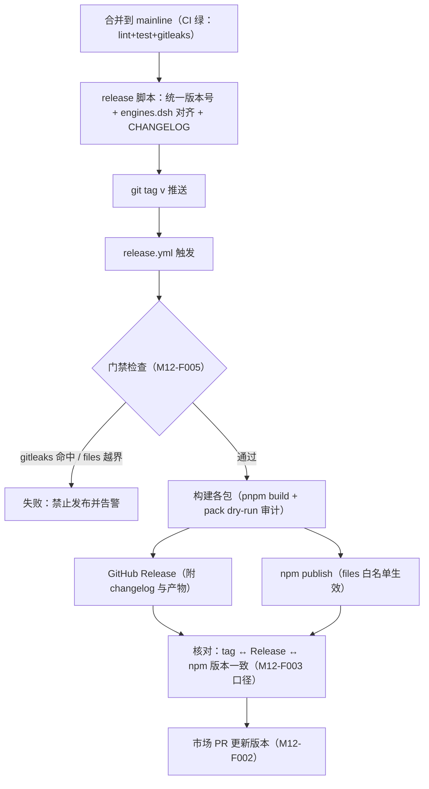
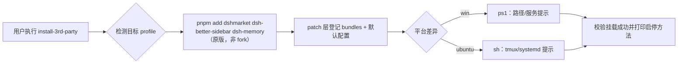

# M12 市场与发布模块（market-release）设计

发布基础设施（非插件）：包脚手架与 dsh manifest 规范、插件市场注册、tag→GitHub Release→npm 同步流水线、A 档第三方插件安装脚本、安全门禁。发布原则全文见 [06-release](../06-release/release-principles.md)。

## 版本记录

| 版本 | 日期       | 作者  | 变更说明                              |
| ---- | ---------- | ----- | ------------------------------------- |
| v0.1 | 2026-08-29 | Maintainers | 初稿：脚手架/市场/流水线/安装脚本/门禁/规范 |

## 1. 概述与目标

- **解决**：R04——插件能被市场发现、安装、升级；发布过程可信（不出敏感信息、版本可追溯、GitHub 与 npm 同步）。
- **不解决**：自建插件市场站点（用官方 awesome-dsh-plugin 注册表）。
- **需求映射**：R04。
- **平台属性**：仓库级设施。

## 2. 功能清单

| 编号 | 功能 | 优先级 | 里程碑 | 验收口径 |
| --- | --- | --- | --- | --- |
| M12-F001 | 包脚手架与 manifest 规范：生成 `dsh-luban-*` 包骨架（package.json 的 `dsh` 字段：engines/bundle.patch/client.inject；cordis.patch.yml 模板），在一个最简插件上验证双端可挂载/可热启停 | P0 | MS1 | 最简插件在双端 profile 挂载成功 |
| M12-F002 | 市场注册：向 awesome-dsh-plugin 仓库提 PR（entry），GitHub 仓库打 `dsh-plugin` 等 topic | P1 | MS2 | 市场检索可见并可安装 |
| M12-F003 | 发布流水线：git tag → CI 构建 → GitHub Release（changelog）→ npm publish，同 tag 同内容；版本号全仓统一 | P1 | MS2 | tag 与 npm 版本一一对应 |
| M12-F004 | A 档第三方安装脚本：win(.ps1)/ubuntu(.sh) 直装 dshmarket、dsh-better-sidebar、dsh-memory 原版到目标 profile（版本锁定可选 latest） | P1 | MS2 | 双端脚本一键装齐且可重复执行 |
| M12-F005 | 安全门禁：gitleaks pre-commit + CI 扫描；npm `files` 白名单；publish 前 dry-run 检查 | P0 | MS1 | 模拟含密钥提交被拦截 |
| M12-F006 | README 与版本记录规范落地：每包 README 模板、`engines.dsh` 对齐表、CHANGELOG 生成约定 | P1 | MS2 | 新包从模板创建即合规 |

## 3. 流程图

### 3.1 发布流水线（含安全门禁）



### 3.2 A 档安装脚本



## 4. 接口设计（脚本与配置约定，非运行时 API）

```text
scripts/release/publish.mjs [--dry-run] [--packages <glob>]
scripts/install-3rd-party.ps1 [-Profile win-debug] [-Version latest|<pin>]
scripts/install-3rd-party.sh  [--profile ubuntu-server] [--version latest|<pin>]
```

包 manifest 基线（全部包必须满足，CI 校验）：

```json
{
  "name": "dsh-luban-<module>",
  "version": "<全仓统一>",
  "license": "MIT",
  "repository": "github:yin52133/dsh-luban",
  "engines": { "dsh": ">=0.1.1-rc.1" },
  "dsh": {
    "engines": { "dsh": ">=0.1.1-rc.1" },
    "bundle": { "patch": "./cordis.patch.yml" },
    "client": { "platform": "web", "inject": ["@deepseek-ai/dsh-client-runtime", "@deepseek-ai/dsh-client-locale", "@deepseek-ai/dsh-client-ui-slots"] }
  }
}
```

## 5. 数据模型

见 `04-interfaces/data-models.md#release`。要点：`ReleaseRecord`（tag、npmVersion、dshBaseline、artifact 清单、marketPrUrl）。

## 6. 配置设计

- `.github/workflows/release.yml` 触发条件 `tags: ['v*']`；npm token 存 GitHub Secrets（P6.1：token 不落盘不入文档）。
- 第三方版本锁定文件 `scripts/install-3rd-party.versions.json`（pin 模式用）。

## 7. 依赖与边界

- 下层：npm registry、GitHub Actions、awesome-dsh-plugin 注册表（市场侧）；A 档三插件（只安装，不修改）。
- 平台属性：仓库级；脚本双平台成对提供。

## 8. 非功能与安全

- 全部红线见 06-release：key/.env 禁提交（P6.1）、files 白名单、gitleaks、泄漏即 rotate。
- 发布原子性：npm publish 失败可重发同版本前必须先 unpublish/deprecate 处理，流水线给出明确指引，避免半发布状态。

## 9. checklist 映射

M12-F001 ~ M12-F006 共 6 项，与 `checklist.json` 一一对应。

## 10. 开放问题

- awesome-dsh-plugin PR 的 entry 字段细则与审核周期（M12-F002 执行时确认）。
- client-ui 槽位清单实测后，脚手架模板补全 client 段默认值。
