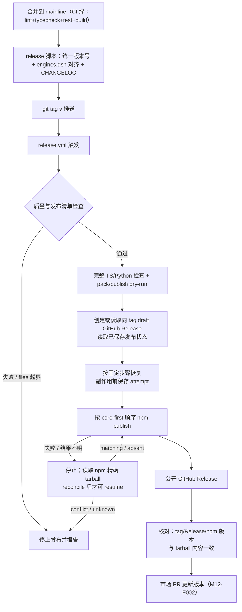
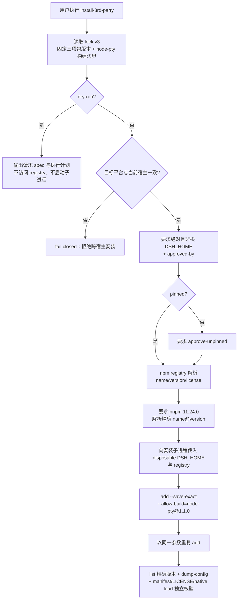

# M12 市场与发布模块（market-release）设计

发布基础设施（非插件）：包脚手架与 dsh manifest 规范、插件市场注册、tag→GitHub Release→npm 同步流水线、A 档第三方插件安装脚本。发布原则全文见 [06-release](../06-release/release-principles.md)。

## 版本记录

| 版本 | 日期       | 作者  | 变更说明                              |
| ---- | ---------- | ----- | ------------------------------------- |
| v0.1 | 2026-08-29 | Maintainers | 初稿：脚手架/市场/流水线/安装脚本/门禁/规范 |
| v0.2 | 2026-08-30 | Codex | 对齐 DSH 0.1.1 bundle/client 与 lazy-CJS 契约 |
| v0.3 | 2026-08-30 | Codex | 回填可复现发布与人工市场边界验证 |
| v0.4 | 2026-08-30 | Codex | 补齐 tag 发布工作流的 files/pack dry-run 检查 |
| v0.5 | 2026-08-30 | Codex | 补齐双端 profile 生成器及隔离配置解析验证 |
| v0.6 | 2026-08-30 | Codex | 让制品构建复用完整 TS/Python CI 检查 |
| v0.7 | 2026-08-30 | Codex | 增加原子 staging 发布与可加载脚手架/profile 验证 |
| v0.8 | 2026-08-30 | Codex | 记录本地发布与 uv 锁定检查结果 |
| v0.9 | 2026-08-30 | Codex | 固化 A 档 lock v2、安装授权门禁与目标宿主 profile smoke |
| v0.10 | 2026-08-30 | Codex | 将 A 档锁升级为 schema v3，并补齐原生构建、幂等安装与安装后独立核验 |
| v0.11 | 2026-08-30 | Codex | 增加 Windows/Ubuntu profile smoke 与固定检查集合 |
| v0.12 | 2026-08-30 | Codex | 固化市场上游 schema 并增加人工批准边界 |
| v0.13 | 2026-08-30 | Codex | 增加发布状态、失败对账与重跑恢复 |
| v0.14 | 2026-08-30 | Codex | 将发布恢复同步为固定步骤、无覆盖写入与逐包 attempt 记录 |
| v0.15 | 2026-08-30 | Codex | 增加 A 档真实安装的双端 disposable live runner 与人工授权 workflow |
| v0.16 | 2026-08-30 | Codex | 增加双端安装结果聚合与独立输出文件 |
| v0.17 | 2026-08-30 | Codex | 补齐最终结果复核和 owned cleanup |
| v0.18 | 2026-08-30 | Codex | 收口为可复现、错误恢复与真实环境验收 |
| v0.19 | 2026-08-31 | Codex | 完成 Windows/Ubuntu A 档真实安装并简化验收链 |

## 1. 概述与目标

- **解决**：R04——插件能被市场发现、安装、升级；版本统一，GitHub/npm 结果可核对，失败后可恢复。
- **不解决**：自建插件市场站点（用官方 awesome-dsh-plugin 注册表）。
- **需求映射**：R04。
- **平台属性**：仓库级设施。

## 2. 功能清单

| 编号 | 功能 | 优先级 | 里程碑 | 验收口径 |
| --- | --- | --- | --- | --- |
| M12-F001 | 包脚手架与 manifest 规范：生成 `dsh-luban-*` 包骨架（顶层 `engines.dsh`、`dsh.bundle.patch`、可选 `dsh.client` + `exports["./client"]`；cordis.patch.yml 模板），在一个最简 host/client 插件上验证双端可挂载/可热启停 | P0 | MS1 | 最简插件在双端 profile 挂载成功，client bundle 可加载 |
| M12-F002 | 市场注册：向 awesome-dsh-plugin 仓库提 PR（entry），GitHub 仓库打 `dsh-plugin` 等 topic | P1 | MS2 | 市场检索可见并可安装 |
| M12-F003 | 发布流水线：git tag → CI 构建 → GitHub Release（changelog）→ npm publish，同 tag 同内容；版本号全仓统一；包含 `files` 清单、pack/publish dry-run 与失败恢复 | P1 | MS2 | tag、Release 与 npm 版本一一对应，失败后可对账恢复 |
| M12-F004 | A 档第三方安装脚本：win(.ps1)/ubuntu(.sh) 安装 `dshmarket@1.36.0`、`dsh-better-sidebar@0.17.1`、`@furongjun1999/dsh-memory@0.4.0` 原版到目标 profile；默认 lock v3 pinned，并精确约束 `node-pty@1.1.0` 原生构建，latest/显式 semver 需二次批准 | P1 | MS2 | 双端脚本一键装齐、重复执行结果一致，且安装后独立核验通过 |
| M12-F005 | **已废弃**：独立安全扫描门禁；不再作为功能或发布 blocker | P0 | MS1 | `dropped`；原有 `files`/dry-run 稳定性检查并入 M12-F003/M12-F006 |
| M12-F006 | README 与版本记录规范落地：每包 README 模板、`engines.dsh` 对齐表、CHANGELOG 生成约定；模板包含发布文件清单与 dry-run 指引 | P1 | MS2 | 新包从模板创建即可构建、检查发布清单 |

## 3. 流程图

### 3.1 发布流水线



### 3.2 A 档安装脚本



## 4. 接口设计（脚本与配置约定，非运行时 API）

```text
node scripts/release/publish.mjs --dry-run [--artifacts <dir>]
node scripts/release/recover-release.mjs --artifacts <dir> --repository <owner/name> [--ledger <path>] [--github-output <path>]
node scripts/release/publish.mjs --publish --artifacts <dir> --repository <owner/name> [--ledger <path>]
node scripts/release/publish.mjs --reconcile --artifacts <dir> --repository <owner/name> [--ledger <path>]
node scripts/release/publish.mjs --resume --artifacts <dir> --repository <owner/name> [--ledger <path>]
node scripts/release/verify-published-release.mjs --artifacts <dir> [--ledger <path>] --repository <owner/name>
node scripts/release/prepare-market-handoff.mjs --package <dsh-luban-*> --category <upstream-slug> [--dry-run|--write]
scripts/install-3rd-party.ps1 [-Profile win-debug] [-Version pinned|latest|<semver>] [-DshHome <absolute>] [-ApprovedBy <actor>] [-Output <path>] [-ApproveUnpinned] [-DryRun|-Apply]
scripts/install-3rd-party.sh  [--profile ubuntu-server] [--version pinned|latest|<semver>] [--dsh-home <absolute>] [--approved-by <actor>] [--output <path>] [--approve-unpinned] [--dry-run|--apply]
node scripts/acceptance/m12-profile-smoke.mjs [--live] [--output <new-json-path>]
node scripts/acceptance/m12-profile-smoke.mjs aggregate --windows <json> --ubuntu <json> --output <new-json-path>
```

安装器默认 dry-run；该路径只校验本地 lock 并输出计划，不访问 registry，也不启动 `dsh`。
`--apply`/`-Apply` 仅允许在与目标一致的宿主执行，并要求通过 `--dsh-home`/`-DshHome` 和
`--approved-by`/`-ApprovedBy` 显式提供绝对、非文件系统根目录的 DSH home 与非空批准人。
latest 或显式 semver 还必须提供 `--approve-unpinned`/`-ApproveUnpinned`；registry 复核后安装器
只把解析出的精确版本交给 `dsh plugin add`。apply 固定 pnpm `11.24.0`，以 `--save-exact` 保存
三项直接依赖，并只允许 `node-pty@1.1.0` 执行原生构建脚本；同一安装命令必须连续成功两次。
随后以 `plugin list --depth=0 --json`、`--dump-config` 和在目标 profile 内运行的独立 verifier
核对精确版本、bundle 唯一挂载、MIT manifest、常规 LICENSE 文件、精确 `allowBuilds` 与
`node-pty` 可加载性。安装在指定的 disposable `DSH_HOME` 中执行，不修改调用者的 profile。

真实验收直接在 Windows/Ubuntu 目标宿主调用 production `.ps1`/`.sh` wrapper，并使用独立、绝对的
disposable `DSH_HOME`。`--output`/`-Output` 将同一份成功结果以 create-once JSON 保存，已有文件拒绝
覆盖。验收不依赖额外 OIDC、证明链或专用 workflow；profile 与证据按用户的删除规则保留供复核。

M12 profile smoke 默认只输出无写入计划。`--live` 根据当前宿主选择 `win-debug` 或
`ubuntu-server`，要求项目本地 DSH `0.1.1-rc.2`，在忽略目录下创建隔离 `DSH_HOME`，离线安装
临时 host/client fixture，验证 config 唯一挂载、lazy-CJS client、热停/热启、进程重启和完整
dispose 序列，最后只清理其明确拥有的临时目录。fixture 结果用于本地回归；平台验收使用目标宿主的
真实 `--live` 运行。双端聚合要求 Windows/Ubuntu 的 canonical check 集合均通过，并保留各平台的
原始错误摘要以便复现和恢复。M12-F001 的脚手架、manifest、host/client 加载与 profile smoke 已有
直接功能证据，按 `statusLegend` 标记为 `done`。

市场 handoff 默认只输出确定性 JSON 预览；`--write` 向忽略目录 `.luban/market-handoffs/` 写入新的
本地审核物，不覆盖已有文件。交接物记录 awesome-dsh-plugin 当前 `data/curated.yml` schema、包版本、
PR title/body、topic add-only plan 与参数化命令。生成器不联网，也不执行交接物列出的命令。所有
`gh`/push/PR/topic 操作保持 `executed: false`，每条命令都记录相对 `cwd` 与独立 argv；PR 命令
固定在 `awesome-dsh-plugin` fork worktree 执行。上游 `npm test` 会重生成 `README.md` 与
`README.zh-CN.md`，计划强制在 test 后先审查这两项与 `data/curated.yml` 的 diff，再只 stage 这三个
文件。获权维护者执行前仍须复核届时上游 schema、版本/tag/npm/Release 一致性与完整命令。

npm 多包发布不是事务。发布状态按 core-first 顺序记录每个包的 `planned`、`attempting`、`published`
或 `failed`；状态文件先写临时文件并 `fsync`，再原子替换。每次 `npm publish` 前先保存 attempt，子进程
以错误、信号或异常结束时立即停止，不继续后续包，也不盲目重发、覆盖或 unpublish。

`--reconcile` 只读官方 npm registry：明确不存在的版本可继续 `resume`；已存在且版本、包名和 tarball
内容与本地制品一致时记录为 matching；内容冲突或结果未知时保持失败并等待人工处理。重跑从本地状态
和 draft Release 已有资产恢复，已确认步骤不重复执行，同名资产不覆盖。

发布后核验 CLI 检查 tag、非 draft/non-prerelease Release、manifest、全部 tarball 和 npm 版本一致，
然后记录 `release-verified`。CLI 只读核验，不创建 tag、Release 或 npm 版本；恢复和核验均保留原始错误
摘要，便于定位部分成功和继续执行的位置。

包 manifest 基线（全部包必须满足，CI 校验）：

```json
{
  "name": "dsh-luban-<module>",
  "version": "<全仓统一>",
  "type": "module",
  "main": "./dist/index.js",
  "types": "./dist/index.d.ts",
  "license": "MIT",
  "repository": "github:yin52133/dsh-luban",
  "engines": { "node": "^22.19.0 || >=24.0.0", "dsh": ">=0.1.1-rc.1" },
  "exports": {
    ".": { "types": "./dist/index.d.ts", "default": "./dist/index.js" },
    "./client": { "types": "./dist/client/index.d.ts", "default": "./dist/client.js" },
    "./package.json": "./package.json"
  },
  "dsh": {
    "bundle": { "patch": "./cordis.patch.yml" },
    "client": { "platform": "web", "inject": ["@deepseek-ai/dsh-client-runtime"] }
  }
}
```

`dsh.client.inject` 按模块填写真实 Cordis client 服务依赖；React、Cordis、slots 等 Web Shell 基线模块不得重复打包。浏览器产物必须是 `window.__ModuleLoader__.load({ id, factory })` lazy-CJS 格式，实际存在于 `exports["./client"]` 指向的位置。`cordis.patch.yml` 只插入一次 host 包行，client 由 Loader 从同包 manifest 自动发现。

## 5. 数据模型

见 `04-interfaces/data-models.md#release`。要点：`ReleaseRecord`（tag、npmVersion、dshBaseline、artifact
清单、marketPrUrl），以及按 core-first 顺序记录步骤、attempt、结果和恢复位置的 `PublishLedger`。

## 6. 配置设计

- `.github/workflows/release.yml` 触发条件 `tags: ['v*']`；npm token 存 GitHub Secrets（P6.1：token 不落盘不入文档）。
- 第三方版本锁定文件 `scripts/install-3rd-party.versions.json` 使用 schema v3，为三项顶层包及
  `dsh-better-sidebar` 的原生构建边界 `node-pty@1.1.0` 记录精确 `name`、`version` 与 license。
  pinned apply 使用这些精确版本，并核对三项顶层包仍声明 `dsh.bundle.patch`、sidebar 仍依赖
  `node-pty@^1.1.0`。

## 7. 依赖与边界

- 下层：官方 npm registry、GitHub Actions、awesome-dsh-plugin 注册表（市场侧）；A 档三插件
  （只安装，不修改）。npm metadata 的许可声明不替代源码仓库 LICENSE 与安装后 notices 复核。
- 平台属性：仓库级；脚本双平台成对提供。

## 8. 运行与恢复约束

- 发布包使用 `files` 清单并在发布前执行 pack/publish dry-run；本地 profile、credentials 与会话数据
  不进入发布包。
- npm publish 不是跨包事务。任一失败或模糊结果必须停止并保存当前位置；不得盲目重发、认领未知
  版本、unpublish 或覆盖。registry 明确不存在时可 resume；已存在版本只有在包名、版本和 tarball
  内容一致时才记为 matching，冲突或未知结果交给人工处理。
- A 档 apply 在任何 registry 请求或 `dsh` 子进程前完成批准人、目标宿主与 DSH_HOME 边界校验；
  dry-run 无网络、无子进程。非 pinned 请求必须二次批准并记录为
  `registry-resolved`。
- A 档原生构建许可不得退化为包名级 `node-pty: true` 或其他版本规则；安装后 verifier 必须看到
  唯一的 `node-pty@1.1.0: true`，并实际加载其 `spawn` API。安装命令返回成功不等于验收成功。

## 9. checklist 映射

M12-F001 ~ M12-F006 共 6 项，与 `checklist.json` 一一对应。

## 10. 开放问题

- market handoff 记录当前 awesome-dsh-plugin entry schema；获准执行 M12-F002 时仍须与届时
  `main` 的贡献说明/schema 做人工 diff，再插入 entry、执行上游测试、开 PR 或追加 topic。仓库不会
  自动调用 GitHub 或修改 topic。
- client-ui 槽位按模块从官方 SlotMap 选择并做 profile 实测；脚手架只提供 lazy-CJS 构建、manifest 与生命周期模板，不虚构通用页面槽位。
- A 档三包及 `node-pty@1.1.0` 的 npm metadata/lock v3 已核对；Windows/Ubuntu disposable profile
  均已完成重复执行、精确清单、配置挂载、LICENSE 和原生模块加载验证。

## 11. 实现与验证记录

- `scripts/create-plugin.mjs` 默认 dry-run、拒绝路径穿越和覆盖，生成统一版本、`engines.dsh`、
  `dsh.bundle.patch`、可选 `dsh.client`、`./client` export、lazy-CJS 构建与 host/client 生命周期测试；
  生成的 host 入口指向 `dist/index.js`，临时包已完成自身 import/build 和 client 类型验证。
- 市场 entry 工具默认只输出预览；写 entry 文件必须同时提供显式批准与批准人。market handoff 保存
  当前 schema、版本、PR title/body、topic add-only dry-run 和未执行命令，已有审核物不覆盖。命令序列
  测试覆盖 cwd/argv/order、上游 `npm test` 后双语 README diff 审查与三文件 stage。本轮仍未执行任何
  外部市场、GitHub topic、PR 或发布操作。
- tag 工作流执行质量检查、构建与 files/pack/publish dry-run，再创建或读取同 tag draft Release。
  每次 npm 副作用前原子保存 attempt；部分成功或结果不明时停止。resume/reconcile 根据状态文件、draft
  Release 资产和 registry 中的版本/tarball 内容继续；发布后只读核对 tag、Release 与 npm 三处版本及
  制品清单。
- Windows/Ubuntu 包装脚本共享 schema v3 A 档锁：`dshmarket@1.36.0`、
  `dsh-better-sidebar@0.17.1`、`@furongjun1999/dsh-memory@0.4.0`，并固定 sidebar 的
  `node-pty@1.1.0` 构建边界。dry-run 无 registry/子进程；apply 在目标宿主要求显式 DSH_HOME 与批准人，
  逐项复核后
  使用 pnpm 11.24.0、精确依赖和精确 allow-build 连续安装两次，再独立核验清单、配置、manifest、
  LICENSE 存在与 native load。latest/显式 semver 需额外批准并先解析为精确版本；定向契约测试
  覆盖成功链、错误恢复、ESM-only 包 manifest 定位和原始 stderr 传播。Windows 与 Ubuntu 已分别在
  disposable profile 完成真实安装，create-once 证据哈希记录于 `checklist.json`，M12-F004 为 `done`。
- `scripts/deploy/setup-windows.ps1` 与 `setup-ubuntu.sh` 共享 allowlist 生成器，默认仅输出计划，
  显式 apply 才创建 profile；同父目录 staging 原子发布，已有目标一律拒绝覆盖，失败时只清理生成器
  自己创建的临时目录。Windows 隔离 `DSH_HOME` 已实际 apply `win-debug`
  与 `ubuntu-server` profile 并由 DSH `--dump-config` 验证加载，随后清理临时目录。
- `scripts/acceptance/m12-profile-smoke.mjs` 提供目标宿主 live runner：生成并构建临时
  host/client 插件，在隔离 profile 中离线安装，验证 host/client 挂载、热启停、重启与清理；契约
  测试证明默认 plan 不写入、缺少项目本地 DSH 时在副作用前报告 blocked，并覆盖 canonical check、
  原子输出与 owned cleanup。脚手架/manifest/profile smoke 已有直接功能证据，M12-F001 标记为 `done`。
- CI 与 tag 发布工作流运行 format/lint/typecheck/build/test、uv lock、ruff、Python 测试、compileall、
  `files` 清单、pack/publish dry-run、tag/版本/CHANGELOG/README/DSH 基线检查；这些稳定性检查归入
  M12-F003/M12-F006，M12-F005 标记为 `dropped`。
- M12 的脚手架、profile 生成、安装、市场、发布恢复及 profile smoke 契约测试通过；A 档
  Windows/Ubuntu 真实双端安装已完成，仍缺获准的 CI tag、npm、GitHub Release、市场 PR 与 topic。
- 全工作区 format/lint/typecheck/build、包测试、跨模块集成、12 包 audit、release metadata、
  pack/publish dry-run、`uv --locked` Ruff、Python 测试与 compileall 通过。具体测试数不在设计记录
  固化，以当前检查输出为准。
