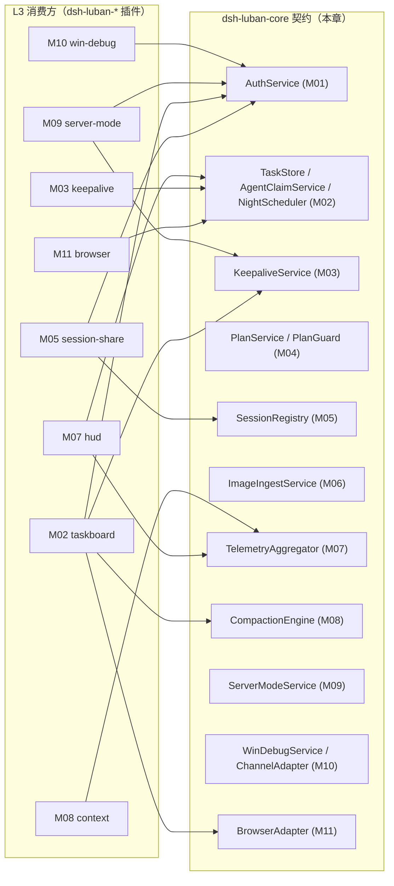

# 接口总览（跨模块契约与事件总线）

## 版本记录

| 版本 | 日期       | 作者  | 变更说明                              |
| ---- | ---------- | ----- | ------------------------------------- |
| v0.1 | 2026-08-29 | Maintainers | 初稿：契约汇总、依赖关系、事件总线登记表 |
| v0.2 | 2026-08-30 | Codex | 统一插件 HTTP 路由为 `/luban-<module>/...` |
| v0.3 | 2026-08-30 | Codex | 登记 HUD 对健康事件与可选 TaskStore 的松耦合消费 |
| v0.4 | 2026-08-30 | Codex | 增加 M01-F008 账号上下文隔离约定并收敛基础认证契约 |
| v0.5 | 2026-08-30 | Codex | 将角色字段收敛为兼容提示，账号隔离仅以 accountId 为边界 |

## 1. 契约一览与依赖方向

所有跨模块契约集中在 `dsh-luban-core` 定义并导出；各模块（L3 插件）只 import 契约与 HAL，不互相 import（原则 P1.4/P2.1）。

各契约的完整 TypeScript 签名分布在对应模块文档「接口设计」章节；本章维护**登记表与公共约定**，新增跨模块契约必须先在此登记。

| 契约 | 提供模块 | 主要消费方 | 文档 |
| --- | --- | --- | --- |
| AuthService / AuthMiddleware | M01 | M02、M05、M09、M10、M11 | [M01 §4](../03-modules/M01-auth.md) |
| TaskStore / AgentClaimService / NightScheduler | M02 | M03、M07、M09、M11 | [M02 §4](../03-modules/M02-taskboard.md) |
| KeepaliveService / KeepaliveAdapter | M03 | M02、M09 | [M03 §4](../03-modules/M03-keepalive.md) |
| PlanService / PlanGuard | M04 | M02 | [M04 §4](../03-modules/M04-plan.md) |
| SessionRegistry | M05 | M02 | [M05 §4](../03-modules/M05-session-share.md) |
| ImageIngestService | M06 | M10 | [M06 §4](../03-modules/M06-image-paste.md) |
| TelemetryAggregator / TelemetryProvider | M07 | M08 | [M07 §4](../03-modules/M07-hud.md) |
| CompactionEngine / CompactionStrategy | M08 | M02 | [M08 §4](../03-modules/M08-context.md) |
| ServerModeService | M09 | — | [M09 §4](../03-modules/M09-server-mode.md) |
| ChannelAdapter / WinDebugService | M10 | M06 | [M10 §4](../03-modules/M10-win-debug.md) |
| BrowserAdapter | M11 | M02 | [M11 §4](../03-modules/M11-browser.md) |

## 2. 公共约定

- **账号上下文（M01-F008）**：M01 将登录 cookie 解析为
  `AccountContext { accountId, username, role }`。业务服务接收已经解析的账号上下文，所有账号数据的
  查询、写入、事件与文件引用均只按 `accountId` 隔离，不得把一个账号的记录返回或写入另一个账号。
  `role` 仅兼容现有账户管理界面，不扩展为复杂 RBAC，也不是业务数据的安全边界。
- **Actor**：操作者统一为用户 actor 或 agent actor；用户 actor 的 `id` 为 `AccountId`，agent actor
  同时携带所属 `accountId` 与会话 id，使任务、计划、会话和附件能保持同一账号归属。
- **乐观锁**：一切可变实体带 `version: number`，更新必须带 `expectedVersion`，冲突返回 409 语义错误。
- **时间**：一律 epoch ms（UTC）；展示层本地化。
- **错误**：跨契约错误统一 `LubanError { code: string; message: string; retriable: boolean; cause? }`；错误码登记于下表，新增需登记。

| 错误码 | 含义 | 典型来源 |
| --- | --- | --- |
| `E_AUTH_REQUIRED` | 未认证 | M01 |
| `E_ACCOUNT_SCOPE_MISMATCH` | 请求与目标记录不属于同一账号 | M01/各业务模块 |
| `E_VERSION_CONFLICT` | 乐观锁冲突 | M02 等 |
| `E_INVALID_TRANSITION` | 非法状态迁移 | M02/M04 |
| `E_ACCEPTANCE_REQUIRED` | 缺验收标准不可领单 | M02 |
| `E_QUOTA_EXCEEDED` | 限额/配额耗尽 | M02/M09 |
| `E_CIRCUIT_OPEN` | 熔断中 | M02 |
| `E_CHANNEL_UNAVAILABLE` | 通道不可用/被占用 | M10 |
| `E_PLATFORM_UNSUPPORTED` | 平台不支持 | M09/M10 |

## 3. 事件总线登记表

进程内事件（cordis 总线）+ 对外 SSE（web）共用同一事件名。**未登记事件禁止发布**（P2.3）。

| 事件名 | 载荷要点 | 发布方 | 消费方 |
| --- | --- | --- | --- |
| `luban.task.changed` | accountId、taskId、from→to、actor、version | M02 | 看板 UI、M03、M09 |
| `luban.task.claimed` | accountId、taskId、actor(agent 会话)、hostScope | M02 | M03、M07 |
| `luban.night.status` | accountId、windowActive、quotaUsed、circuit | M02 | HUD、看板 |
| `luban.keepalive.health` | accountId、sessionId、alive、有界诊断摘要 | M03 | 看板告警、HUD |
| `luban.session.lock` | accountId、sessionId、holder、同账号控制锁状态 | M05 | 看板、HUD |
| `luban.telemetry.snapshot` | TelemetrySnapshot（节流 1s） | M07 | 扩展插件 |
| `luban.compaction.done` | sessionId、strategy、前后 token | M08 | HUD、审计 |
| `luban.channel.data` | endpointId、kind、方向 | M10 | 监视 UI |
| `luban.build.job` | jobId、状态迁移 | M09 | 看板 |
| `luban.browser.progress` | runId、step、截图引用 | M11 | 会话/看板 |

## 4. Web API 组织约定

- 各插件的 HTTP 端点统一前缀 `/luban-<module>/...`（如 `/luban-taskboard/tasks`、`/luban-auth/login`），与 cordis 插件 id `luban-<module>` 一致并避免和 dsh 内建路由冲突。
- 除 `/luban-auth/login` 外，业务端点复用 M01 登录会话并取得 `AccountContext`；账号数据的查询与
  mutation 均使用该上下文限定范围。
- SSE 端点约定 `GET /luban-<module>/events`，断线重连携带 `Last-Event-ID` 做补发。
- `GET /luban-hud/snapshot` 与 HUD SSE envelope 可选携带 `keepalive { healthy, alerts[] }`；
  这是向后兼容扩展，alerts 只包含当前账号的 `sessionId` 与有界诊断摘要，不包含会话正文。

## 5. 变更流程

新增/修改契约：先改本章或对应模块文档 → 运行 `scripts/validate-design.mjs` → 版本记录追加 → 再实现。事件与错误码必须同步登记表。
