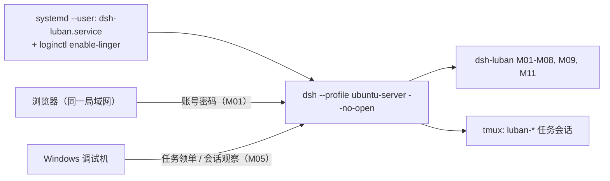
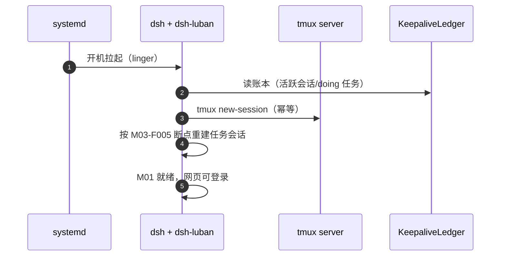

# Ubuntu 端部署设计（ubuntu-server 形态）

## 版本记录

| 版本 | 日期       | 作者  | 变更说明                              |
| ---- | ---------- | ----- | ------------------------------------- |
| v0.1 | 2026-08-29 | Maintainers | 初稿：systemd 常驻、tmux 保活、网页访问链路 |
| v0.2 | 2026-08-30 | Codex | 增加 M11 browser-use 的 uv 隔离环境要求 |
| v0.3 | 2026-08-30 | Codex | 落地默认预览且拒绝覆盖的 ubuntu-server 生成脚本 |
| v0.4 | 2026-08-30 | Codex | 修正 systemd 启动命令并明确强制恢复哨兵语义 |

## 1. 目标形态

局域网 Ubuntu 编译服务器：dsh 以 user 级 systemd 服务常驻（M09-F001），tmux 托管任务会话（M03-F001），重启后自动恢复；工程师浏览器经 M01 登录直接使用网页（R01）。



## 2. 安装步骤（设计口径）

1. **前置**：Node ≥ 22、pnpm ≥ 10、uv ≥ 0.11、tmux、git；建议专用用户（如 `dsh`）。
2. **profile**：先运行 `scripts/deploy/setup-ubuntu.sh` 预览目标与文件清单；确认后增加
   `--apply`，生成 `~/.dsh/profiles/ubuntu-server/`。可用 `--dsh-home <path>` 指向隔离目录。
   脚本不改官方 preset，且目标已存在时拒绝覆盖。
3. **安装套件**：`dsh plugin --profile ubuntu-server add dsh-luban-auth ... dsh-luban-server-mode`。
4. **A 档直装**：`scripts/install-3rd-party.sh --profile ubuntu-server`。
5. **服务注册**：M09-F001 安装 user 级 unit：

```ini
# ~/.config/systemd/user/dsh-luban.service（设计样例）
[Unit]
Description=dsh-luban workbench (ubuntu-server profile)
After=network-online.target
Wants=network-online.target

[Service]
Type=simple
ExecStart="/usr/bin/env" "dsh" "--profile" "ubuntu-server" "--no-open"
Environment=LUBAN_BOOT_RESTORE=1
Restart=on-failure
RestartSec=5
NoNewPrivileges=true
PrivateTmp=true

[Install]
WantedBy=default.target
```

`LUBAN_BOOT_RESTORE=1` 是部署层强制恢复哨兵：即使 profile 中配置
`bootRestore: false`，M03 仍会在该 systemd 启动路径执行恢复。只有精确字符串 `1`
生效，其他类 truthy 文本不取得覆盖语义。

6. **linger**：`sudo loginctl enable-linger <user>`——不登录桌面也让 user 级服务开机自启（R02 关键）。
7. **认证初始化**：首启引导建管理员；`config.port` 自定义（默认 42600）。

```sh
# Preview only (default)
scripts/deploy/setup-ubuntu.sh --dsh-home /tmp/dsh-acceptance

# Create after reviewing the JSON plan
scripts/deploy/setup-ubuntu.sh --dsh-home /tmp/dsh-acceptance --apply

DSH_HOME=/tmp/dsh-acceptance dsh --profile ubuntu-server --dump-config
```

## 3. 重启恢复链路（与 M03/M09 协作）



## 4. 运维要点

- 日志：`journalctl --user -u dsh-luban -f`；套件自有日志在 `~/.dsh/luban/logs/`（滚动 30 天）。
- 升级：同 Windows（dsh-market Update API / pnpm）；dsh 本体升级前在测试 profile 验证。
- 备份：`~/.dsh/luban/`（看板/认证/保活账本）每日 cron 快照保留 7 份；**备份文件含口令哈希，禁止提交到任何仓库**（P6.1）。
- 防火墙：`ufw allow <port>/tcp`（限内网网段更佳）。

## 5. 浏览器自动化（M11）无桌面注意点

ubuntu-server 无显示环境：M11-F004 HAL 默认走无头 Chromium；插件以 `uv run --locked` 启动随包 Python 项目，隔离环境位于 `~/.dsh/luban/browser/uv-env`，禁止使用全局 pip；Chromium 在安装脚本中预下载（或配置离线包），部署文档给出磁盘占用预估。
