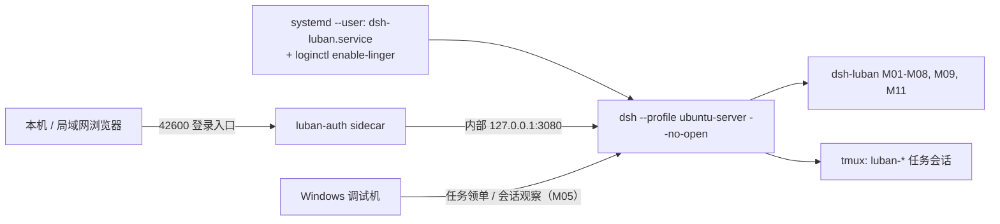
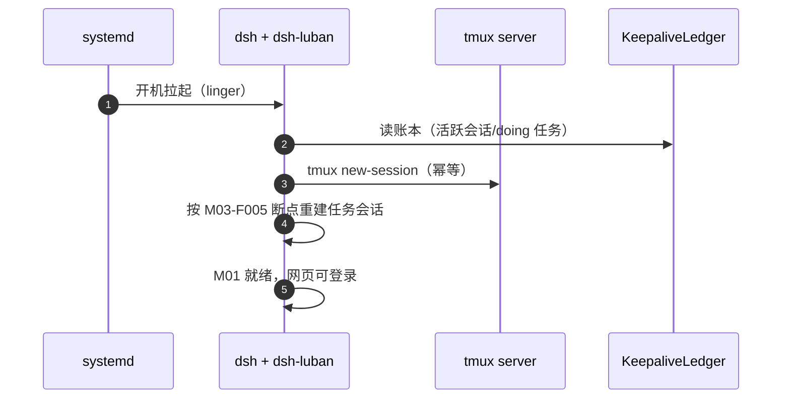

# Ubuntu 端部署设计（ubuntu-server 形态）

## 版本记录

| 版本 | 日期       | 作者  | 变更说明                              |
| ---- | ---------- | ----- | ------------------------------------- |
| v0.1 | 2026-08-29 | Maintainers | 初稿：systemd 常驻、tmux 保活、网页访问链路 |
| v0.2 | 2026-08-30 | Codex | 增加 M11 browser-use 的 uv 隔离环境要求 |
| v0.3 | 2026-08-30 | Codex | 落地默认预览且拒绝覆盖的 ubuntu-server 生成脚本 |
| v0.4 | 2026-08-30 | Codex | 修正 systemd 启动命令并明确强制恢复哨兵语义 |
| v0.5 | 2026-08-30 | Codex | 同步 A 档 lock v2、安装授权门禁与 profile smoke |
| v0.6 | 2026-08-30 | Codex | 同步 A 档 lock v3、精确原生构建许可与安装后验收链 |
| v0.7 | 2026-08-30 | Codex | 增加 profile smoke 双端结果聚合 |
| v0.8 | 2026-08-30 | Codex | 增加 M09 systemd 分阶段安装、重启与清理验收命令 |
| v0.9 | 2026-08-30 | Codex | 完善 M09 分阶段恢复账本与重启验证 |
| v0.10 | 2026-08-30 | Codex | 增加 M09 独立构建与安装准备步骤 |
| v0.11 | 2026-08-30 | Codex | 固定 M09 验收所用 pnpm 版本与运行文件 |
| v0.12 | 2026-08-30 | Codex | 完善 M09 验收运行目录与阶段重试 |
| v0.13 | 2026-08-30 | Codex | 收敛安装与重启 smoke 为幂等、owned cleanup 和真实宿主功能验收 |
| v0.14 | 2026-08-31 | Codex | 限定 Web 端口为实际 LAN CIDR 并记录跨机登录验收 |
| v0.15 | 2026-09-05 | Maintainers | 补充防火墙检查、端口放行、撤销和 Windows 访问排查 |

## 1. 目标形态

局域网 Ubuntu 编译服务器：dsh 以 user 级 systemd 服务常驻（M09-F001），tmux 托管任务会话（M03-F001），重启后自动恢复；工程师浏览器经 M01 登录直接使用网页（R01）。



## 2. 安装步骤（设计口径）

1. **前置**：Node ≥ 22、pnpm ≥ 10、uv ≥ 0.11、tmux、git；建议专用用户（如 `dsh`）。
2. **profile**：先运行 `scripts/deploy/setup-ubuntu.sh` 预览目标与文件清单；确认后增加
   `--apply`，生成 `~/.dsh/profiles/ubuntu-server/`。可用 `--dsh-home <path>` 指向隔离目录。
   脚本不改官方 preset，且目标已存在时拒绝覆盖。
3. **安装套件**：直接从公共 npm registry 执行
   `dsh plugin --profile ubuntu-server add @yin52133/dsh-luban-auth ... @yin52133/dsh-luban-server-mode`；
   安装不需要 GitHub 账号或 PAT；也可使用 GitHub Release 的本地 `.tgz`。
4. **A 档直装**：先运行 `scripts/install-3rd-party.sh --profile ubuntu-server --dry-run` 审核
   本地 lock v3 计划；默认固定 `dshmarket@1.42.0`、`dsh-better-sidebar@0.18.0`、
   `@furongjun1999/dsh-memory@0.4.0`。apply 必须在 Linux 宿主提供绝对且非根目录的
   `--dsh-home` 与 `--approved-by`；变更 lock 中的版本前必须重新 dry-run 并明确确认计划。
5. **服务注册**：M09-F001 安装 user 级 unit：

```ini
# ~/.config/systemd/user/dsh-luban.service（设计样例）
[Unit]
Description=dsh-luban workbench (ubuntu-server profile)
After=network-online.target
Wants=network-online.target

[Service]
Type=simple
ExecStart="/usr/bin/env" "dsh" "--profile" "ubuntu-server" "--no-open"
Environment=LUBAN_BOOT_RESTORE=1
Restart=on-failure
RestartSec=5

[Install]
WantedBy=default.target
```

`LUBAN_BOOT_RESTORE=1` 是部署层强制恢复哨兵：即使 profile 中配置
`bootRestore: false`，M03 仍会在该 systemd 启动路径执行恢复。只有精确字符串 `1`
生效，其他类 truthy 文本不取得覆盖语义。

M09 日常验收优先使用正式 operator 与 systemd 服务重启：

```sh
systemctl --user restart dsh-luban.service
systemctl --user is-enabled dsh-luban.service
systemctl --user is-active dsh-luban.service
```

整机重启只用于明确的开机恢复验收，不是常规安装或配置验证步骤。

6. **linger**：`sudo loginctl enable-linger <user>`——不登录桌面也让 user 级服务开机自启（R02 关键）。
7. **认证初始化**：DSH WebServer 仅监听内部 `127.0.0.1:3080`；本机和局域网浏览器统一访问
   Luban `42600`。首启页面引导创建管理员，无需密码环境变量；`config.port` 仍可自定义。

```sh
# Preview only (default)
scripts/deploy/setup-ubuntu.sh --dsh-home /tmp/dsh-acceptance

# Create after reviewing the JSON plan
scripts/deploy/setup-ubuntu.sh --dsh-home /tmp/dsh-acceptance --apply

DSH_HOME=/tmp/dsh-acceptance dsh --profile ubuntu-server --dump-config

# Review the pinned A-class plan (no registry request and no dsh child process)
bash scripts/install-3rd-party.sh --profile ubuntu-server --dry-run

# Apply only on the matching Linux host after explicit review
bash scripts/install-3rd-party.sh --profile ubuntu-server \
  --dsh-home /tmp/dsh-acceptance --approved-by operator-name --apply

# Unpinned resolution requires a separate approval
bash scripts/install-3rd-party.sh --profile ubuntu-server --version latest \
  --dsh-home /tmp/dsh-acceptance --approved-by operator-name --approve-unpinned --apply
```

apply 在指定 `DSH_HOME` 中按 dry-run 展示的精确版本安装，不修改当前 shell 环境。安装后核对依赖
清单、`--dump-config`、bundle 挂载与 `node-pty` native load；相同计划重复执行应保持相同版本和
配置，不重复写入 bundle。版本或安装结果不一致时停止并保留现有 profile，供用户检查或回退。

构建与安装后使用正常命令验收：

```sh
pnpm build
pnpm test
dsh --profile ubuntu-server --dump-config
```

Windows 与 Ubuntu 分别验证自己的 profile；无需额外证据 runner。

浏览器统一入口：

```text
本机：http://127.0.0.1:42600/luban-auth/login
局域网：http://<Ubuntu机器IP>:42600/luban-auth/login
```

不要直接访问或向局域网开放内部 DSH 上游 `127.0.0.1:3080`。

## 3. 重启恢复链路（与 M03/M09 协作）



## 4. 运维要点

- 日志：`journalctl --user -u dsh-luban -f`；套件自有日志在 `~/.dsh/luban/logs/`（滚动 30 天）。
- 升级：同 Windows（dsh-market Update API / pnpm）；dsh 本体升级前在测试 profile 验证。
- 备份：`~/.dsh/luban/`（看板/认证/保活账本）每日 cron 快照保留 7 份；备份包含账号数据，按普通本地备份保存，不作为项目文件提交。

### 防火墙与 Windows 访问排查

默认浏览器端口为 `42600`。如果配置了其他端口（例如独立预览使用 `42601`），下面的
Ubuntu 命令、Windows 命令和浏览器地址必须一起替换。内部 DSH 上游端口不需要放行，
应继续只监听 `127.0.0.1`。

**1. 先在 Ubuntu 确认服务就绪。** 在运行 DSH 的用户下执行；自定义服务名也要相应替换：

```sh
LUBAN_WEB_PORT=42600
systemctl --user status dsh-luban.service --no-pager
ss -ltnp "sport = :$LUBAN_WEB_PORT"
curl --noproxy '*' --max-time 5 -I "http://127.0.0.1:$LUBAN_WEB_PORT/luban-auth/login"
```

登录页应返回 HTTP `200`。没有监听或本机请求失败时，先查看
`journalctl --user -u dsh-luban.service -n 50 --no-pager`，不要用放行防火墙代替修复服务。
局域网访问需要 `luban-auth` 的 `config.host: 0.0.0.0`；只监听 `127.0.0.1` 时其他设备无法直连。

**2. 检查 Ubuntu 防火墙，再按实际来源放行。** 以下管理员命令会要求 Ubuntu 的 sudo 授权，
与网页登录账号无关：

```sh
sudo ufw status verbose
sudo ufw status numbered
```

若 UFW 为 `inactive`，不要为了排查而直接执行 `ufw enable`。继续检查其他防火墙、路由器或云安全组；
确需启用 UFW 时，应先由管理员审核现有策略并保留实际 SSH 管理端口，避免远程连接被锁在外面。

若 UFW 已启用且缺少对应允许规则，确认 Windows 客户端 IP 或局域网地址范围后再执行：

```sh
# Replace the quoted placeholder with the approved client IP or LAN CIDR.
LUBAN_LAN_CIDR='<lan-client-cidr>'
LUBAN_WEB_PORT=42600
sudo ufw --dry-run allow proto tcp from "$LUBAN_LAN_CIDR" to any port "$LUBAN_WEB_PORT"
# Apply only after reviewing the source and port above.
sudo ufw allow proto tcp from "$LUBAN_LAN_CIDR" to any port "$LUBAN_WEB_PORT"
sudo ufw status numbered
```

不要把实际部署网段写进仓库。单台 Windows 使用其客户端 IP 即可；网段应由路由器或网络管理员确认，
不要根据一个 IP 猜测子网掩码。不要无来源限制地开放端口，也不要关闭或重置整个防火墙。
已有拒绝规则时需检查匹配顺序，而不是反复追加相同允许规则。

**3. 从 Windows 验证。** 在 PowerShell 中替换服务器 IP 和实际端口：

```powershell
Test-NetConnection -ComputerName '<ubuntu-ip>' -Port 42600
curl.exe --noproxy '*' --connect-timeout 5 -I 'http://<ubuntu-ip>:42600/luban-auth/login'
```

- `TcpTestSucceeded: False`：检查服务器地址、监听地址、Ubuntu 防火墙及中间网络访问规则。
  本机 HTTP `200` 而 Windows 超时，只能说明跨机链路受阻，不能单凭这一点断定是 UFW。
- TCP 成功且命令返回 HTTP `200`，但浏览器打不开：检查浏览器代理是否绕过局域网，
  并确认使用 `http://` 和实际端口，而不是未配置的 `https://`。
- 已显示登录页或返回 HTTP `401` / `403`：网络已连通，应检查账号、页面错误提示和同源设置，
  不要通过扩大防火墙来源或关闭登录保护解决。

浏览器打开 `http://<ubuntu-ip>:42600/luban-auth/login`，首次进入按页面指引创建账号密码。
防火墙限制可连接的设备，登录页负责用户认证；两者不能互相替代。

**4. 撤销临时放行。** 只撤销本次新加的规则；若规则原本已存在，保留它：

```sh
# Reuse the exact source and port recorded when adding the temporary rule.
sudo ufw delete allow proto tcp from "$LUBAN_LAN_CIDR" to any port "$LUBAN_WEB_PORT"
sudo ufw status numbered
```

命令依据：[Ubuntu 官方防火墙文档](https://documentation.ubuntu.com/server/how-to/security/firewalls/index.html)
和 [UFW 命令手册](https://manpages.ubuntu.com/manpages/jammy/man8/ufw.8.html)。

### 管理员忘记密码

网页登录密码与 Ubuntu 系统账号密码是两套凭据。忘记网页登录密码时，通过服务器终端或 SSH
登录后，使用 sudo 验证系统管理权限，再执行本地复位；网页和本机 IP 均不能绕过这一验证。

```sh
sudo /absolute/path/to/node /absolute/path/to/dsh-luban-auth/dist/recovery-cli.js \
  reset-admin --users-file /absolute/path/to/auth/users.json --service dsh-luban
```

将 Node、命令和账号文件路径替换为实际安装位置。账号文件取自当前 profile 的 `luban-auth.config.usersFile`，
服务名必须与该部署匹配；不通过隐藏环境变量选择目标或传密码。
命令会显示目标、列出管理员，要求两次不回显的新密码及确认；输错可重试，确认前不会停服或修改账号。

确认后自动停止原来运行的用户服务，备份、原子更新密码、解除该管理员锁定并撤销其登录会话，
随后恢复服务。原来未运行的服务仍保持停止。其他账号和业务数据不变，浏览器继续使用原端口 `42600`。
若提示“密码已复位，但服务启动失败”，先检查服务日志并手动启动，不要直接恢复旧账号备份。
备份含旧登录凭据和会话，需妥善保管。详细限制见
[认证插件本地复位说明](../../packages/dsh-luban-auth/README.md#forgotten-administrator-password-ubuntu)。

## 5. 浏览器自动化（M11）无桌面注意点

ubuntu-server 无显示环境：M11-F004 HAL 默认走无头 Chromium；插件以 `uv run --locked` 启动随包 Python 项目，隔离环境位于 `~/.dsh/luban/browser/uv-env`，禁止使用全局 pip；Chromium 在安装脚本中预下载（或配置离线包），部署文档给出磁盘占用预估。
