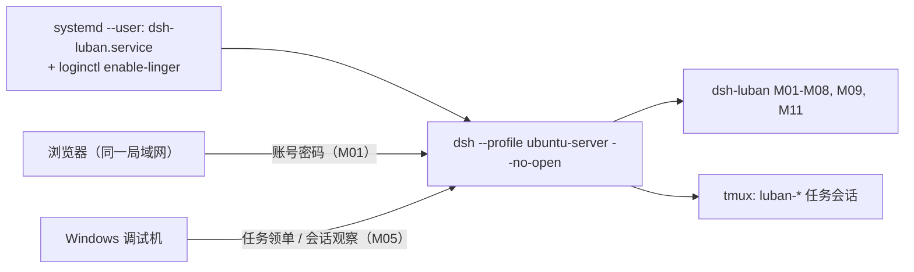
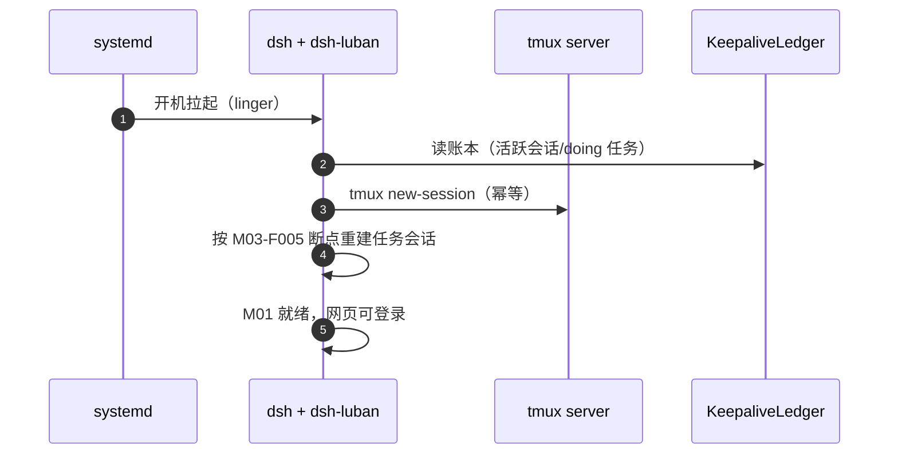

# Ubuntu 端部署设计（ubuntu-server 形态）

## 版本记录

| 版本 | 日期       | 作者  | 变更说明                              |
| ---- | ---------- | ----- | ------------------------------------- |
| v0.1 | 2026-08-29 | Maintainers | 初稿：systemd 常驻、tmux 保活、网页访问链路 |
| v0.2 | 2026-08-30 | Codex | 增加 M11 browser-use 的 uv 隔离环境要求 |
| v0.3 | 2026-08-30 | Codex | 落地默认预览且拒绝覆盖的 ubuntu-server 生成脚本 |
| v0.4 | 2026-08-30 | Codex | 修正 systemd 启动命令并明确强制恢复哨兵语义 |
| v0.5 | 2026-08-30 | Codex | 同步 A 档 lock v2、安装授权门禁与 profile smoke |
| v0.6 | 2026-08-30 | Codex | 同步 A 档 lock v3、精确原生构建许可与安装后验收链 |
| v0.7 | 2026-08-30 | Codex | 增加 profile smoke 双端结果聚合 |
| v0.8 | 2026-08-30 | Codex | 增加 M09 systemd 分阶段安装、重启与清理验收命令 |
| v0.9 | 2026-08-30 | Codex | 完善 M09 分阶段恢复账本与重启验证 |
| v0.10 | 2026-08-30 | Codex | 增加 M09 独立构建与安装准备步骤 |
| v0.11 | 2026-08-30 | Codex | 固定 M09 验收所用 pnpm 版本与运行文件 |
| v0.12 | 2026-08-30 | Codex | 完善 M09 验收运行目录与阶段重试 |
| v0.13 | 2026-08-30 | Codex | 收敛安装与重启 smoke 为幂等、owned cleanup 和真实宿主功能验收 |
| v0.14 | 2026-08-31 | Codex | 限定 Web 端口为实际 LAN CIDR 并记录跨机登录验收 |

## 1. 目标形态

局域网 Ubuntu 编译服务器：dsh 以 user 级 systemd 服务常驻（M09-F001），tmux 托管任务会话（M03-F001），重启后自动恢复；工程师浏览器经 M01 登录直接使用网页（R01）。



## 2. 安装步骤（设计口径）

1. **前置**：Node ≥ 22、pnpm ≥ 10、uv ≥ 0.11、tmux、git；建议专用用户（如 `dsh`）。
2. **profile**：先运行 `scripts/deploy/setup-ubuntu.sh` 预览目标与文件清单；确认后增加
   `--apply`，生成 `~/.dsh/profiles/ubuntu-server/`。可用 `--dsh-home <path>` 指向隔离目录。
   脚本不改官方 preset，且目标已存在时拒绝覆盖。
3. **安装套件**：先按根 README 登录 GitHub Packages，再执行
   `dsh plugin --profile ubuntu-server add @yin52133/dsh-luban-auth ... @yin52133/dsh-luban-server-mode`；
   也可使用 GitHub Release 的本地 `.tgz`。
4. **A 档直装**：先运行 `scripts/install-3rd-party.sh --profile ubuntu-server --dry-run` 审核
   本地 lock v3 计划；默认固定 `dshmarket@1.36.0`、`dsh-better-sidebar@0.17.1`、
   `@furongjun1999/dsh-memory@0.4.0`。apply 必须在 Linux 宿主提供绝对且非根目录的
   `--dsh-home` 与 `--approved-by`；变更 lock 中的版本前必须重新 dry-run 并明确确认计划。
5. **服务注册**：M09-F001 安装 user 级 unit：

```ini
# ~/.config/systemd/user/dsh-luban.service（设计样例）
[Unit]
Description=dsh-luban workbench (ubuntu-server profile)
After=network-online.target
Wants=network-online.target

[Service]
Type=simple
ExecStart="/usr/bin/env" "dsh" "--profile" "ubuntu-server" "--no-open"
Environment=LUBAN_BOOT_RESTORE=1
Restart=on-failure
RestartSec=5

[Install]
WantedBy=default.target
```

`LUBAN_BOOT_RESTORE=1` 是部署层强制恢复哨兵：即使 profile 中配置
`bootRestore: false`，M03 仍会在该 systemd 启动路径执行恢复。只有精确字符串 `1`
生效，其他类 truthy 文本不取得覆盖语义。

M09 日常验收优先使用正式 operator 与 systemd 服务重启：

```sh
systemctl --user restart dsh-luban.service
systemctl --user is-enabled dsh-luban.service
systemctl --user is-active dsh-luban.service
```

整机重启只用于明确的开机恢复验收，不是常规安装或配置验证步骤。

6. **linger**：`sudo loginctl enable-linger <user>`——不登录桌面也让 user 级服务开机自启（R02 关键）。
7. **认证初始化**：首启引导建管理员；`config.port` 自定义（默认 42600）。

```sh
# Preview only (default)
scripts/deploy/setup-ubuntu.sh --dsh-home /tmp/dsh-acceptance

# Create after reviewing the JSON plan
scripts/deploy/setup-ubuntu.sh --dsh-home /tmp/dsh-acceptance --apply

DSH_HOME=/tmp/dsh-acceptance dsh --profile ubuntu-server --dump-config

# Review the pinned A-class plan (no registry request and no dsh child process)
bash scripts/install-3rd-party.sh --profile ubuntu-server --dry-run

# Apply only on the matching Linux host after explicit review
bash scripts/install-3rd-party.sh --profile ubuntu-server \
  --dsh-home /tmp/dsh-acceptance --approved-by operator-name --apply

# Unpinned resolution requires a separate approval
bash scripts/install-3rd-party.sh --profile ubuntu-server --version latest \
  --dsh-home /tmp/dsh-acceptance --approved-by operator-name --approve-unpinned --apply
```

apply 在指定 `DSH_HOME` 中按 dry-run 展示的精确版本安装，不修改当前 shell 环境。安装后核对依赖
清单、`--dump-config`、bundle 挂载与 `node-pty` native load；相同计划重复执行应保持相同版本和
配置，不重复写入 bundle。版本或安装结果不一致时停止并保留现有 profile，供用户检查或回退。

构建与安装后使用正常命令验收：

```sh
pnpm build
pnpm test
dsh --profile ubuntu-server --dump-config
```

Windows 与 Ubuntu 分别验证自己的 profile；无需额外证据 runner。

## 3. 重启恢复链路（与 M03/M09 协作）



## 4. 运维要点

- 日志：`journalctl --user -u dsh-luban -f`；套件自有日志在 `~/.dsh/luban/logs/`（滚动 30 天）。
- 升级：同 Windows（dsh-market Update API / pnpm）；dsh 本体升级前在测试 profile 验证。
- 备份：`~/.dsh/luban/`（看板/认证/保活账本）每日 cron 快照保留 7 份；备份包含账号数据，按普通本地备份保存，不作为项目文件提交。
- 防火墙：只向实际局域网客户端地址范围开放配置的 Web 端口。不要把验收环境的真实网段提交到
  仓库；应使用路由器或网络管理员提供的客户端 CIDR。

```sh
# Example only: replace this value with the actual LAN client CIDR.
LAN_CIDR=<lan-client-cidr>
sudo ufw allow proto tcp from "$LAN_CIDR" to any port 42600
```

该规则只放通到认证 sidecar 的网络连接；用户仍需在 `/luban-auth/login` 使用本地账号登录。除非明确
需要接受所有可路由来源，否则不要配置无来源限制的 `ufw allow 42600/tcp`。

## 5. 浏览器自动化（M11）无桌面注意点

ubuntu-server 无显示环境：M11-F004 HAL 默认走无头 Chromium；插件以 `uv run --locked` 启动随包 Python 项目，隔离环境位于 `~/.dsh/luban/browser/uv-env`，禁止使用全局 pip；Chromium 在安装脚本中预下载（或配置离线包），部署文档给出磁盘占用预估。
