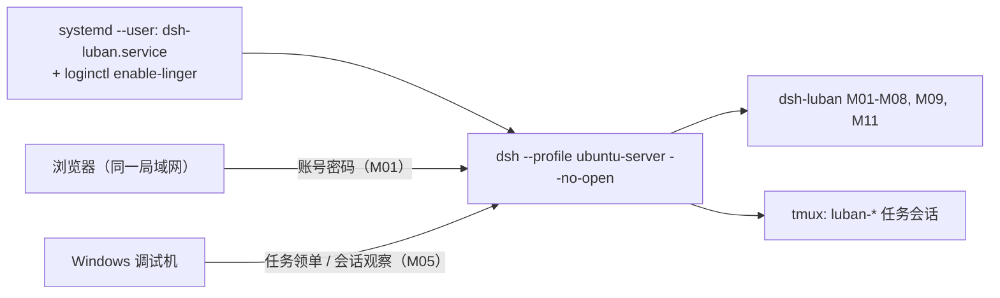
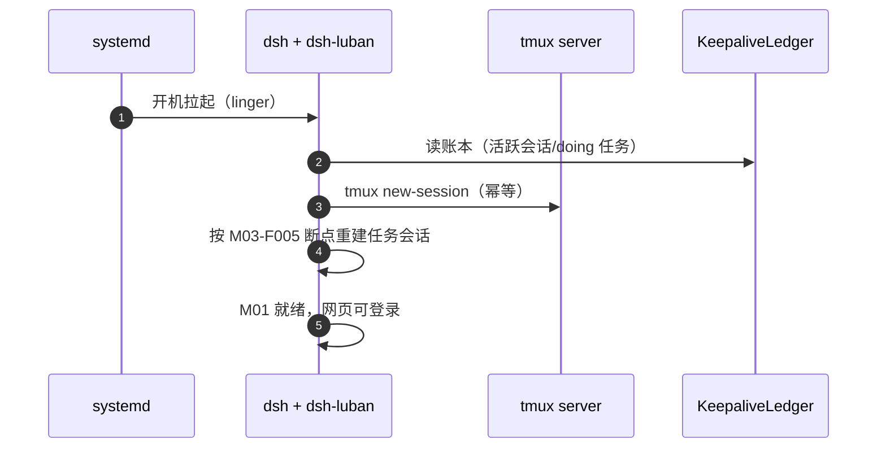

# Ubuntu 端部署设计（ubuntu-server 形态）

## 版本记录

| 版本 | 日期       | 作者  | 变更说明                              |
| ---- | ---------- | ----- | ------------------------------------- |
| v0.1 | 2026-08-29 | Maintainers | 初稿：systemd 常驻、tmux 保活、网页访问链路 |
| v0.2 | 2026-08-30 | Codex | 增加 M11 browser-use 的 uv 隔离环境要求 |
| v0.3 | 2026-08-30 | Codex | 落地默认预览且拒绝覆盖的 ubuntu-server 生成脚本 |
| v0.4 | 2026-08-30 | Codex | 修正 systemd 启动命令并明确强制恢复哨兵语义 |
| v0.5 | 2026-08-30 | Codex | 同步 A 档 lock v2、安装授权门禁与 profile smoke |
| v0.6 | 2026-08-30 | Codex | 同步 A 档 lock v3、精确原生构建许可与安装后验收链 |
| v0.7 | 2026-08-30 | Codex | 将 profile smoke 证据绑定到 CI commit、run identity 与 attempt |
| v0.8 | 2026-08-30 | Codex | 增加 M09 systemd 分阶段安装、重启与清理验收命令 |
| v0.9 | 2026-08-30 | Codex | 收紧 M09 fresh-build provenance、可恢复 attempt 账本与 logind/InvocationID 验证 |
| v0.10 | 2026-08-30 | Codex | 要求 M09 使用 frozen/offline 隔离 pnpm 工具链后再进入系统副作用阶段 |
| v0.11 | 2026-08-30 | Codex | 将 M09 pnpm 候选严格绑定到 tracked HEAD 官方 tarball 与 runtime tree manifest |
| v0.12 | 2026-08-30 | Codex | 要求仅从 runner 私有 pnpm runtime 快照执行，关闭外部候选目录 TOCTOU |

## 1. 目标形态

局域网 Ubuntu 编译服务器：dsh 以 user 级 systemd 服务常驻（M09-F001），tmux 托管任务会话（M03-F001），重启后自动恢复；工程师浏览器经 M01 登录直接使用网页（R01）。



## 2. 安装步骤（设计口径）

1. **前置**：Node ≥ 22、pnpm ≥ 10、uv ≥ 0.11、tmux、git；建议专用用户（如 `dsh`）。
2. **profile**：先运行 `scripts/deploy/setup-ubuntu.sh` 预览目标与文件清单；确认后增加
   `--apply`，生成 `~/.dsh/profiles/ubuntu-server/`。可用 `--dsh-home <path>` 指向隔离目录。
   脚本不改官方 preset，且目标已存在时拒绝覆盖。
3. **安装套件**：`dsh plugin --profile ubuntu-server add dsh-luban-auth ... dsh-luban-server-mode`。
4. **A 档直装**：先运行 `scripts/install-3rd-party.sh --profile ubuntu-server --dry-run` 审核
   本地 lock v3 计划；默认固定 `dshmarket@1.36.0`、`dsh-better-sidebar@0.17.1`、
   `@furongjun1999/dsh-memory@0.4.0`。apply 必须在 Linux 宿主提供绝对且非根目录的
   `--dsh-home` 与 `--approved-by`，并使用 pnpm `11.24.0`；latest/显式 semver 还需
   `--approve-unpinned`。
5. **服务注册**：M09-F001 安装 user 级 unit：

```ini
# ~/.config/systemd/user/dsh-luban.service（设计样例）
[Unit]
Description=dsh-luban workbench (ubuntu-server profile)
After=network-online.target
Wants=network-online.target

[Service]
Type=simple
ExecStart="/usr/bin/env" "dsh" "--profile" "ubuntu-server" "--no-open"
Environment=LUBAN_BOOT_RESTORE=1
Restart=on-failure
RestartSec=5
NoNewPrivileges=true
PrivateTmp=true

[Install]
WantedBy=default.target
```

`LUBAN_BOOT_RESTORE=1` 是部署层强制恢复哨兵：即使 profile 中配置
`bootRestore: false`，M03 仍会在该 systemd 启动路径执行恢复。只有精确字符串 `1`
生效，其他类 truthy 文本不取得覆盖语义。

M09-F001 的真实验收使用仓库已构建的 production operator CLI，证据目录必须是仓库外的绝对
私有目录。除 plan 外的阶段需 `--apply` 才写证据；其中只有 install/cleanup 会修改 user unit：

```sh
# Zero-write plan
node scripts/acceptance/m09-systemd-reboot.mjs

# Run as the target non-root user after an authorized administrator enabled linger.
mkdir -m 700 /tmp/luban-m09-$USER
node scripts/acceptance/m09-systemd-reboot.mjs preflight --apply \
  --run-dir /tmp/luban-m09-$USER/run
node scripts/acceptance/m09-systemd-reboot.mjs install --apply \
  --run-dir /tmp/luban-m09-$USER/run
node scripts/acceptance/m09-systemd-reboot.mjs arm-reboot --apply \
  --run-dir /tmp/luban-m09-$USER/run

# Human authorization boundary: reboot the same host outside this runner, then log in again.
node scripts/acceptance/m09-systemd-reboot.mjs verify-reboot --apply \
  --run-dir /tmp/luban-m09-$USER/run
node scripts/acceptance/m09-systemd-reboot.mjs cleanup --apply \
  --run-dir /tmp/luban-m09-$USER/run
```

执行前需先完成 package build 并保持 tracked worktree clean；`NODE_OPTIONS`、`NODE_PATH` 与外来
`GIT_*` 必须为空，并需预先准备 `package.json#packageManager` 指定精确版本的独立 pnpm 安装及完整
离线 store。该 pnpm 必须逐文件匹配 HEAD 内 `scripts/acceptance/m09-pnpm-trust.json` 固定的官方
registry tarball SRI、manifest 入口摘要、unpacked size 与确定性完整 runtime tree 摘要；PATH launcher、
package.json 和 `--version` 自报均不构成信任。匹配的外部包只作为字节源复制到 runner-owned 0700
临时目录，runner 复核快照的同一完整 tree 后，仅用固定 Node 执行快照中的 manifest 入口；外部目录
复制后或构建后发生漂移同样 fail closed。每个阶段都会在仓库外临时快照中从当前 HEAD 复制完整构建
输入，执行
`offline + frozen-lockfile + ignore-scripts + verify-store-integrity + copy` 隔离安装；用户/全局 npm
配置不会参与，缺包或工具闭包漂移直接 blocked，绝不回退到 workspace `node_modules`。随后 fresh
build，并把 core/server 的完整 JavaScript inventory 与当前 dist 逐字节摘要比较，同时绑定源码、
package、tsconfig、tsdown、workspace 与 lockfile 输入。install/cleanup 的内部证据顺序为 durable
attempt → production CLI 副作用 → confirmed；已确认完成的副作用不重复，部分副作用按 exact
ownership 安全重试完成。

安装前必须 absent，安装后必须 exact/enabled/active/running。重启后 boot ID 与 systemd
`InvocationID` 必须变化，MainPID 只要求为正（允许跨 boot 数字复用）；服务 activation monotonic
必须早于 logind `self` 所属用户当前可见的最早 session，runner 不信任 `XDG_SESSION_ID`。cleanup
只会卸载证据拥有且身份未变的 exact unit，并在 missing/not-found/inactive 后保留最终证据。runner
**永不**启用 linger、执行 reboot、logout 或 disconnect；这些动作需要独立人工授权。

6. **linger**：`sudo loginctl enable-linger <user>`——不登录桌面也让 user 级服务开机自启（R02 关键）。
7. **认证初始化**：首启引导建管理员；`config.port` 自定义（默认 42600）。

```sh
# Preview only (default)
scripts/deploy/setup-ubuntu.sh --dsh-home /tmp/dsh-acceptance

# Create after reviewing the JSON plan
scripts/deploy/setup-ubuntu.sh --dsh-home /tmp/dsh-acceptance --apply

DSH_HOME=/tmp/dsh-acceptance dsh --profile ubuntu-server --dump-config

# Review the pinned A-class plan (no registry request and no dsh child process)
bash scripts/install-3rd-party.sh --profile ubuntu-server --dry-run

# Apply only on the matching Linux host after explicit review
bash scripts/install-3rd-party.sh --profile ubuntu-server \
  --dsh-home /tmp/dsh-acceptance --approved-by operator-name --apply

# Unpinned resolution requires a separate approval
bash scripts/install-3rd-party.sh --profile ubuntu-server --version latest \
  --dsh-home /tmp/dsh-acceptance --approved-by operator-name --approve-unpinned --apply
```

apply 只向子进程注入 `DSH_HOME`、固定官方 npm registry 与无敏感字段的验收身份，不修改当前
shell 环境。执行前会核对三包及 `node-pty@1.1.0` 的包名、版本、license metadata、repository、
integrity、bundle 与依赖边界；任一不一致即拒绝安装。安装使用 `--save-exact` 与
`--allow-build=node-pty@1.1.0` 连续执行两次，随后核对精确依赖清单、`--dump-config`、唯一 bundle、
安装 manifest、LICENSE SHA-256 和 `node-pty` native load。npm metadata 中的 MIT 声明仍不等于
双端 live notices 证据已经生成。

M12-F001 的目标宿主 smoke runner 默认只打印无写入计划。Ubuntu 现场验收时使用项目本地
DSH `0.1.1-rc.2` 执行：

```sh
node scripts/acceptance/m12-profile-smoke.mjs
node scripts/acceptance/m12-profile-smoke.mjs --live \
  --expected-git-sha "$GITHUB_SHA" \
  --workflow-run-id "$GITHUB_RUN_ID" \
  --workflow-run-attempt "$GITHUB_RUN_ATTEMPT" \
  --output /tmp/m12-ubuntu-server.json
```

live runner 在隔离 `DSH_HOME` 中安装临时 host/client fixture，验证唯一挂载、lazy-CJS client、
热停/热启、重启和清理。可聚合证据必须从 CI 注入 `GITHUB_SHA`、`GITHUB_RUN_ID` 与
`GITHUB_RUN_ATTEMPT`；手工虚构这些值不构成可信 workflow 证据。聚合器要求双端同一 SHA/run/
attempt、不同一次性 smoke run ID、完整有序 canonical check 集合，并记录原始输入 SHA-256；
旧 attempt 与重复输入 fail closed。runner 存在不代表 Windows/Ubuntu 双端已验收；两端必须各自
产出真实 live pass 证据。

## 3. 重启恢复链路（与 M03/M09 协作）



## 4. 运维要点

- 日志：`journalctl --user -u dsh-luban -f`；套件自有日志在 `~/.dsh/luban/logs/`（滚动 30 天）。
- 升级：同 Windows（dsh-market Update API / pnpm）；dsh 本体升级前在测试 profile 验证。
- 备份：`~/.dsh/luban/`（看板/认证/保活账本）每日 cron 快照保留 7 份；**备份文件含口令哈希，禁止提交到任何仓库**（P6.1）。
- 防火墙：`ufw allow <port>/tcp`（限内网网段更佳）。

## 5. 浏览器自动化（M11）无桌面注意点

ubuntu-server 无显示环境：M11-F004 HAL 默认走无头 Chromium；插件以 `uv run --locked` 启动随包 Python 项目，隔离环境位于 `~/.dsh/luban/browser/uv-env`，禁止使用全局 pip；Chromium 在安装脚本中预下载（或配置离线包），部署文档给出磁盘占用预估。
