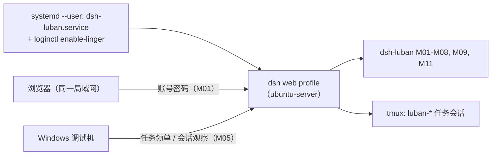
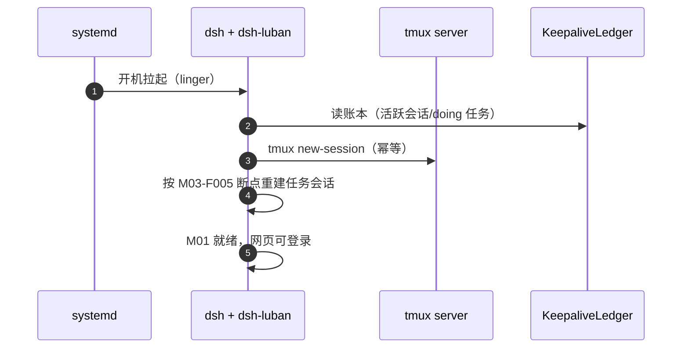

# Ubuntu 端部署设计（ubuntu-server 形态）

## 版本记录

| 版本 | 日期       | 作者  | 变更说明                              |
| ---- | ---------- | ----- | ------------------------------------- |
| v0.1 | 2026-08-29 | Maintainers | 初稿：systemd 常驻、tmux 保活、网页访问链路 |

## 1. 目标形态

局域网 Ubuntu 编译服务器：dsh 以 user 级 systemd 服务常驻（M09-F001），tmux 托管任务会话（M03-F001），重启后自动恢复；工程师浏览器经 M01 登录直接使用网页（R01）。



## 2. 安装步骤（设计口径）

1. **前置**：Node ≥ 22、pnpm ≥ 10、tmux、git；建议专用用户（如 `dsh`）。
2. **profile**：`scripts/deploy/setup-ubuntu.sh` 生成 `~/.dsh/profiles/ubuntu-server/`。
3. **安装套件**：`dsh plugin --profile ubuntu-server add dsh-luban-auth ... dsh-luban-server-mode`。
4. **A 档直装**：`scripts/install-3rd-party.sh --profile ubuntu-server`。
5. **服务注册**：M09-F001 安装 user 级 unit：

```ini
# ~/.config/systemd/user/dsh-luban.service（设计样例）
[Unit]
Description=dsh-luban workbench (dsh web profile)
After=network-online.target

[Service]
Type=simple
ExecStart=/usr/bin/env dsh web --profile ubuntu-server
Restart=on-failure
RestartSec=5

[Install]
WantedBy=default.target
```

6. **linger**：`sudo loginctl enable-linger <user>`——不登录桌面也让 user 级服务开机自启（R02 关键）。
7. **认证初始化**：首启引导建管理员；`config.port` 自定义（默认 42600）。

## 3. 重启恢复链路（与 M03/M09 协作）



## 4. 运维要点

- 日志：`journalctl --user -u dsh-luban -f`；套件自有日志在 `~/.dsh/luban/logs/`（滚动 30 天）。
- 升级：同 Windows（dsh-market Update API / pnpm）；dsh 本体升级前在测试 profile 验证。
- 备份：`~/.dsh/luban/`（看板/认证/保活账本）每日 cron 快照保留 7 份；**备份文件含口令哈希，禁止提交到任何仓库**（P6.1）。
- 防火墙：`ufw allow <port>/tcp`（限内网网段更佳）。

## 5. 浏览器自动化（M11）无桌面注意点

ubuntu-server 无显示环境：M11-F004 HAL 默认走无头 Chromium；playwright 浏览器二进制在安装脚本中预下载（或配置离线包），部署文档给出磁盘占用预估。
