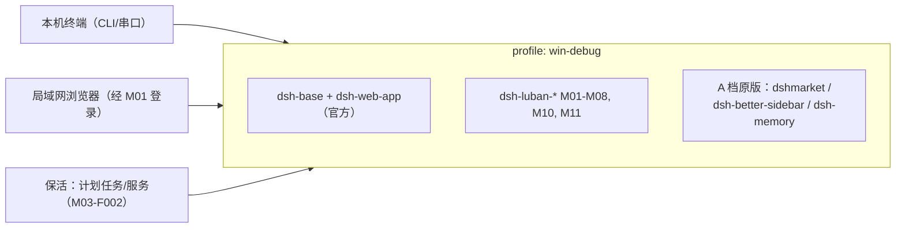

# Windows 端部署设计（win-debug 形态）

## 版本记录

| 版本 | 日期       | 作者  | 变更说明                              |
| ---- | ---------- | ----- | ------------------------------------- |
| v0.1 | 2026-08-29 | Maintainers | 初稿：profile 组成、安装步骤、保活、A 档直装 |
| v0.2 | 2026-08-30 | Codex | 增加 M11 browser-use 的 uv 隔离环境要求 |
| v0.3 | 2026-08-30 | Codex | 落地默认预览且拒绝覆盖的 win-debug 生成脚本 |

## 1. 目标形态

Windows 本地调试机：dsh 本机运行（本机终端用 CLI，局域网其他设备经 web 访问），叠加自研套件的 M01-M08、M10、M11 与 A 档三个原版插件。



## 2. 安装步骤

1. **前置**：Node ≥ 22、pnpm ≥ 10、uv ≥ 0.11；`npm i -g @deepseek-ai/dsh`；确认 `dsh --version` 与 `uv --version`。
2. **创建 profile**：先运行 `scripts/deploy/setup-windows.ps1` 预览目标与文件清单；确认后增加
   `-Apply`，生成 `%DSH_HOME%\profiles\win-debug\`（`package.json`、`cordis.patch.yml`、
   `README.md`）。可用 `-DshHome <path>` 指向隔离目录。脚本不改官方 preset，且目标已存在时拒绝覆盖。
3. **安装本套件**：`dsh plugin --profile win-debug add dsh-luban-auth dsh-luban-taskboard ...`（monorepo 发布后逐包，或本地 `file:` 联调）。
4. **A 档直装**：`scripts/install-3rd-party.ps1 -Profile win-debug`（装 dshmarket、dsh-better-sidebar、dsh-memory 原版，可选版本 pin）。
5. **保活注册**：M03-F002 注册计划任务（登录时启动/开机按用户选择）；账本与配置目录 `%DSH_HOME%\luban\`。
6. **认证初始化**：首次访问 web 引导创建管理员（M01-F001）；端口默认 42600 可配。

```powershell
# Preview only (default)
.\scripts\deploy\setup-windows.ps1 -DshHome C:\dsh-acceptance

# Create after reviewing the JSON plan
.\scripts\deploy\setup-windows.ps1 -DshHome C:\dsh-acceptance -Apply

$env:DSH_HOME = 'C:\dsh-acceptance'
dsh --profile win-debug --dump-config
```

## 3. 配置分层

```text
%DSH_HOME%\
├── profiles\win-debug\
│   ├── package.json             # bundles 有序：官方 base → A 档 → dsh-luban-*
│   ├── cordis.patch.yml         # 用户启停层（disabled 开关写这里）
│   └── node_modules\
├── luban\                       # 本套件数据（认证/看板/保活账本）
└── cordis.patch.yml             # 全局覆盖层（最优先）
```

## 4. 平台注意点

- 串口：pnpm 构建脚本允许清单需包含原生模块（本机 profile 的 `pnpm-workspace.yaml` 设置 onlyBuiltDependencies）。
- 桌面自动化（M10-F006）：MCP 服务以独立进程配置接入，凭据走系统凭据管理器。
- 浏览器桥接（M11）：插件以 `uv run --locked` 启动随包 Python 项目，隔离环境位于 `%DSH_HOME%\luban\browser\uv-env`，禁止使用全局 pip。
- 防火墙：首次监听提示放行私网；文档明确「仅限可信局域网」。

## 5. 升级与回退

- 本套件升级：`dsh plugin --profile win-debug update <pkg>`（dsh-market Update API）；dsh 本体升级后按 `engines.dsh` 对齐表（06-release）验证。
- 回退：profile 的 `cordis.patch.yml` 热停单个插件（`disabled: true`，约 1s 生效）；数据目录独立，卸载插件不删数据。
